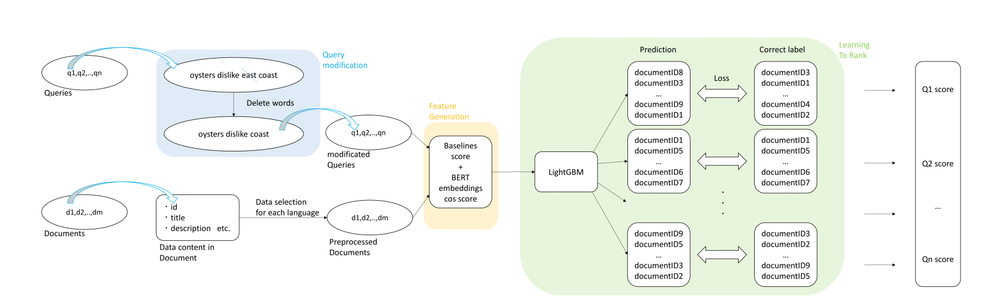

---
title: The 15th NTCIR Conference 参加報告
date: 2020-12-10
subtitle: ""
tags: ["国際学会発表"]
type: post
author: ""
summary: The 15th NTCIR Conference
---

<!--more-->

#### 日時：2020 年 12 月 10 日（木）

#### 場所：オンライン

#### 公式 Web ページ：[ntcir15](http://research.nii.ac.jp/ntcir/ntcir-15/conference.html)

上記日程にて、オンライン開催されました、The 15th NTCIR Conferenceに参加しました。大島研究室からは、三林さんと吉村さんが口頭発表を行いました。詳細については以下のとおりです。

+ Takuma Yoshimura, Pham Huulong, Ryota Mibayashi, Rui Kimura and Hiroaki Ohshima: "Behavioral Classification Using Feature Selection in the Micro Activity Retrieval Task", NTCIR 15 Conference: Proceedings of the 15th NTCIR Conference on Evaluation of Information Access Technologies, December 8-11, 2020 Tokyo Japan

+ Ryota Mibayashi, Huulong Pham, Naoaki Matsumoto, Takehiro Yamamoto and Hiroaki Ohshima: "Uhai at the NTCIR-15 Data Search task", NTCIR 15 Conference: Proceedings of the 15th NTCIR Conference on Evaluation of Information Access Technologies, December 8-11, 2020 Tokyo Japan

