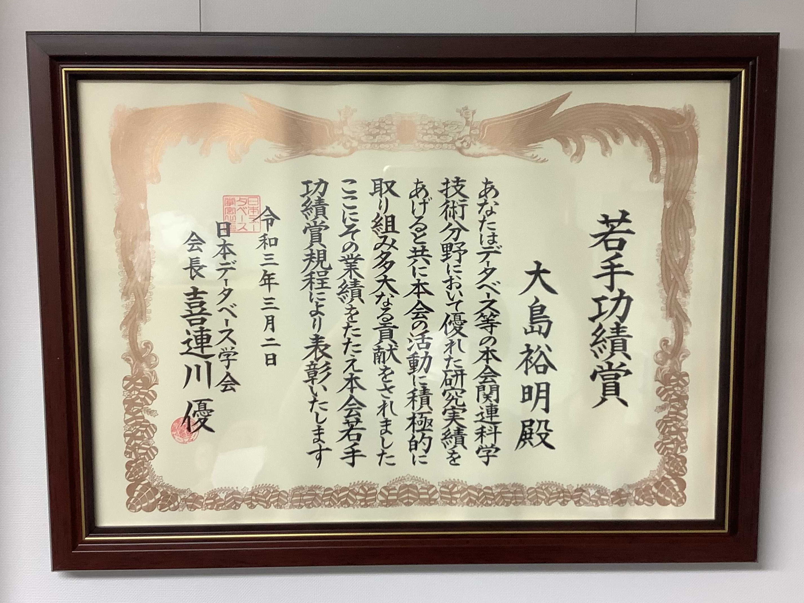
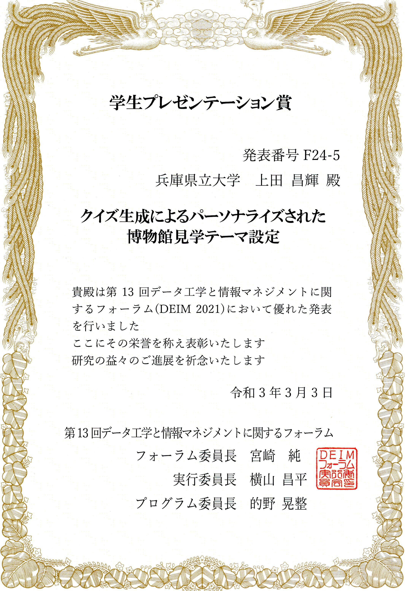
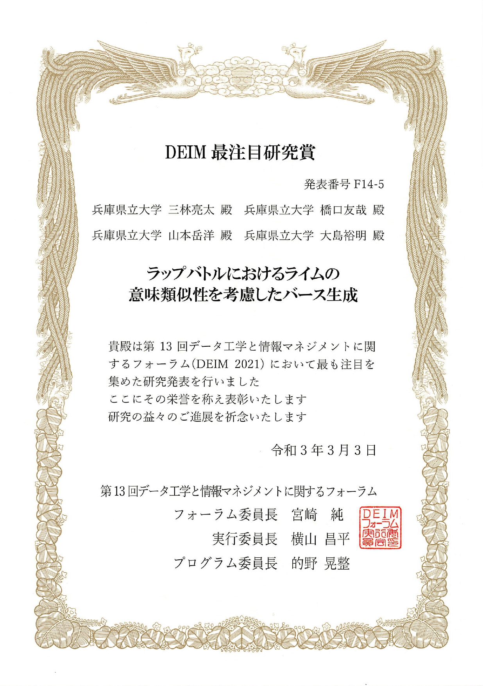

<!-- ---
title: 濵島 聡一郎さんの論文が AAI 2021 に採録されました
date: 2021-06-01
subtitle: ""
tags: ["国際学会発表"]
type: post
---

+ titile
  + [第一著者]さんの論文が[学会短縮名]に採録されました
  + 複数名同学会の場合はあいうえお順で「大島研のn件論文が」
  + 研究室単位の時は「大島研の論文が」
  + バリエーションは「論文が採録されました」「で発表しました」「論文が受賞しました」ぐらい？ -->

大島研究室のメンバーが、2021年の3月1日～3日に開催された「第13回データ工学と情報マネジメントに関するフォーラム（DEIM2021）」で発表しました。

[公式Webページ](https://db-event.jpn.org/deim2021/index.html)

[最終論文集ページ](https://proceedings-of-deim.github.io/DEIM2021/)

+ 顧 席銘, 窪内 将隆, 山本 岳洋, 大島 裕明: 「教師なしドメイン適応を用いた粒子形状評価」, 電子情報通信学会, 第13回データ工学と情報マネジメントに関するフォーラム (DEIM Forum 2021), E24-1, 2021年3月.
+ 崔 洙瑚, 橋口 友哉, 木村 塁, 大島 裕明: 「ウェブ閲覧URL列へのTransformer Encoderの適用による広告閲覧ユーザの属性推定」, 電子情報通信学会, 第13回データ工学と情報マネジメントに関するフォーラム (DEIM Forum 2021), B21-2, 2021年3月.
+ 橋口 友哉, 山本 岳洋, 藤田 澄男, 大島 裕明: 「ユーザが共感できる悩みの対話コンテンツ生成」, 電子情報通信学会, 第13回データ工学と情報マネジメントに関するフォーラム (DEIM Forum 2021), E33-4, 2021年3月.
+ Huu-Long Pham, Yusuke Yamamoto, Takehiro Yamamoto, Hiroaki Ohshima: 「Distraction Detection using Wearable Device and its Application to Concentration Level Improvement」, 電子情報通信学会, 第13回データ工学と情報マネジメントに関するフォーラム (DEIM Forum 2021), J24-3, 2021年3月.
+ 中田 祐誠, 山本 岳洋, 藤田 澄男, 大島 裕明: 「オンラインショッピングにおける購買意図の推移とウェブ検索クエリの分析」, 電子情報通信学会, 第13回データ工学と情報マネジメントに関するフォーラム (DEIM Forum 2021), F13-4, 2021年3月.
+ 上田 昌輝, 橋口 友哉, 莊司 慶行, 神門 典子, 山本 祐輔, 山本 岳洋, 大島 裕明: 「クイズ生成によるパーソナライズされた博物館見学テーマ設定」, 電子情報通信学会, 第13回データ工学と情報マネジメントに関するフォーラム (DEIM Forum 2021), F24-5, 2021年3月.
+ 川原 敬史, 橋口 友哉, 湯本 高行, 大島 裕明: 「事故概要説明文の文脈理解による傷病の程度の推定」, 電子情報通信学会, 第13回データ工学と情報マネジメントに関するフォーラム (DEIM Forum 2021), C25-2, 2021年3月.
+ 坂根 和光, 山本 岳洋, 澤田 祥一, 大塚 一路, 山本 光穂, 大島 裕明: 「自然言語からの緯度経度推定に向けた説明文収集とパターン分析」, 電子情報通信学会, 第13回データ工学と情報マネジメントに関するフォーラム (DEIM Forum 2021), H33-2, 2021年3月.
+ 浜島 聡一郎, 山本 岳洋, 大島 裕明: 「健康情報検索におけるユーザのクエリ作成能力の検証」, 電子情報通信学会, 第13回データ工学と情報マネジメントに関するフォーラム (DEIM Forum 2021), F11-4, 2021年3月.
+ 吉岡 朋友, 湯本 高行, 山本 岳洋, 大島 裕明: 「生成型深層学習によるアパレルデザインのためのコーディネート画像生成」, 電子情報通信学会, 第13回データ工学と情報マネジメントに関するフォーラム (DEIM Forum 2021), C14-1, 2021年3月.
+ 吉村 拓真, ファム フーロン, 和田 真弥, 大島 裕明: 「空間的特徴量とパーソナリティ分析を用いたストレス推定」, 電子情報通信学会, 第13回データ工学と情報マネジメントに関するフォーラム (DEIM Forum 2021), J33-3, 2021年3月.
+ 三林 亮太, 橋口 友哉, 山本 岳洋, 大島 裕明: 「ラップバトルにおけるライムの意味類似性を考慮したバース生成」, 電子情報通信学会, 第13回データ工学と情報マネジメントに関するフォーラム (DEIM Forum 2021), F14-5, 2021年3月.
+ 松本 直彰, 湯本 高行, 山本 岳洋, 大島 裕明: 「ニュースアーカイブ探索のための記事間の関係抽出とその可視化」, 電子情報通信学会, 第13回データ工学と情報マネジメントに関するフォーラム (DEIM Forum 2021), F25-3, 2021年3月.

<!-- 1. 論文採録バージョン -->
<!-- [第一著者]さんの論文が「[学会フルネーム]」に採録されました。 -->

<!-- [公式Webページ](学会公式ページTopのURL) -->

<!-- 書誌情報。書式はPublicationsを参考。変にコードブロックとかで囲まなくてOK -->

<!-- [年月日]に発表予定 -->

<!-- 2. 論文発表済みバージョン -->
<!-- [第一著者]さんが「[学会フルネーム]」で発表しました。 -->

<!-- [公式Webページ](学会公式ページTopのURL) -->

<!-- 書誌情報。書式はPublicationsを参考。変にコードブロックとかで囲まなくてOK -->

<!-- 3. 論文受賞バージョン -->
<!-- [第一著者]さんの論文が「[学会フルネーム]」で「[受賞名]」を受賞しました -->

<!-- [公式Webページ](学会公式ページTopのURL) -->

<!-- 書誌情報。書式はPublicationsを参考。変にコードブロックとかで囲まなくてOK -->

<!-- 同学会複数名の場合は並べて良い感じにして -->

大島裕明さんが「日本データベース学会若手功績賞」を受賞しました。

上田昌輝さんが「DEIM学生プレゼンテーション賞」を受賞しました。

三林亮太さんが「DEIM最注目研究賞」を受賞しました。

