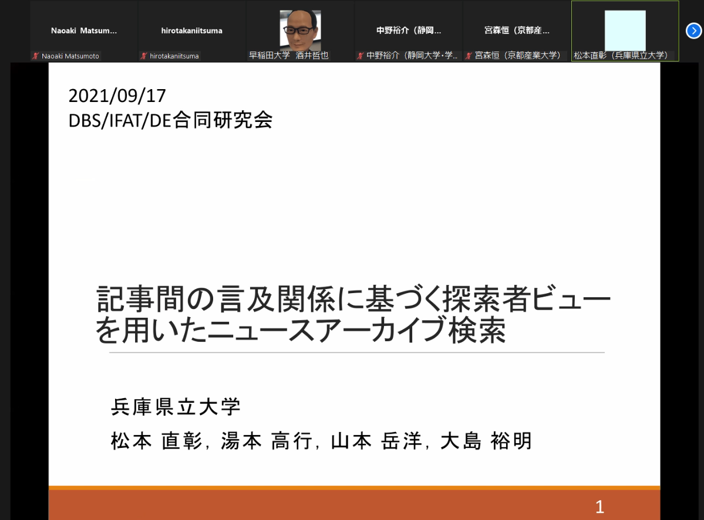
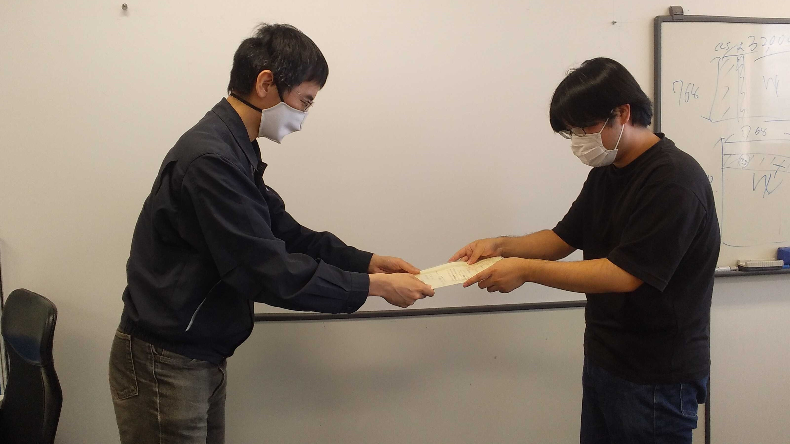
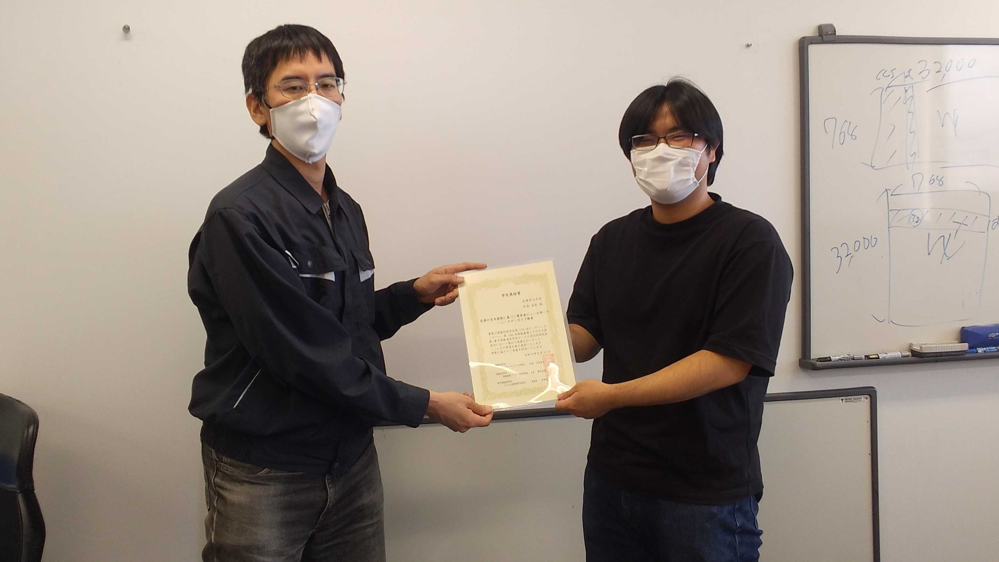
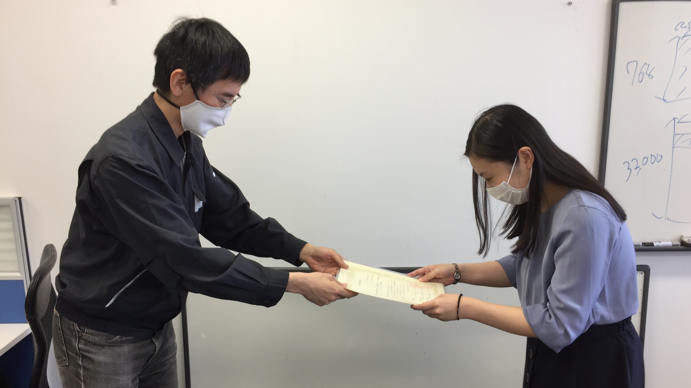
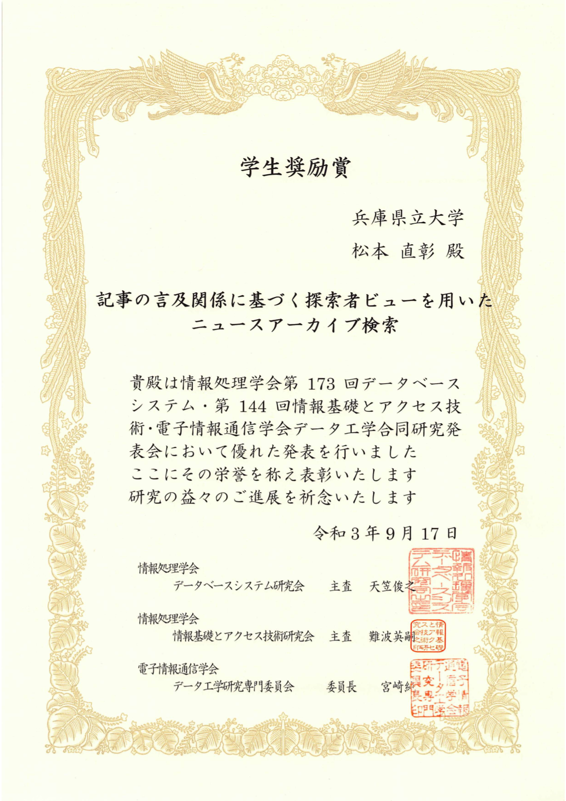
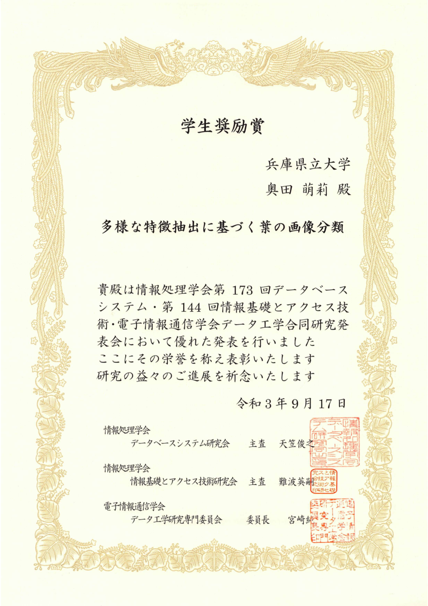

#### 日時：2021年9月16日（木）～9月17日（金）
#### 場所：Zoom

上記日程にて、松本 直彰さんと奥田 萌莉さんが、第173回 データベースシステム研究会（SIG-DBS） 情報処理学会 第144回 情報基礎とアクセス技術研究会（SIG-IFAT） 電子情報通信学会 データ工学研究会（DE） 合同研究会で発表しました。

+ 松本直彰, 湯本高行, 山本岳洋, 大島裕明：「記事の言及関係に基づく探索者ビューを用いたニュースアーカイブ検索」, 情報処理学会データベースシステム研究会・情報基礎とアクセス技術研究会・電子情報通信学会データ工学研究会 研究報告, 2021年9月

+ 奥田萌莉, 大島裕明：「多様な特徴抽出に基づく葉の画像分類」, 研究報告データベースシステム（DBS）/情報処理学会データベースシステム研究会・情報基礎とアクセス技術研究会・電子情報通信学会データ工学研究会 研究報告, 2021年9月

二人とも、学生奨励賞を受賞しました。
- 松本直彰, 学生奨励賞, 記事の言及関係に基づく探索者ビューを用いたニュースアーカイブ検索, 第173回 データベースシステム研究会・第144回 情報基礎とアクセス技術研究会・電子情報通信学会 データ工学研究会, 2021年9月17日
- 奥田萌莉, 学生奨励賞, 多様な特徴抽出に基づく葉の画像分類, 第173回 データベースシステム研究会・第144回 情報基礎とアクセス技術研究会・電子情報通信学会 データ工学研究会, 2021年9月17日

気を再び引き締めて、今後も頑張りましょう！お疲れ様でした！

<!--  -->
[公式webページ](https://www.ipsj.or.jp/award/dbs-award1.html) 
  
  

<!-- 1. 論文採録バージョン -->
<!-- [第一著者]さんの論文が「[学会フルネーム]」に採録されました。 -->

<!-- [公式Webページ](学会公式ページTopのURL) -->

<!-- 書誌情報。書式はPublicationsを参考。変にコードブロックとかで囲まなくてOK -->

<!-- [年月日]に発表予定 -->

<!-- 2. 論文発表済みバージョン -->
<!-- [第一著者]さんが「[学会フルネーム]」で発表しました。 -->

<!-- [公式Webページ](学会公式ページTopのURL) -->

<!-- 書誌情報。書式はPublicationsを参考。変にコードブロックとかで囲まなくてOK -->

<!-- 3. 論文受賞バージョン -->
<!-- [第一著者]さんの論文が「[学会フルネーム]」で「[受賞名]」を受賞しました -->

<!-- [公式Webページ](学会公式ページTopのURL) -->

<!-- 書誌情報。書式はPublicationsを参考。変にコードブロックとかで囲まなくてOK -->

<!-- 同学会複数名の場合は並べて良い感じにして -->