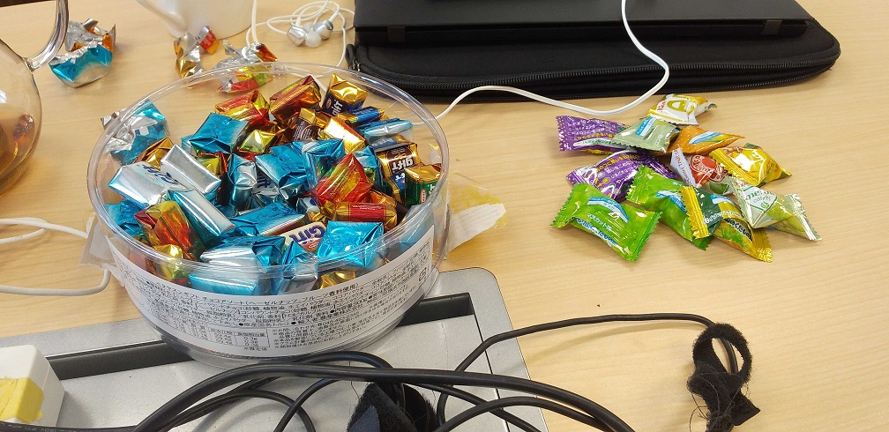

#### 日時：2021年10月30日（土）
#### 場所：Zoom

上記日程にて、大島研のメンバーがIR Readingに参加しました。

ハロウィンの前日だったということもあり、先輩がチョコレートを持ってきてくださいました！

お疲れ様でした！

<!--  -->
[公式webページ](https://sigir.jp/post/2021-10-30-irreading_2021fall/#program) 
  
  

<!-- 1. 論文採録バージョン -->
<!-- [第一著者]さんの論文が「[学会フルネーム]」に採録されました。 -->

<!-- [公式Webページ](学会公式ページTopのURL) -->

<!-- 書誌情報。書式はPublicationsを参考。変にコードブロックとかで囲まなくてOK -->

<!-- [年月日]に発表予定 -->

<!-- 2. 論文発表済みバージョン -->
<!-- [第一著者]さんが「[学会フルネーム]」で発表しました。 -->

<!-- [公式Webページ](学会公式ページTopのURL) -->

<!-- 書誌情報。書式はPublicationsを参考。変にコードブロックとかで囲まなくてOK -->

<!-- 3. 論文受賞バージョン -->
<!-- [第一著者]さんの論文が「[学会フルネーム]」で「[受賞名]」を受賞しました -->

<!-- [公式Webページ](学会公式ページTopのURL) -->

<!-- 書誌情報。書式はPublicationsを参考。変にコードブロックとかで囲まなくてOK -->

<!-- 同学会複数名の場合は並べて良い感じにして -->