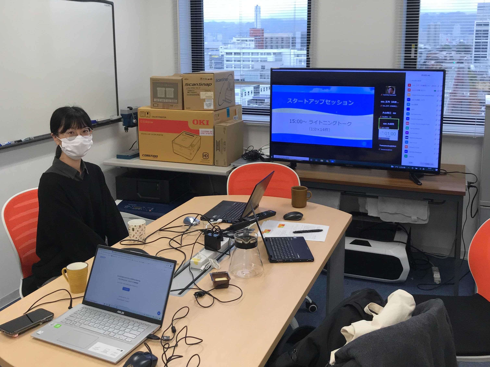
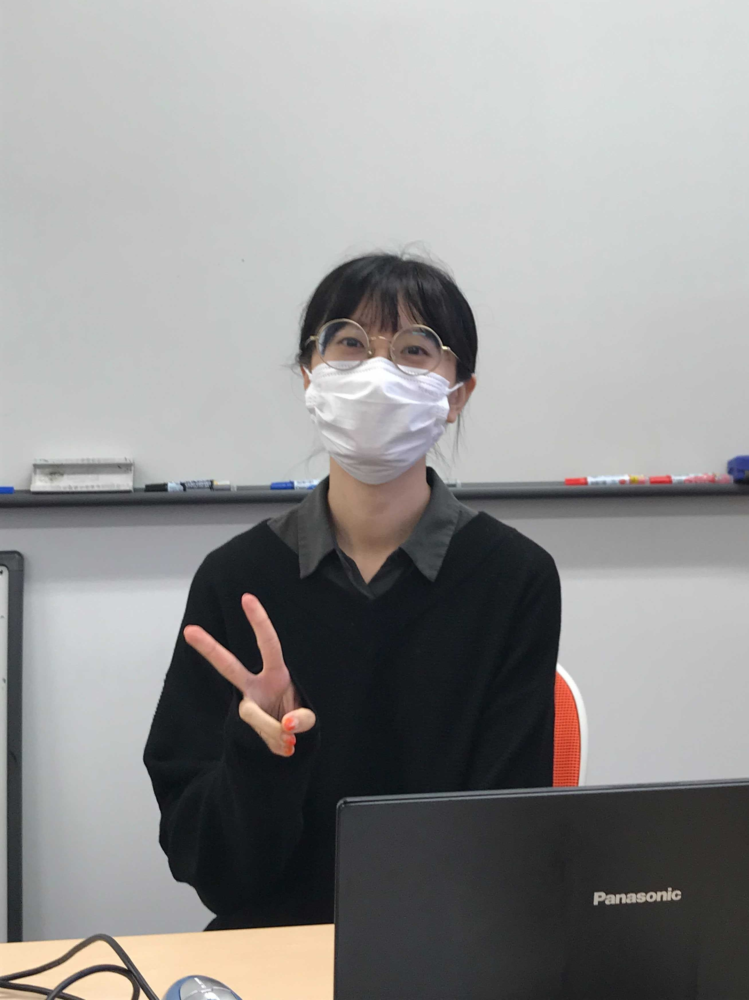

#### 日時：2021年11月22日（月）
#### 場所：Zoom，Gather.Town

王丹さんがIDRユーザフォーラム 2021のスタートアップセッションで発表しました。

[公式Webページ](https://www.nii.ac.jp/dsc/idr/userforum/2021.html)

[ポスター資料](https://www.nii.ac.jp/dsc/idr/userforum/startup/IDR-UF2021_S02.pdf)

+ 王丹，三林 亮太，大島 裕明：「視覚的比喩による商品の魅力的なキャッチコピーの生成」，IDRユーザフォーラム2021（IDR 2021），S02，2021年11月．
王さん、お疲れさまでした。

<!-- 1. 論文採録バージョン -->
<!-- [第一著者]さんの論文が「[学会フルネーム]」に採録されました。 -->

<!-- [公式Webページ](学会公式ページTopのURL) -->

<!-- 書誌情報。書式はPublicationsを参考。変にコードブロックとかで囲まなくてOK -->

<!-- [年月日]に発表予定 -->

<!-- 2. 論文発表済みバージョン -->
<!-- [第一著者]さんが「[学会フルネーム]」で発表しました。 -->

<!-- [公式Webページ](学会公式ページTopのURL) -->

<!-- 書誌情報。書式はPublicationsを参考。変にコードブロックとかで囲まなくてOK -->

<!-- 3. 論文受賞バージョン -->
<!-- [第一著者]さんの論文が「[学会フルネーム]」で「[受賞名]」を受賞しました -->

<!-- [公式Webページ](学会公式ページTopのURL) -->

<!-- 書誌情報。書式はPublicationsを参考。変にコードブロックとかで囲まなくてOK -->

<!-- 同学会複数名の場合は並べて良い感じにして -->