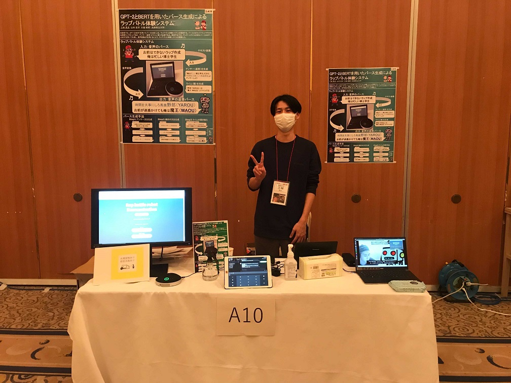

#### 日時：2021年12月8日(水)～10日(金)
#### 場所：ザ浜名湖，オンライン

三林 亮太さんが「WISS: 2021 第29回インタラクティブシステムとソフトウェアに関するワークショップ」で発表しました。

- 三林亮太, 山本岳洋, 大島裕明：「GPT-2とBERTを用いたバース生成によるラップバトル体験システム」, WISS 2021: 第29回インタラクティブシステムとソフトウェアに関するワークショップ, 2021年12月

[公式Webページ](https://www.wiss.org/WISS2021/)

[予稿ページ](https://www.wiss.org/WISS2021Proceedings/data/2-A10.pdf)

三林さん、お疲れさまでした。

<!-- 1. 論文採録バージョン -->
<!-- [第一著者]さんの論文が「[学会フルネーム]」に採録されました。 -->

<!-- [公式Webページ](学会公式ページTopのURL) -->

<!-- 書誌情報。書式はPublicationsを参考。変にコードブロックとかで囲まなくてOK -->

<!-- [年月日]に発表予定 -->

<!-- 2. 論文発表済みバージョン -->
<!-- [第一著者]さんが「[学会フルネーム]」で発表しました。 -->

<!-- [公式Webページ](学会公式ページTopのURL) -->

<!-- 書誌情報。書式はPublicationsを参考。変にコードブロックとかで囲まなくてOK -->

<!-- 3. 論文受賞バージョン -->
<!-- [第一著者]さんの論文が「[学会フルネーム]」で「[受賞名]」を受賞しました -->

<!-- [公式Webページ](学会公式ページTopのURL) -->

<!-- 書誌情報。書式はPublicationsを参考。変にコードブロックとかで囲まなくてOK -->

<!-- 同学会複数名の場合は並べて良い感じにして -->