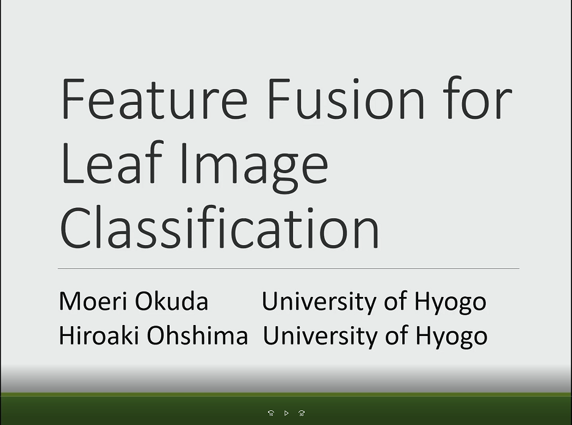

#### 日時：2022年1月17日（月）～1月20日（木）
#### 場所：Zoom
  
  
奥田 萌莉さんが「2022 IEEE International Conference on Big Data and Smart Computing (BigComp 2022)」で発表しました。

[公式Webページ](http://www.bigcomputing.org/)

+ Moeri Okuda, and Hiroaki Ohshima:
"Feature Fusion for Leaf Image Classification"
In Proceedings of the 2022 IEEE International Conference on Big Data and Smart Computing, January, 2022.

今後も頑張りましょう！！

<!-- 1. 論文採録バージョン -->
<!-- [第一著者]さんの論文が「[学会フルネーム]」に採録されました。 -->

<!-- [公式Webページ](学会公式ページTopのURL) -->

<!-- 書誌情報。書式はPublicationsを参考。変にコードブロックとかで囲まなくてOK -->

<!-- [年月日]に発表予定 -->

<!-- 2. 論文発表済みバージョン -->
<!-- [第一著者]さんが「[学会フルネーム]」で発表しました。 -->

<!-- [公式Webページ](学会公式ページTopのURL) -->

<!-- 書誌情報。書式はPublicationsを参考。変にコードブロックとかで囲まなくてOK -->

<!-- 3. 論文受賞バージョン -->
<!-- [第一著者]さんの論文が「[学会フルネーム]」で「[受賞名]」を受賞しました -->

<!-- [公式Webページ](学会公式ページTopのURL) -->

<!-- 書誌情報。書式はPublicationsを参考。変にコードブロックとかで囲まなくてOK -->

<!-- 同学会複数名の場合は並べて良い感じにして -->