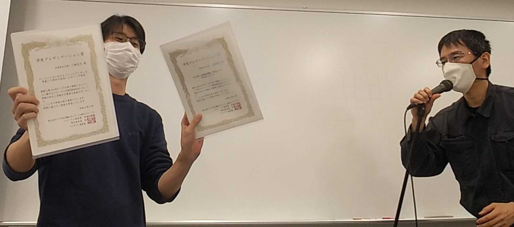
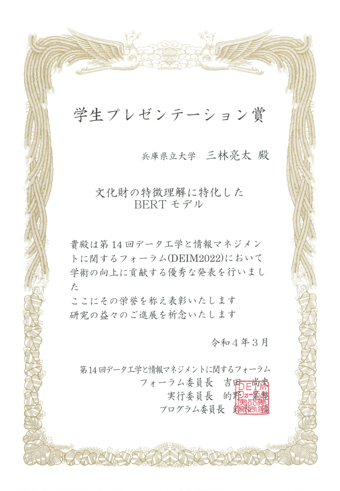
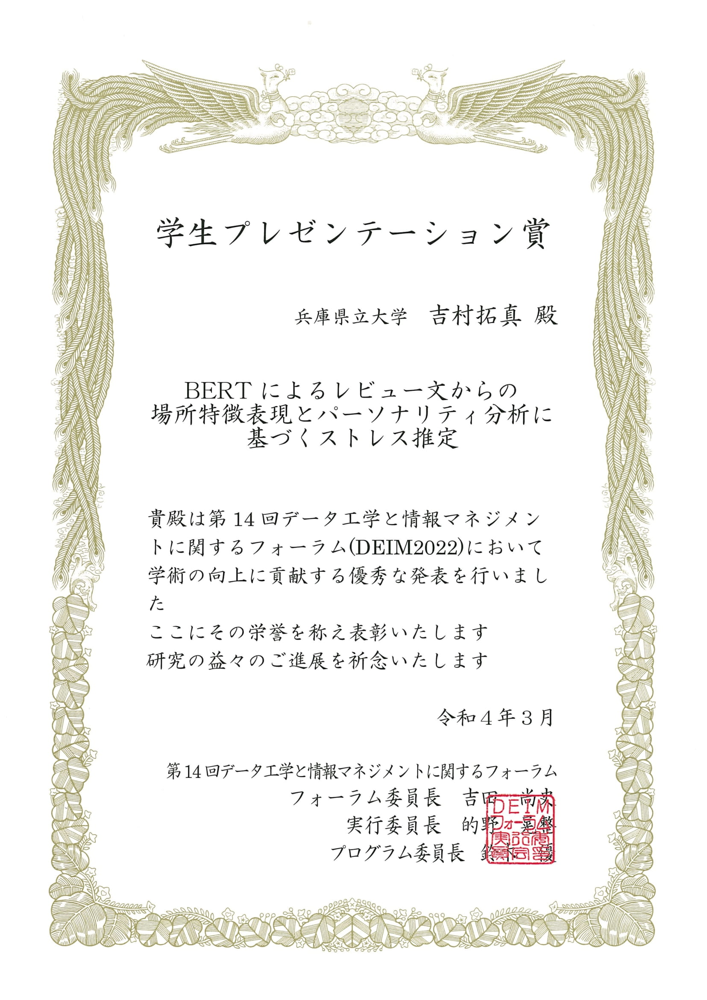

#### 日時：2022年2月27日（日）～3月2日（水）
#### 場所：Zoom、Ovice

大島研究室のメンバーがDEIM2022で発表しました。

+ [1] 	三林 亮太, 上田 昌輝, 川原 敬史, 松本 直彰, 吉村 拓真, 相原 健郎, 神門 典子, 莊司 慶行, 中島 悠太, 山本 岳洋, 山本 祐輔, 大島 裕明: 「文化財の特徴理解に特化したBERTモデル」, 日本データベース学会, 第14回データ工学と情報マネジメントに関するフォーラム (DEIM Forum 2022), F43-4, 2022年3月.
+ [2] 	古屋 昭拓, 山本 岳洋, 窪内 将隆, 大島 裕明: 「特許文書を用いた物質と特徴の関係理解に基づく物質の意外な用途の発見」, 日本データベース学会, 第14回データ工学と情報マネジメントに関するフォーラム (DEIM Forum 2022), E43-2, 2022年3月.
+ [3] 	河田 友香, 山本 岳洋, 大島 裕明, 柳田 雄輝, 加藤 誠, 藤田 澄男: 「ECサイトでのカメラ購買前後におけるWeb検索クエリの時系列分析」, 日本データベース学会, 第14回データ工学と情報マネジメントに関するフォーラム (DEIM Forum 2022), C41-4, 2022年3月.
+ [4] 	浜島 聡一郎, 山本 岳洋, 山本 祐輔, 大島 裕明: 「健康情報検索における信憑性判断と意見の形成に関する調査」, 日本データベース学会, 第14回データ工学と情報マネジメントに関するフォーラム (DEIM Forum 2022), A34-5, 2022年3月.
+ [5] 	Dan Wang, Ryota Mibayashi, Hiroaki Ohshima: 「Catchcopy Generation for Fashion Goods using Visual Metaphor」, 日本データベース学会, 第14回データ工学と情報マネジメントに関するフォーラム (DEIM Forum 2022), H33-1, 2022年3月.
+ [6] 	吉村 拓真, 和田 真弥, 大島 裕明: 「BERTによるレビュー文からの場所特徴表現とパーソナリティ分析に基づくストレス推定」, 日本データベース学会, 第14回データ工学と情報マネジメントに関するフォーラム (DEIM Forum 2022), A33-4, 2022年3月.
+ [7] 	三林 亮太, 山本 岳洋, 大島 裕明: 「ラップバトルにおけるライムとアンサーを考慮した逆向き生成によるバース生成」, 日本データベース学会, 電子情報通信学会, 情報処理学会, 第14回データ工学と情報マネジメントに関するフォーラム (DEIM Forum 2022), E31-3, 2022年3月.
+ [8] 	福島 航平, 大島 裕明: 「チラシ媒体通販における商品の販売数予測」, 日本データベース学会, 第14回データ工学と情報マネジメントに関するフォーラム (DEIM Forum 2022), H23-1, 2022年2月.
+ [9] 	柳田 雄輝, 加藤 誠, 河田 友香, 山本 岳洋, 大島 裕明, 藤田 澄男: 「検索行動に基づく購買満足度の関係分析」, 日本データベース学会, 第14回データ工学と情報マネジメントに関するフォーラム (DEIM Forum 2022), E23-3, 2022年2月.
+ [10] 	松本 直彰, 湯本 高行, 山本 岳洋, 大島 裕明: 「疑似訓練データを用いたニュース記事間の続報判定」, 日本データベース学会, 第14回データ工学と情報マネジメントに関するフォーラム (DEIM Forum 2022), B23-3, 2022年2月.
+ [11] 	川原 敬史, 湯本 高行, 大島 裕明: 「日常的な行動を表す文からのリスク文の検索と生成」, 日本データベース学会, 第14回データ工学と情報マネジメントに関するフォーラム (DEIM Forum 2022), A23-5, 2022年2月.
+ [12] 	坂根 和光, 三林 亮太, 川原 敬史, 山本 岳洋, 澤田 祥一, 高階 勇人, 大島 裕明: 「BERTを用いた場所の説明文に対する位置特定容易性の推定」, 日本データベース学会, 第14回データ工学と情報マネジメントに関するフォーラム (DEIM Forum 2022), D21-3, 2022年2月.
+ [13] 	奥田 萌莉, 大島 裕明: 「BERTとPANNsを用いた文脈を考慮した効果音検索」, 日本データベース学会 , 第14回データ工学と情報マネジメントに関するフォーラム (DEIM Forum 2022), C21-1, 2022年2月.

また、三林さん、濱島さん、吉村さんの3名が学生プレゼンテーション賞を受賞しました！

おめでとうございます！

川原さんが、優秀論文賞と優秀インタラクティブ賞を受賞しました！

おめでとうございます！

<!-- 1. 論文採録バージョン -->
<!-- [第一著者]さんの論文が「[学会フルネーム]」に採録されました。 -->

<!-- [公式Webページ](学会公式ページTopのURL) -->

<!-- 書誌情報。書式はPublicationsを参考。変にコードブロックとかで囲まなくてOK -->

<!-- [年月日]に発表予定 -->

<!-- 2. 論文発表済みバージョン -->
<!-- [第一著者]さんが「[学会フルネーム]」で発表しました。 -->

<!-- [公式Webページ](学会公式ページTopのURL) -->

<!-- 書誌情報。書式はPublicationsを参考。変にコードブロックとかで囲まなくてOK -->

<!-- 3. 論文受賞バージョン -->
<!-- [第一著者]さんの論文が「[学会フルネーム]」で「[受賞名]」を受賞しました -->

<!-- [公式Webページ](学会公式ページTopのURL) -->

<!-- 書誌情報。書式はPublicationsを参考。変にコードブロックとかで囲まなくてOK -->

<!-- 同学会複数名の場合は並べて良い感じにして -->