#### 日時：2022年3月4日（金）
#### 場所：研究室

M2の先輩たちの追いコンを行いました！
大島研究室では、毎年恒例でおひとりおひとりに表彰状とプレゼントをお渡ししています！！

↓表彰状贈呈前の、先生からのお言葉。
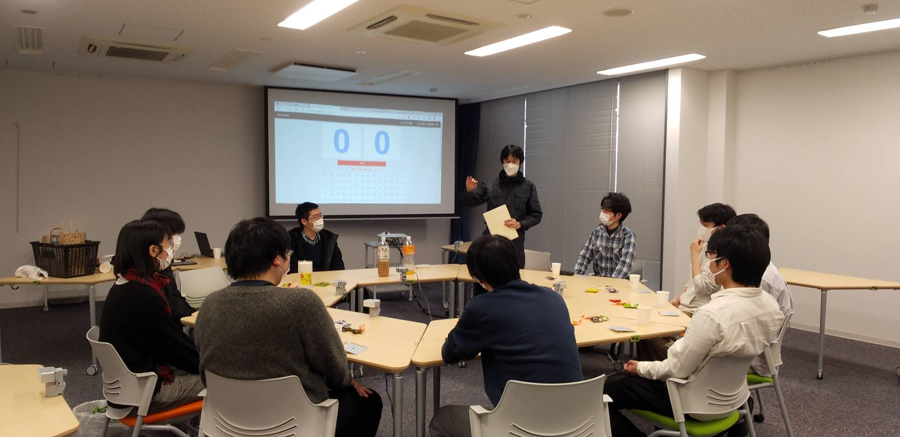

↓表彰状を贈呈中！
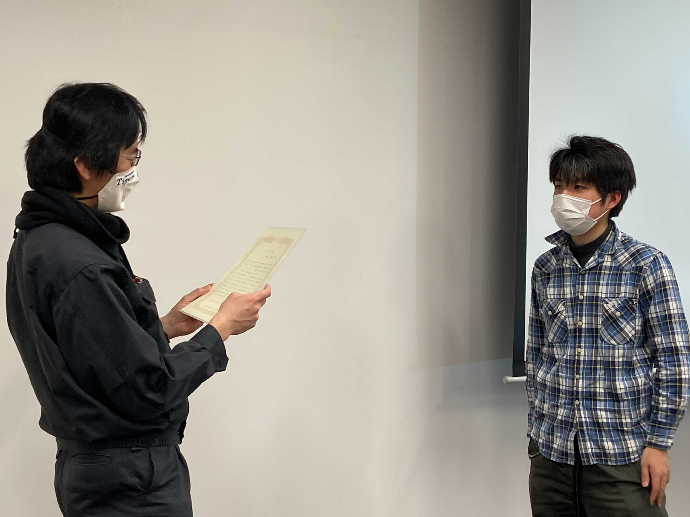
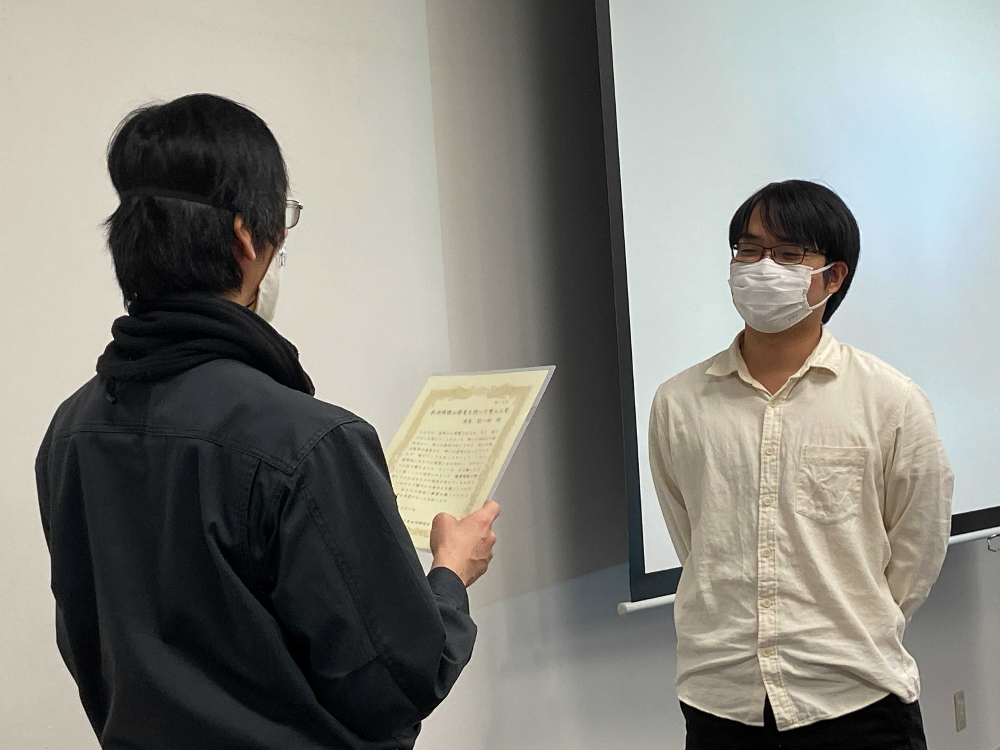
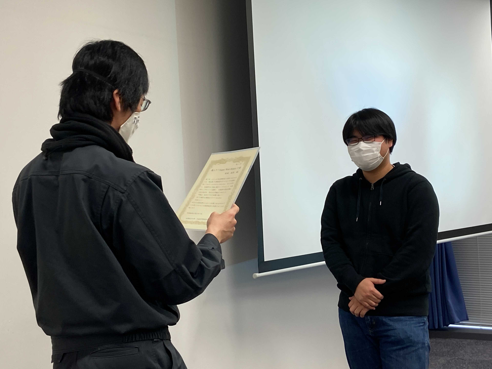
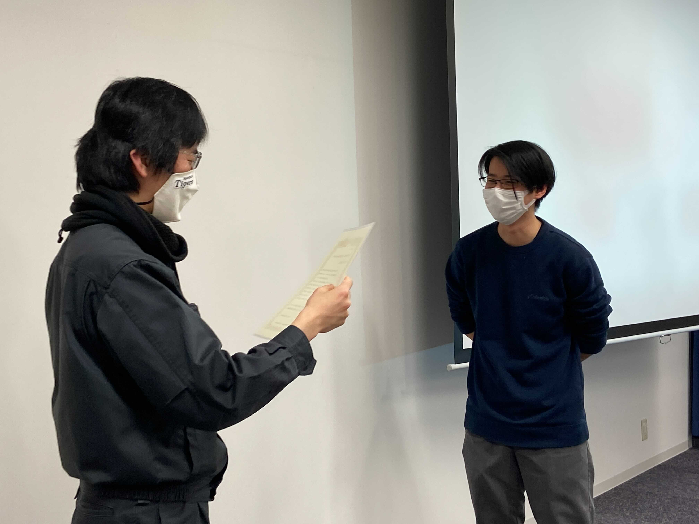
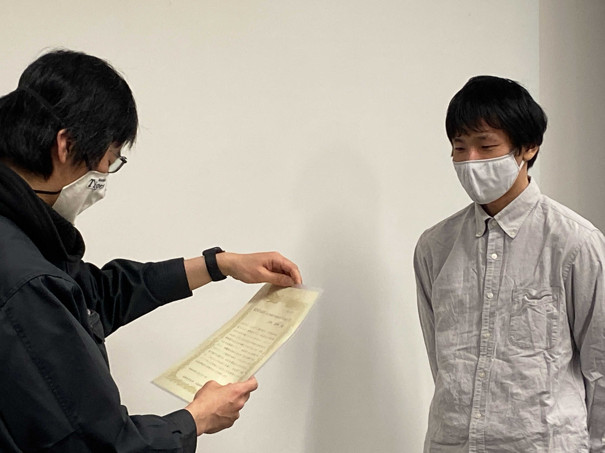
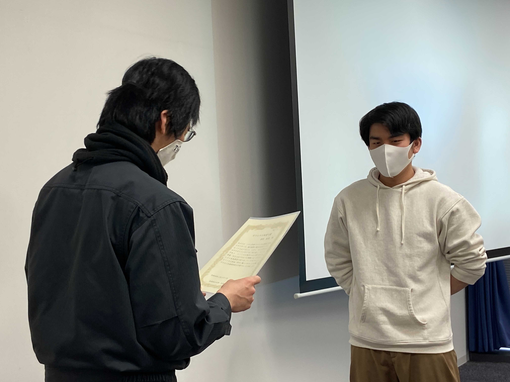
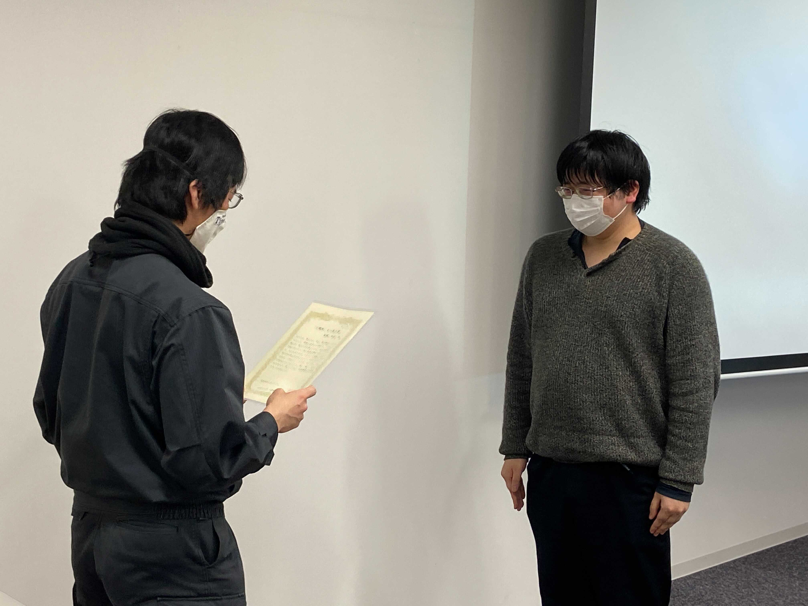

↓ビンゴ大会を企画しました！
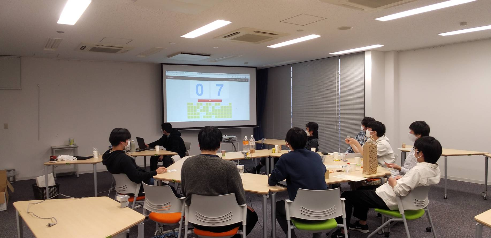

↓ビンゴ大会を企画しているM1の雄姿。
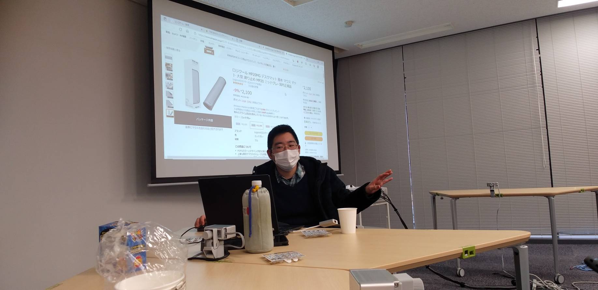

↓M2の先輩たちから先生にプレゼント！サプライズです。
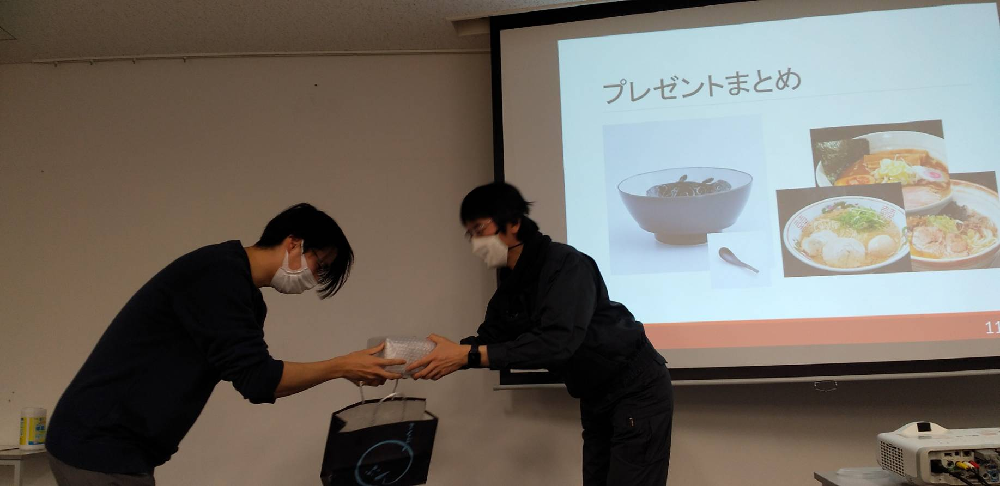

↓先生、嬉しそうです！
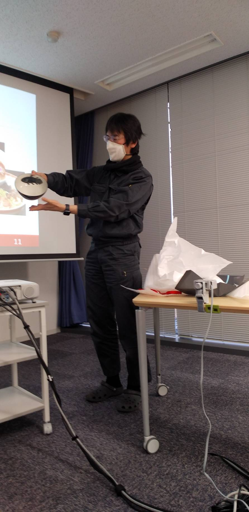

先輩方、2年間本当にお疲れ様でした！！
先輩方が研究のみではなく生活面まで相談に乗って下さったりと、本当に支えて頂きました！

私たちはいつでも皆さんの訪問を待っています！！
今後とも仲良くしてくださると嬉しいです！

<!-- 1. 論文採録バージョン -->
<!-- [第一著者]さんの論文が「[学会フルネーム]」に採録されました。 -->

<!-- [公式Webページ](学会公式ページTopのURL) -->

<!-- 書誌情報。書式はPublicationsを参考。変にコードブロックとかで囲まなくてOK -->

<!-- [年月日]に発表予定 -->

<!-- 2. 論文発表済みバージョン -->
<!-- [第一著者]さんが「[学会フルネーム]」で発表しました。 -->

<!-- [公式Webページ](学会公式ページTopのURL) -->

<!-- 書誌情報。書式はPublicationsを参考。変にコードブロックとかで囲まなくてOK -->

<!-- 3. 論文受賞バージョン -->
<!-- [第一著者]さんの論文が「[学会フルネーム]」で「[受賞名]」を受賞しました -->

<!-- [公式Webページ](学会公式ページTopのURL) -->

<!-- 書誌情報。書式はPublicationsを参考。変にコードブロックとかで囲まなくてOK -->

<!-- 同学会複数名の場合は並べて良い感じにして -->