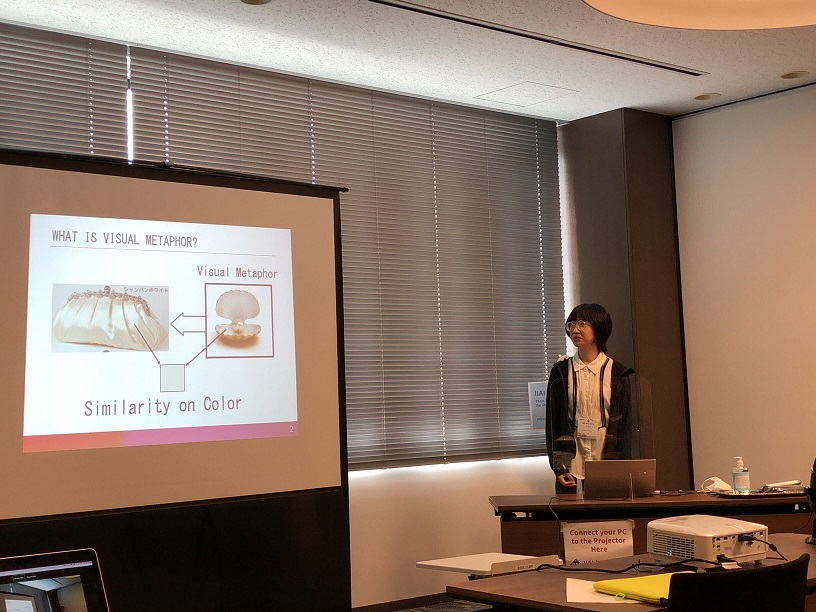

#### 日時：2022年7月4日（火）～7月6日（木）
#### 場所：ハイブリッド

<!--  -->

<!--  -->

三林　亮太さんと王　丹さんが「14th International Conference on E-Service and Knowledge Management (ESKM 2022)」で発表しました。
[公式Webページ](https://iaiai.org/conference/aai2022/conferences/eskm-2022/)

<!-- 発表日を記入するが、まだ未定 -->
2022年の7月4日～6日に発表。

3日間お疲れ様でした！

+ Ryota Mibayashi, Masaki Ueta, Takafumi Kawahara, Naoaki Matsumoto, Takuma Yoshimura, Kenro Aihara, Noriko Kando, Yoshiyuki Shoji, Yuta Nakajima, Takehiro Yamamoto, Yusuke Yamamoto and Hiroaki Ohshima: "MinpakuBERT: A Language Model for Understanding Cultural Properties in Museum", Proceedings of the 12th International Congress on Advanced Applied Informatics (IIAI-AAI 2022).
+ Wang Dan, Ryota Mibayashi and Hiroaki Ohshima: " Visual Metaphor Construction for Image and Description of Fashion Goods", Proceedings of the 12th International Congress on Advanced Applied Informatics (IIAI-AAI 2022).

<!-- 1. 論文採録バージョン -->
<!-- [第一著者]さんの論文が「[学会フルネーム]」に採録されました。 -->

<!-- [公式Webページ](学会公式ページTopのURL) -->

<!-- 書誌情報。書式はPublicationsを参考。変にコードブロックとかで囲まなくてOK -->

<!-- [年月日]に発表予定 -->

<!-- 2. 論文発表済みバージョン -->
<!-- [第一著者]さんが「[学会フルネーム]」で発表しました。 -->

<!-- [公式Webページ](学会公式ページTopのURL) -->

<!-- 書誌情報。書式はPublicationsを参考。変にコードブロックとかで囲まなくてOK -->

<!-- 3. 論文受賞バージョン -->
<!-- [第一著者]さんの論文が「[学会フルネーム]」で「[受賞名]」を受賞しました -->

<!-- [公式Webページ](学会公式ページTopのURL) -->

<!-- 書誌情報。書式はPublicationsを参考。変にコードブロックとかで囲まなくてOK -->

<!-- 同学会複数名の場合は並べて良い感じにして -->

<!-- 1. 論文採録バージョン -->
<!-- [第一著者]さんの論文が「[学会フルネーム]」に採録されました。 -->

<!-- [公式Webページ](学会公式ページTopのURL) -->

<!-- 書誌情報。書式はPublicationsを参考。変にコードブロックとかで囲まなくてOK -->

<!-- [年月日]に発表予定 -->

<!-- 2. 論文発表済みバージョン -->
<!-- [第一著者]さんが「[学会フルネーム]」で発表しました。 -->

<!-- [公式Webページ](学会公式ページTopのURL) -->

<!-- 書誌情報。書式はPublicationsを参考。変にコードブロックとかで囲まなくてOK -->

<!-- 3. 論文受賞バージョン -->
<!-- [第一著者]さんの論文が「[学会フルネーム]」で「[受賞名]」を受賞しました -->

<!-- [公式Webページ](学会公式ページTopのURL) -->

<!-- 書誌情報。書式はPublicationsを参考。変にコードブロックとかで囲まなくてOK -->

<!-- 同学会複数名の場合は並べて良い感じにして -->