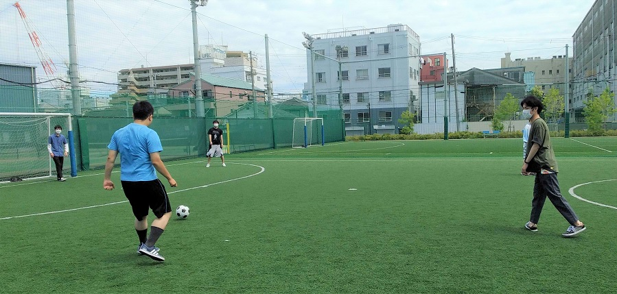
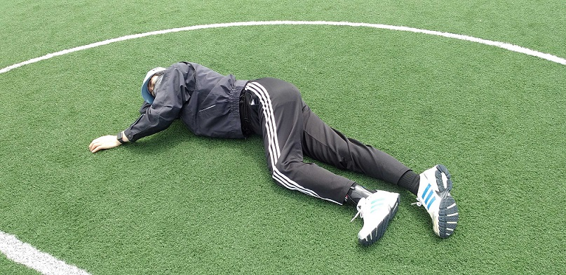
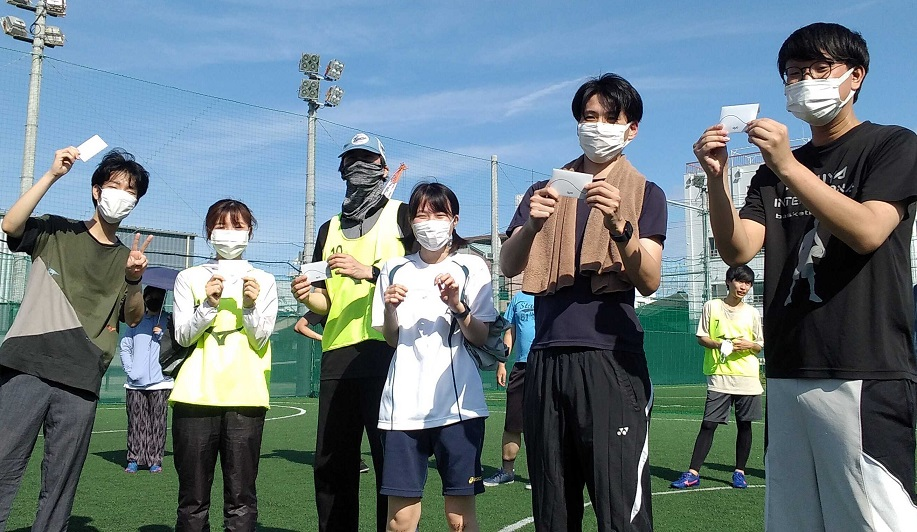
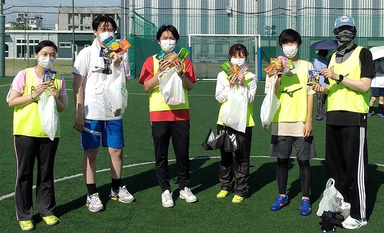
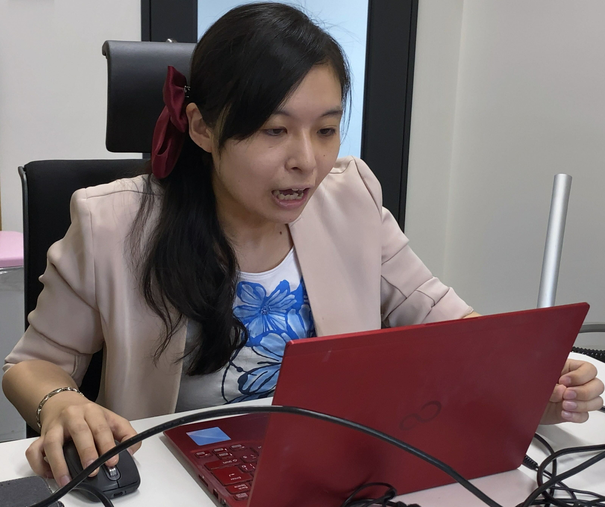

#### 日時：2022年6月22日（水）
#### 場所：ミズノスポーツプラザ神戸和田岬

大島研のメンバーでフットサルをしました。

天気予報では雨が降りそうで開催できるかどうか怪しかったのですが、当日になってみると無事に晴れ、開催することができました！

参加人数は18人！3チームに分かれ、総当たり戦をしました。

試合開始前、大島先生の無防備な姿。

  
優勝チームには景品が送られました。

楽しい1日でした！

<!-- 1. 論文採録バージョン -->
<!-- [第一著者]さんの論文が「[学会フルネーム]」に採録されました。 -->

<!-- [公式Webページ](学会公式ページTopのURL) -->

<!-- 書誌情報。書式はPublicationsを参考。変にコードブロックとかで囲まなくてOK -->

<!-- [年月日]に発表予定 -->

<!-- 2. 論文発表済みバージョン -->
<!-- [第一著者]さんが「[学会フルネーム]」で発表しました。 -->

<!-- [公式Webページ](学会公式ページTopのURL) -->

<!-- 書誌情報。書式はPublicationsを参考。変にコードブロックとかで囲まなくてOK -->

<!-- 3. 論文受賞バージョン -->
<!-- [第一著者]さんの論文が「[学会フルネーム]」で「[受賞名]」を受賞しました -->

<!-- [公式Webページ](学会公式ページTopのURL) -->

<!-- 書誌情報。書式はPublicationsを参考。変にコードブロックとかで囲まなくてOK -->

<!-- 同学会複数名の場合は並べて良い感じにして -->