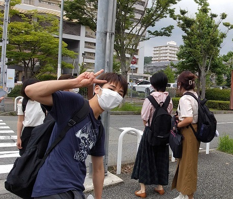
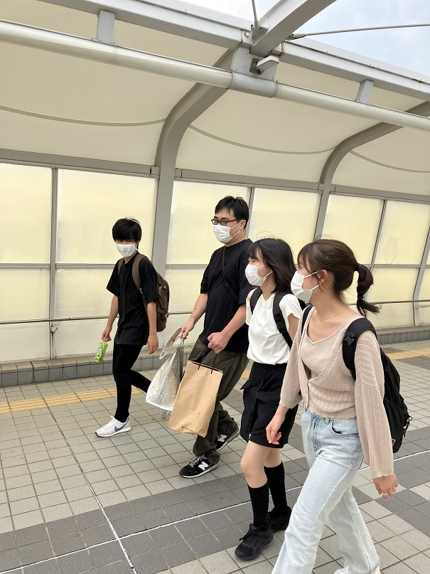
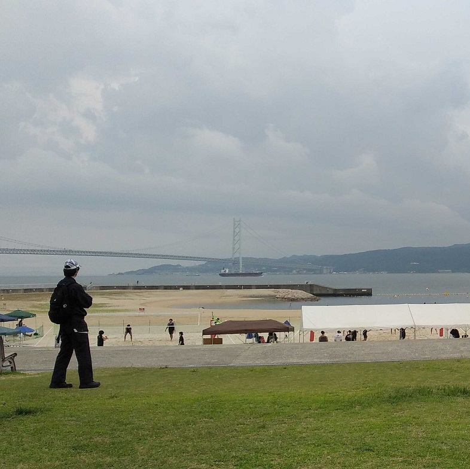
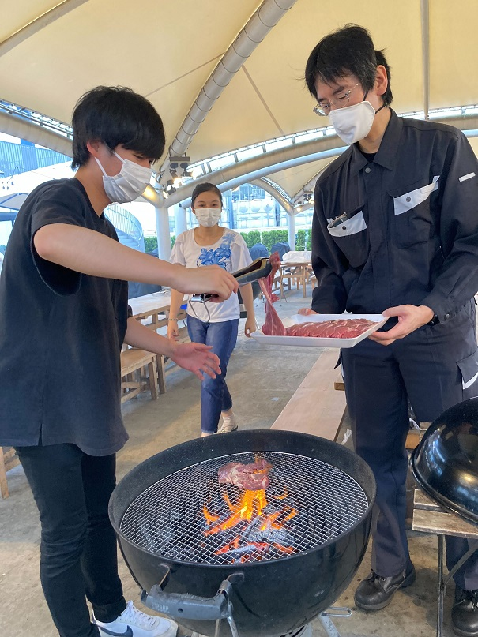
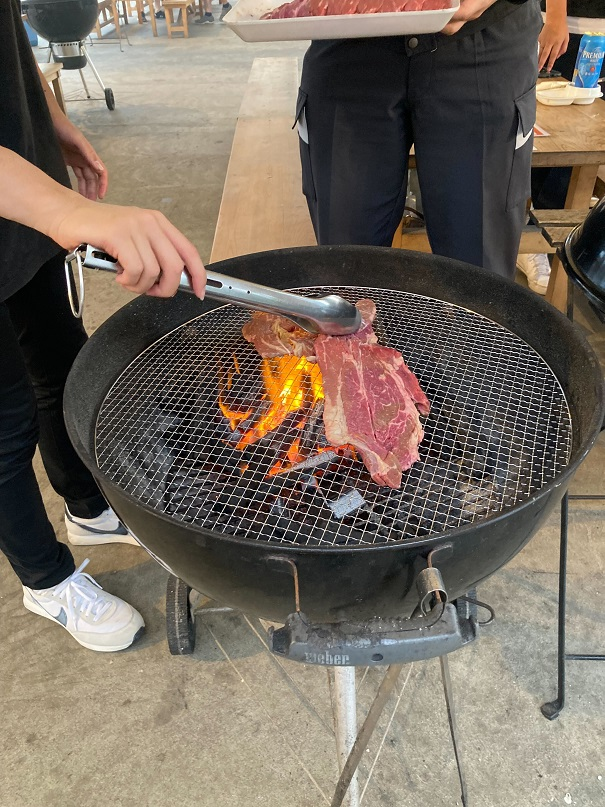
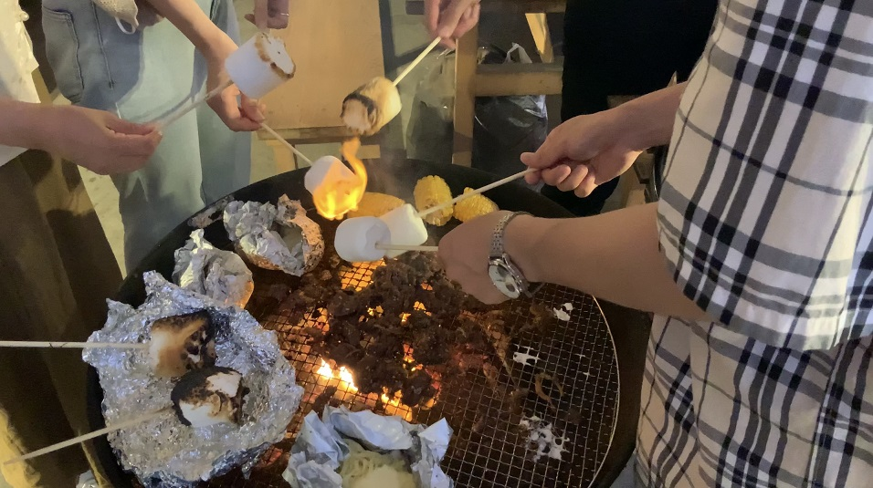

#### 日時：2022年7月15日（金）
#### 場所：大蔵海岸BBQ ZAZAZA

大島研のメンバーでBBQをしました。

徒歩で最寄りの学園都市駅へ。そこからはバスを使いました。

やって来たのは「大蔵海岸BBQ ZAZAZA」。朝霧駅前にあり、瀬戸内海が一望できます。

  
大量の肉を焼いていきます。

燃えるマシュマロ

イベント係の皆様、楽しい企画をありがとうございました！

<!-- 1. 論文採録バージョン -->
<!-- [第一著者]さんの論文が「[学会フルネーム]」に採録されました。 -->

<!-- [公式Webページ](学会公式ページTopのURL) -->

<!-- 書誌情報。書式はPublicationsを参考。変にコードブロックとかで囲まなくてOK -->

<!-- [年月日]に発表予定 -->

<!-- 2. 論文発表済みバージョン -->
<!-- [第一著者]さんが「[学会フルネーム]」で発表しました。 -->

<!-- [公式Webページ](学会公式ページTopのURL) -->

<!-- 書誌情報。書式はPublicationsを参考。変にコードブロックとかで囲まなくてOK -->

<!-- 3. 論文受賞バージョン -->
<!-- [第一著者]さんの論文が「[学会フルネーム]」で「[受賞名]」を受賞しました -->

<!-- [公式Webページ](学会公式ページTopのURL) -->

<!-- 書誌情報。書式はPublicationsを参考。変にコードブロックとかで囲まなくてOK -->

<!-- 同学会複数名の場合は並べて良い感じにして -->