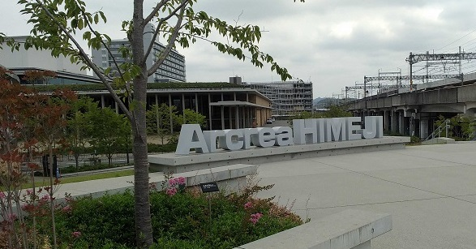
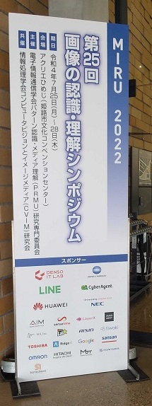
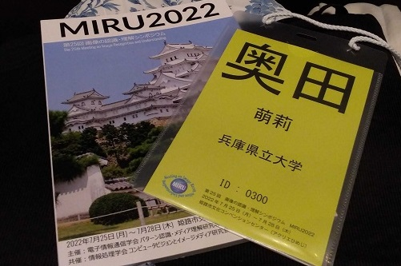

#### 日時：2022年7月25日（月）～7月28日（木）
#### 場所：姫路市文化コンベンションセンター  アクリエひめじ （ハイブリッド開催）

M2の奥田萌莉です。

7月25日から7月28日に行われたMIRU2022でポスター発表を行いました。

私にとって、初めての現地開催での発表でした！

たくさんの知り合いができ、多くの方々にポスターを見に来て頂けて、刺激になりました！

書誌情報は以下の通りです。
+ 奥田萌莉, 大島裕明：「多様な特徴に基づく葉の分類」, 第25回 画像の認識・理解シンポジウム（MIRU2022）, 2022年7月.

今後もこのような場で対面で議論できることを楽しみにしつつ、今後も頑張ります。

<!-- 1. 論文採録バージョン -->
<!-- [第一著者]さんの論文が「[学会フルネーム]」に採録されました。 -->

<!-- [公式Webページ](学会公式ページTopのURL) -->

<!-- 書誌情報。書式はPublicationsを参考。変にコードブロックとかで囲まなくてOK -->

<!-- [年月日]に発表予定 -->

<!-- 2. 論文発表済みバージョン -->
<!-- [第一著者]さんが「[学会フルネーム]」で発表しました。 -->

<!-- [公式Webページ](学会公式ページTopのURL) -->

<!-- 書誌情報。書式はPublicationsを参考。変にコードブロックとかで囲まなくてOK -->

<!-- 3. 論文受賞バージョン -->
<!-- [第一著者]さんの論文が「[学会フルネーム]」で「[受賞名]」を受賞しました -->

<!-- [公式Webページ](学会公式ページTopのURL) -->

<!-- 書誌情報。書式はPublicationsを参考。変にコードブロックとかで囲まなくてOK -->

<!-- 同学会複数名の場合は並べて良い感じにして -->