#### 日時：2022年9月11日（日）～13日（火）
#### 場所：神戸市立自然の家

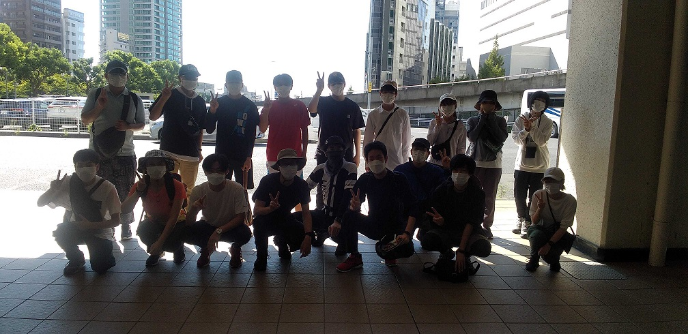
2022年8月17日、神戸市立自然の家へ講座旅行に行ってきました！

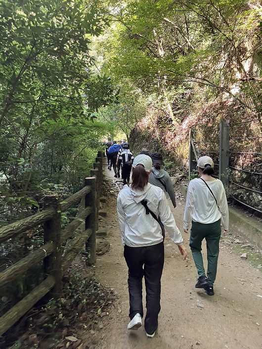

1日目は山登り。新神戸駅から布引の滝を経由して、摩耶山の掬星台へ。

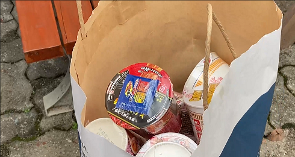
いろいろハプニングはあったものの、山を登り切って、自然の家に向かったら、カップヌードルを用意してくれました！

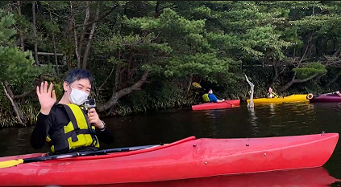
その後、カヌーをしました！

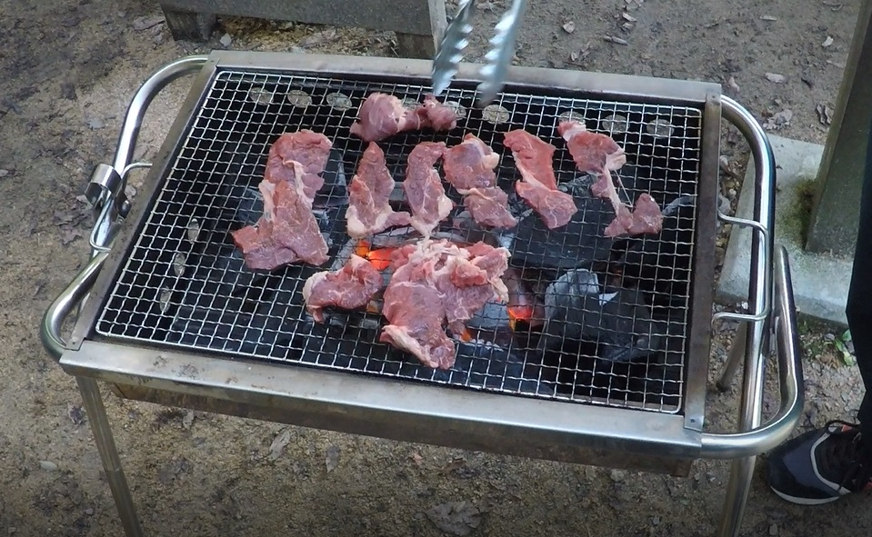
夕食はBBQ！肉がおいしかったです！

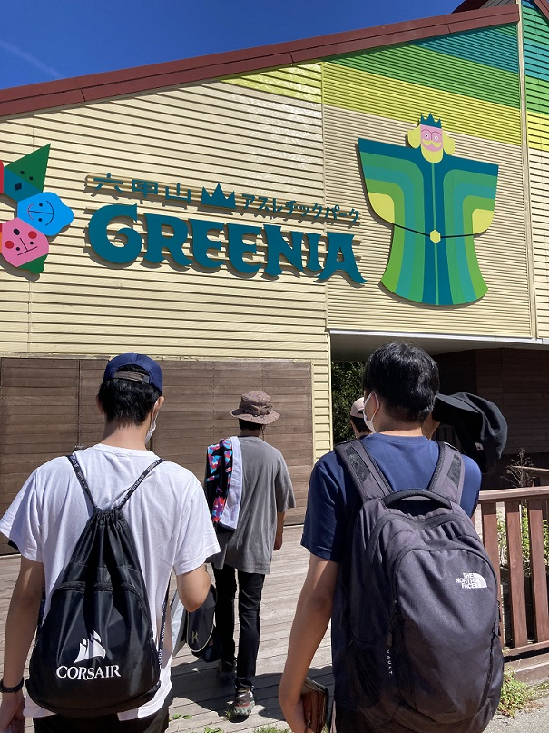
おはようございます。2日目は朝から六甲山アスレチックパークGREENIAへ行ってきました！

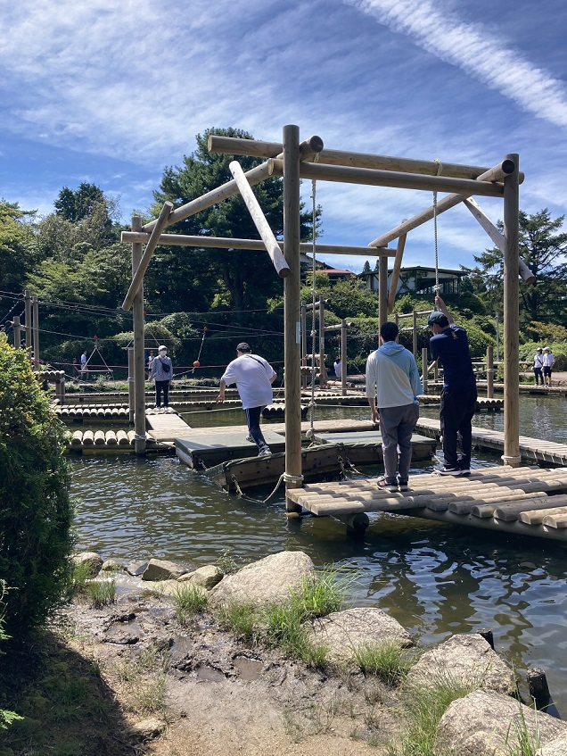
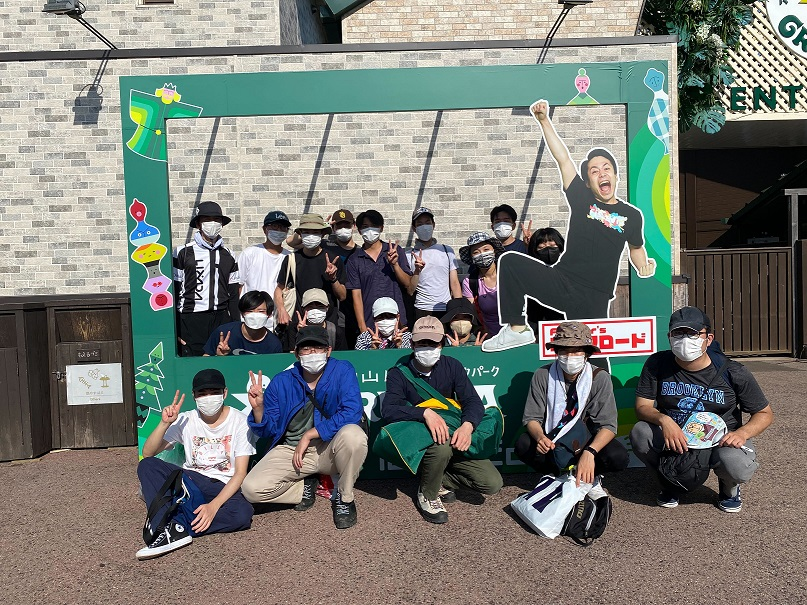
六甲山アスレチックパークでは、とにかく遊び、濡れました。。

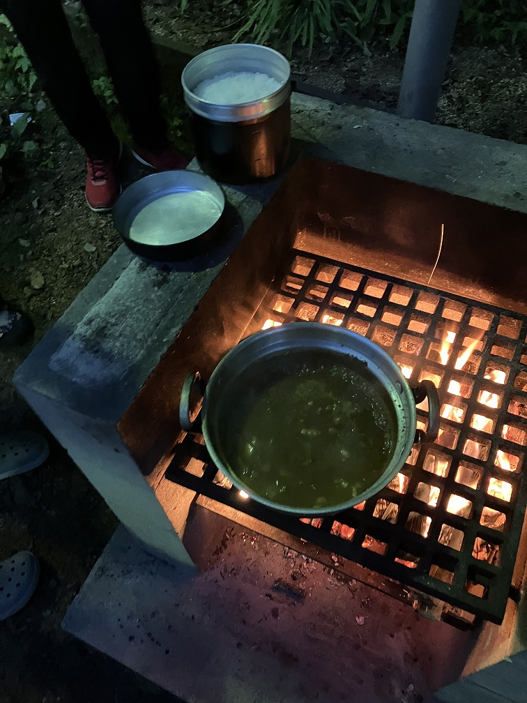
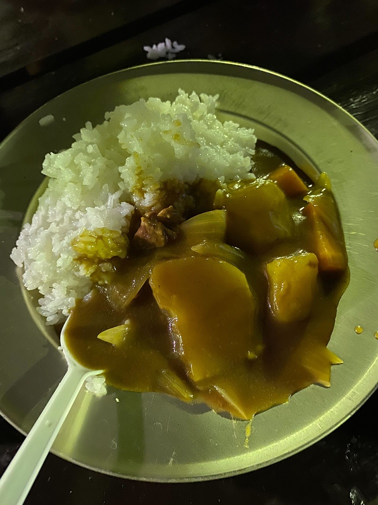
バスで帰って、その後、飯盒炊爨でした。
カレーを作りましたが、点火が大変でした。

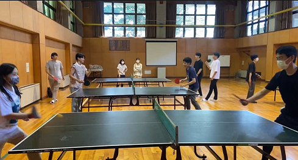
3日目の朝は、卓球をしました。

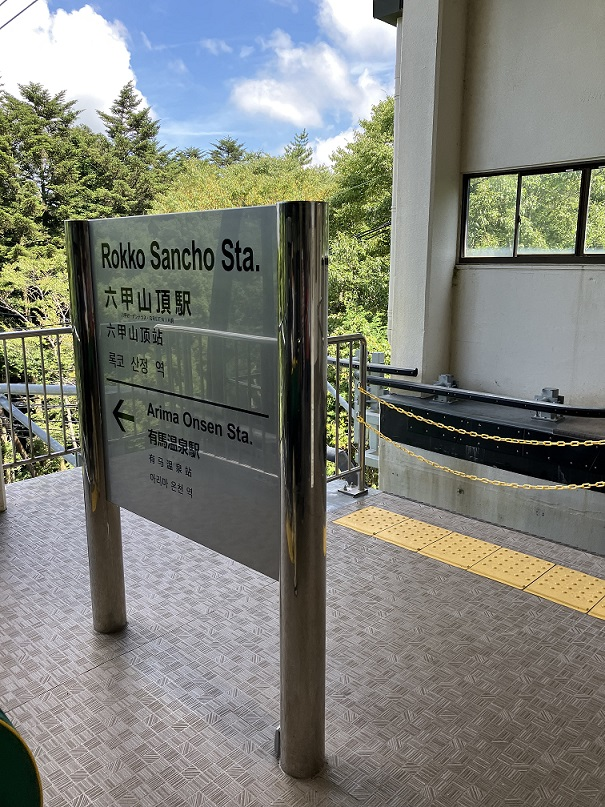
卓球後、自然の家から離れ、バスとロープウェイで有馬温泉へ。

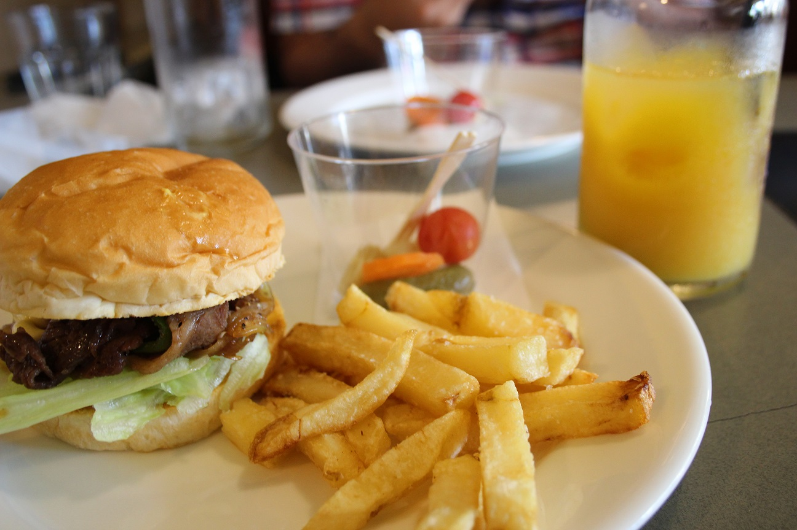
そこで食べたハンバーガーが美味しかったです！

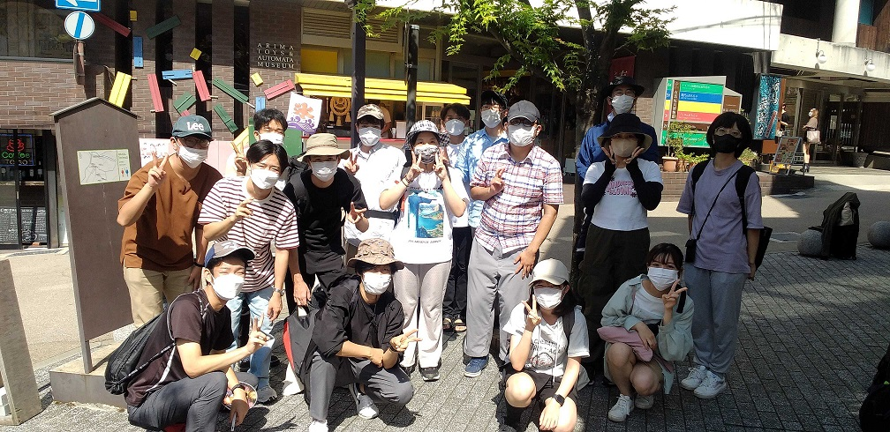
その後、現地解散しました！お疲れ様でした！

<!-- 1. 論文採録バージョン -->
<!-- [第一著者]さんの論文が「[学会フルネーム]」に採録されました。 -->

<!-- [公式Webページ](学会公式ページTopのURL) -->

<!-- 書誌情報。書式はPublicationsを参考。変にコードブロックとかで囲まなくてOK -->

<!-- [年月日]に発表予定 -->

<!-- 2. 論文発表済みバージョン -->
<!-- [第一著者]さんが「[学会フルネーム]」で発表しました。 -->

<!-- [公式Webページ](学会公式ページTopのURL) -->

<!-- 書誌情報。書式はPublicationsを参考。変にコードブロックとかで囲まなくてOK -->

<!-- 3. 論文受賞バージョン -->
<!-- [第一著者]さんの論文が「[学会フルネーム]」で「[受賞名]」を受賞しました -->

<!-- [公式Webページ](学会公式ページTopのURL) -->

<!-- 書誌情報。書式はPublicationsを参考。変にコードブロックとかで囲まなくてOK -->

<!-- 同学会複数名の場合は並べて良い感じにして -->