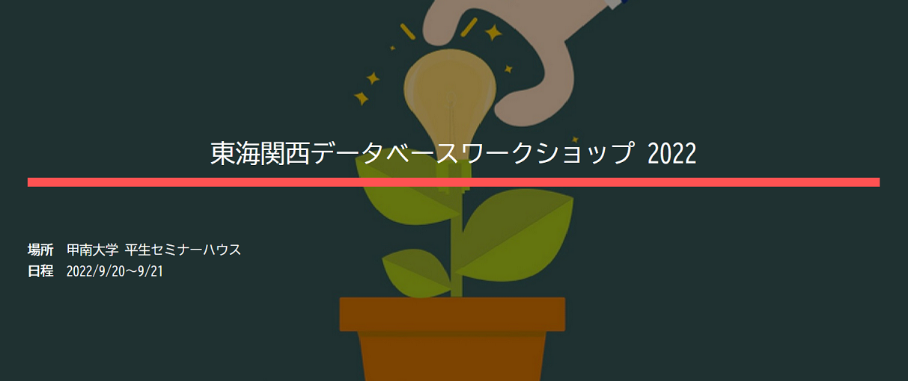
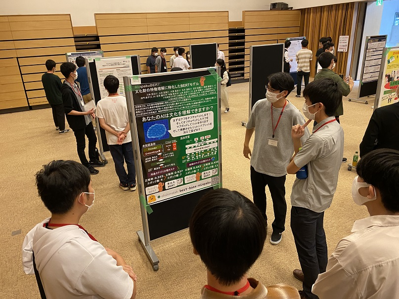
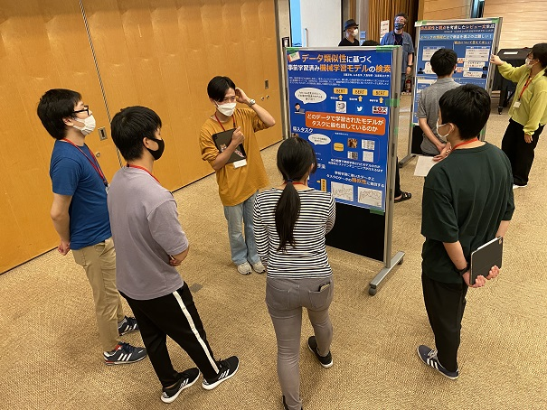
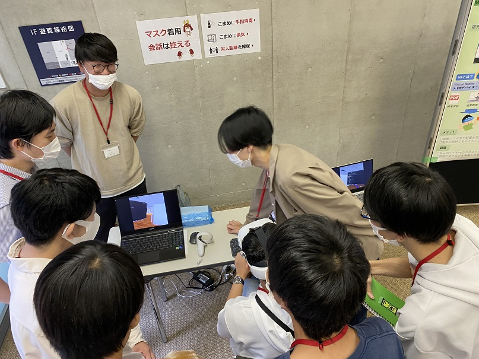

#### 日時：2022年9月20日（火）～9月21日（水）
#### 場所：甲南大学 平生セミナーハウス

上記日程にて、大島研のメンバーが東海関西データベースワークショップ 2022に参加しました。

他大学の学生と研究について意見を交わすことができる貴重な場でした。

また、桑田 若菜さん、芦澤 亜里紗さん、髙嶋 優快さん、西本 海生さん、津田 裕哉さんが優秀学生プレゼンテーション賞を受賞しました。

おめでとうございます！

### 発表タイトル

- 三林 亮太, MinpakuBERT：文化財の特徴理解に特化したBERTモデル, 第7回東海関西データベースワークショップ, 2022年
- 奥田 萌莉, 画像認識によるウキクサ科植物の総枚数と表面積の推定, 第7回東海関西データベースワークショップ, 2022年
- 古屋 昭拓, 特許文書を用いた用途の関係理解に基づく物質の新たな用途の発見, 第7回東海関西データベースワークショップ, 2022年
- 王 丹, ファッション商品における視覚的比喩データセットの構築とその応用, 第7回東海関西データベースワークショップ, 2022年
- 伊藤 優真, 意味類似性に基づく細粒度の観点をクエリとした小説検索, 第7回東海関西データベースワークショップ, 2022年
- 奥村 笑大, VRにおけるオンライン授業受講環境, 第7回東海関西データベースワークショップ, 2022年
- 髙嶋 優快, Transformer Encoderによる場所説明文からの位置推定, 第7回東海関西データベースワークショップ, 2022年
- 谷口 明徳, 地物の位置説明に役立つランドマークの発見, 第7回東海関西データベースワークショップ, 2022年
- 張 雯佳, PCログからのタスク認識に基づく行動推薦, 第7回東海関西データベースワークショップ, 2022年
- 津田 裕哉, MRデバイスによる物理インタラクションを交えたタスク処理システム, 第7回東海関西データベースワークショップ, 2022年
- 西本 海生, ゲーミフィケーションによる共通点を持つ展示物の推薦に基づく博物館での興味喚起, 第7回東海関西データベースワークショップ, 2022年
- 日置 淳也, データ類似性に基づく事前学習済み機械学習モデルの検索, 第7回東海関西データベースワークショップ, 2022年
- 芦澤 亜里紗, 食品レビューにおける観点抽出とその検索への応用, 第7回東海関西データベースワークショップ, 2022年
- 桑田 若菜, Transformer Encoderによる書家俵越山を模倣した書道作品生成, 第7回東海関西データベースワークショップ, 2022年
- 狹間 亮太朗, スマートウォッチで取得される断続的な心拍データからのストレス推定, 第7回東海関西データベースワークショップ, 2022年
- 花谷 翔, 特許マイニングによる重要な特許の発見, 第7回東海関西データベースワークショップ, 2022年
- 眞鍋 陽向, Transformer Encoderによるプラズマ乱流モデルの構築, 第7回東海関西データベースワークショップ, 2022年

皆さんお疲れさまでした！

[公式webページ](https://sites.google.com/mil.doshisha.ac.jp/dbws2022/) 

<!-- 1. 論文採録バージョン -->
<!-- [第一著者]さんの論文が「[学会フルネーム]」に採録されました。 -->

<!-- [公式Webページ](学会公式ページTopのURL) -->

<!-- 書誌情報。書式はPublicationsを参考。変にコードブロックとかで囲まなくてOK -->

<!-- [年月日]に発表予定 -->

<!-- 2. 論文発表済みバージョン -->
<!-- [第一著者]さんが「[学会フルネーム]」で発表しました。 -->

<!-- [公式Webページ](学会公式ページTopのURL) -->

<!-- 書誌情報。書式はPublicationsを参考。変にコードブロックとかで囲まなくてOK -->

<!-- 3. 論文受賞バージョン -->
<!-- [第一著者]さんの論文が「[学会フルネーム]」で「[受賞名]」を受賞しました -->

<!-- [公式Webページ](学会公式ページTopのURL) -->

<!-- 書誌情報。書式はPublicationsを参考。変にコードブロックとかで囲まなくてOK -->

<!-- 同学会複数名の場合は並べて良い感じにして -->