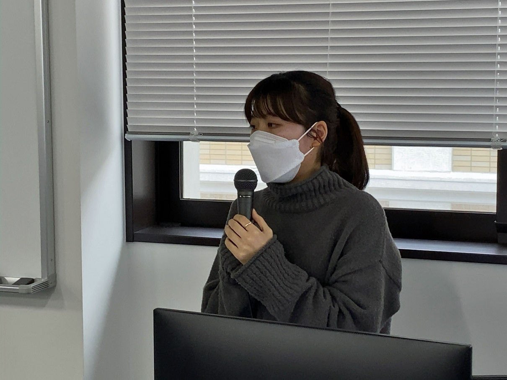
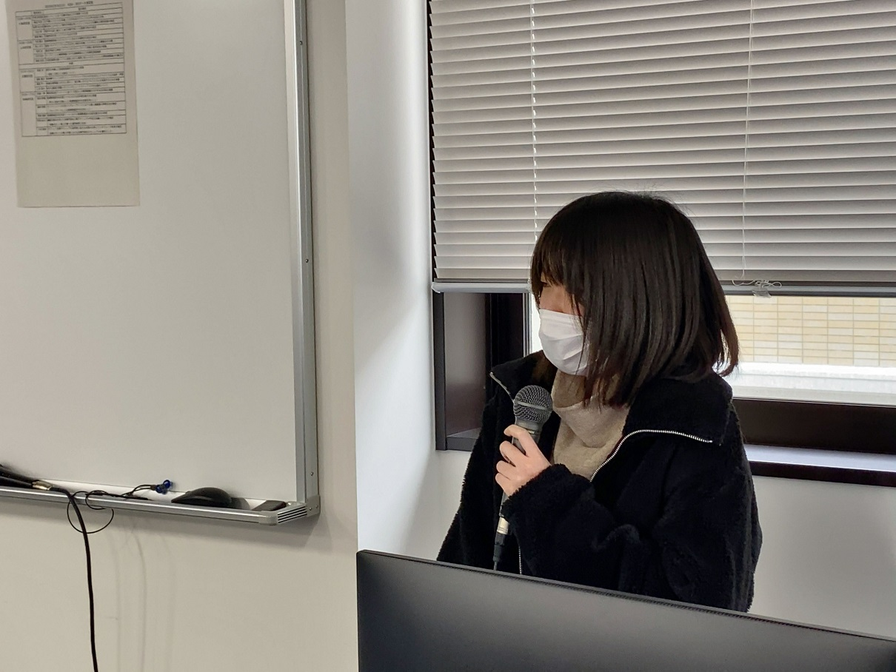
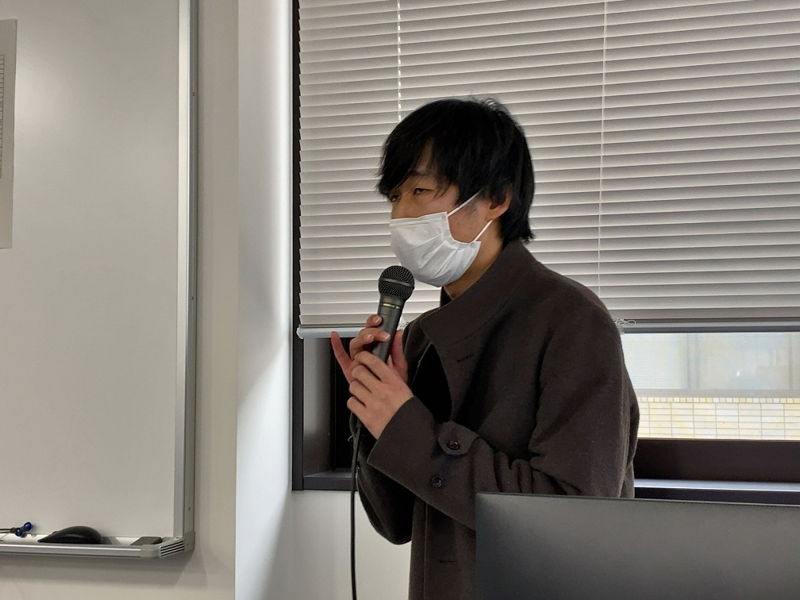
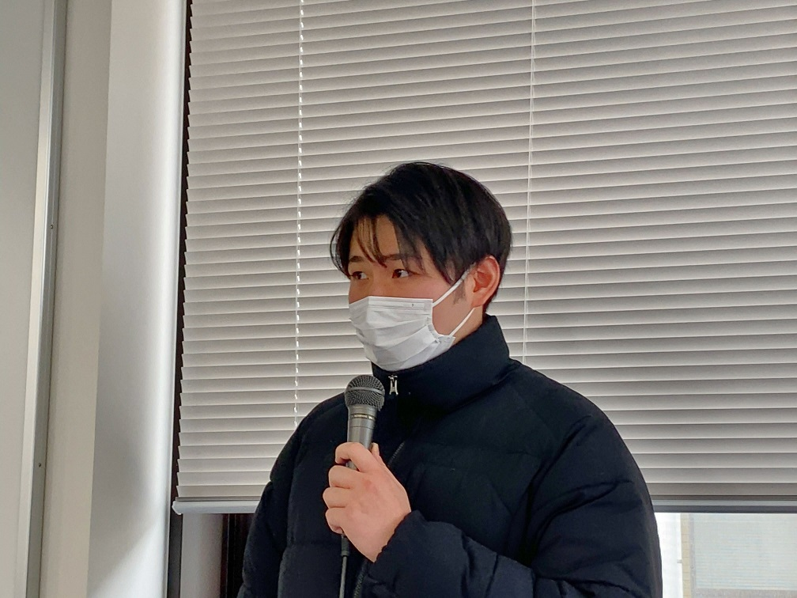
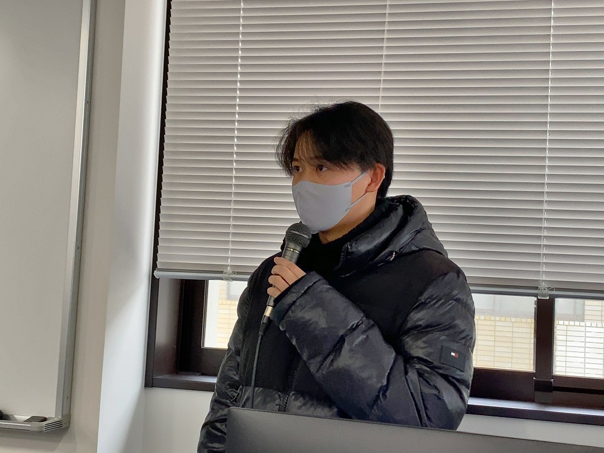

#### 日時：2023年2月16日（木）～2月17日（金）
#### 場所：神戸商科キャンパス

上記日程にて、大島研究室からは学部4年生5人が卒業研究報告を行いました。

卒業研究報告会は2日間開催され、1人あたり発表5分、質疑5分でした。

研究室ごとに発表を行い、大島研究室は1日目のトップバッターでした。

みんな多かれ少なかれ緊張していましたが、無事発表を終えることができました。

お疲れ様でした！

