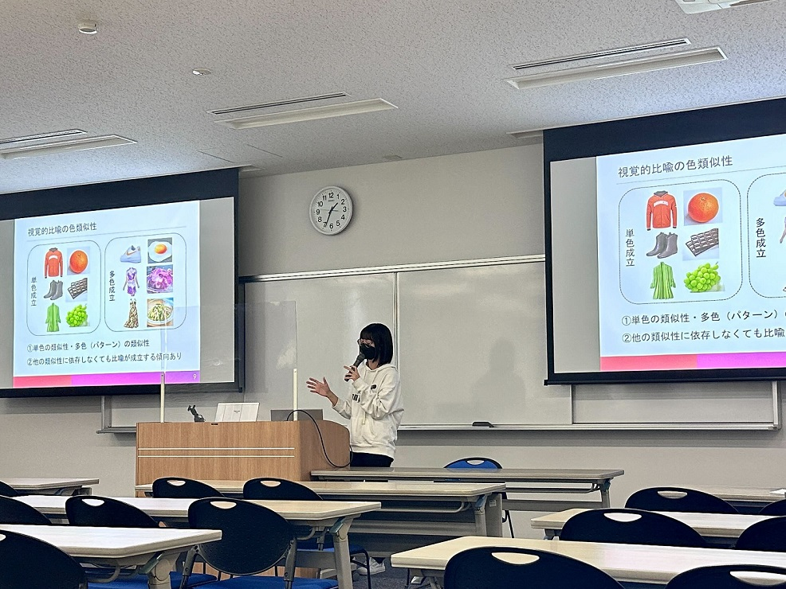
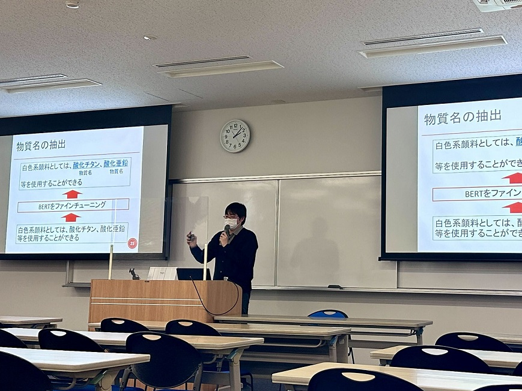

#### 日時：2023年2月20日（月）～2月21日（火）
#### 場所：神戸情報科学キャンパス

上記日程にて、大島研究室からは修士2年生3人が修士論文発表を行いました。

修士論文発表会は2日間開催され、1人あたり発表20分、質疑10分でした。

研究室ごとに発表を行い、大島研究室の発表は2日目の午後の部でした。

質疑応答では、それぞれの研究についての鋭いご指摘をいただきました。

修士研究の締めくくりと言える修士論文発表会で、無事発表を終えられました。

お疲れ様でした！

<!--  -->

