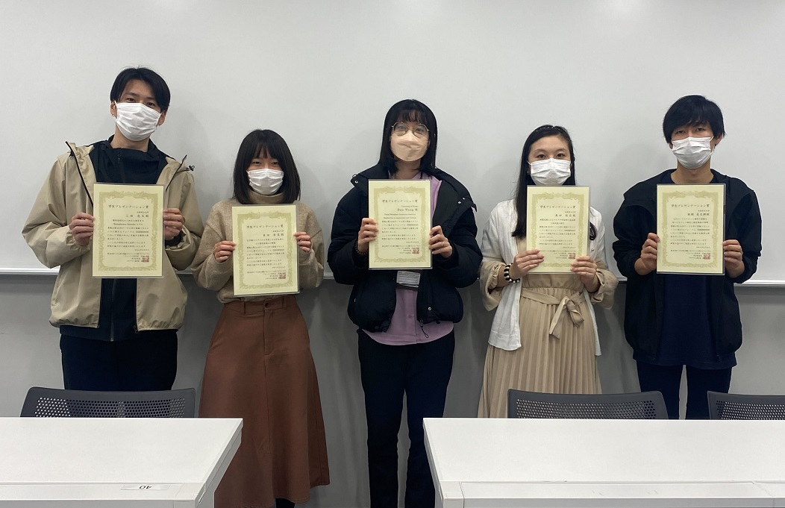
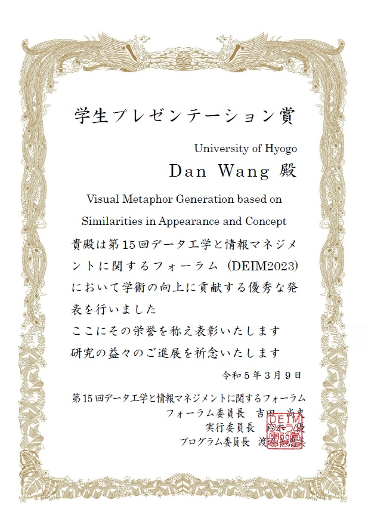
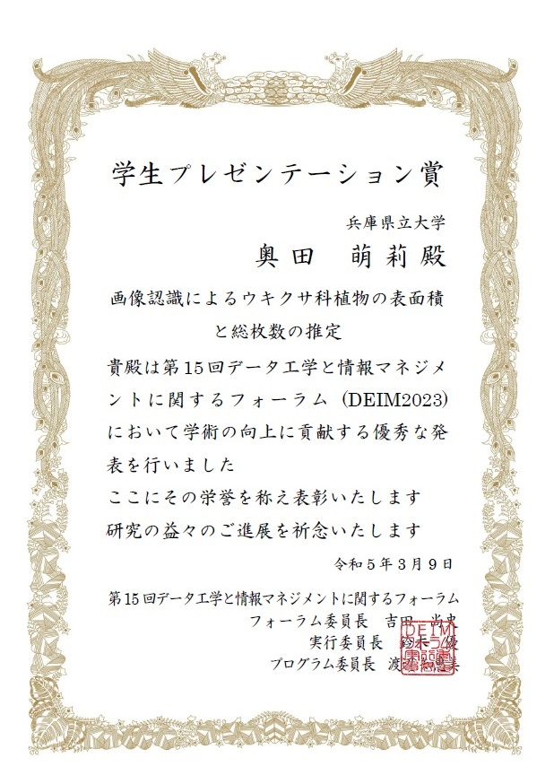
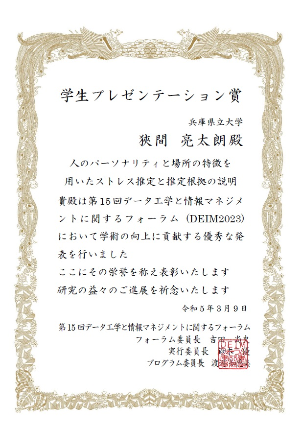
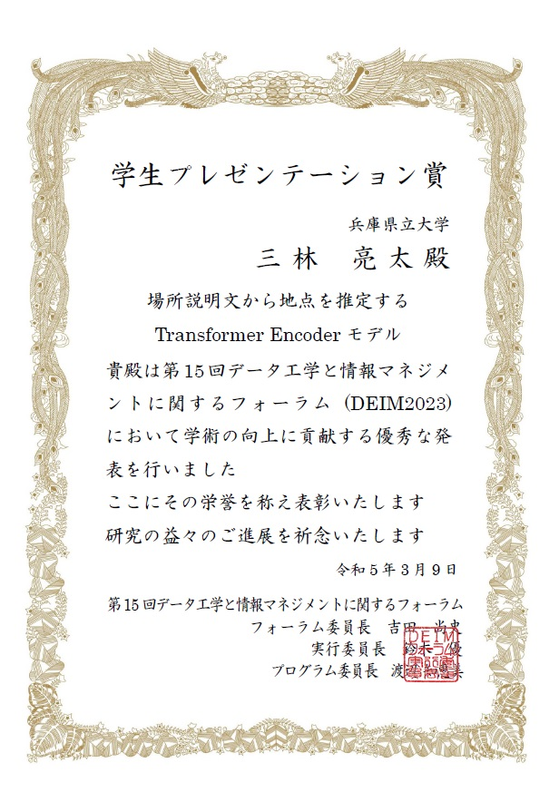
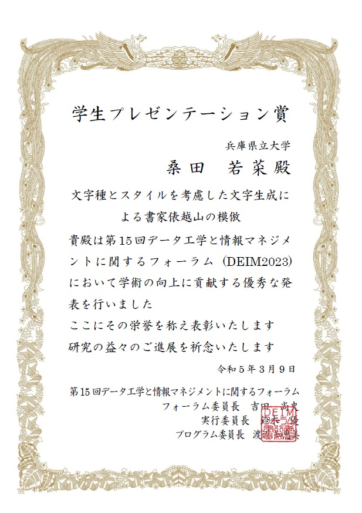
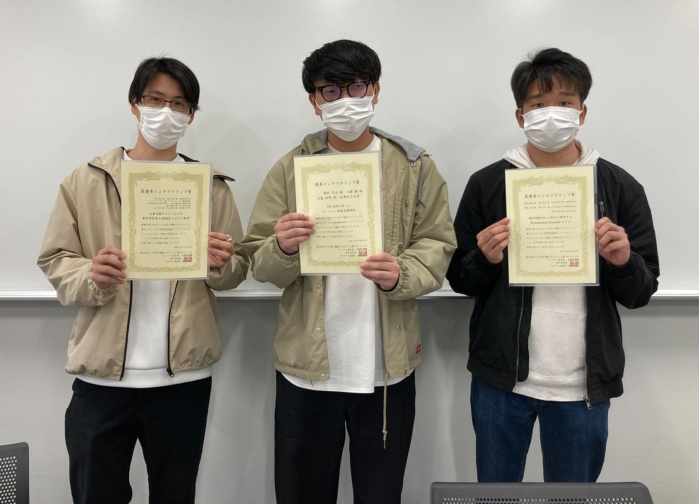
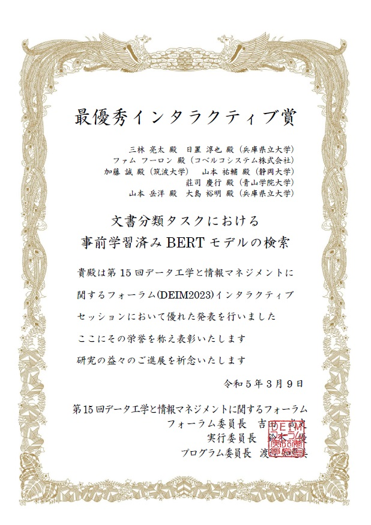
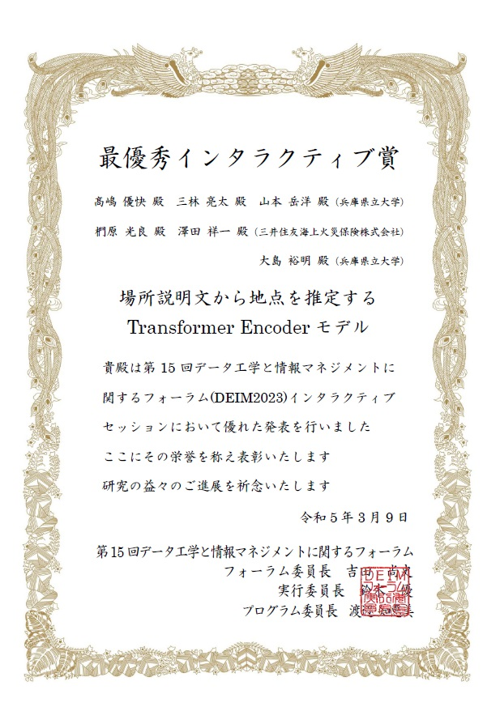
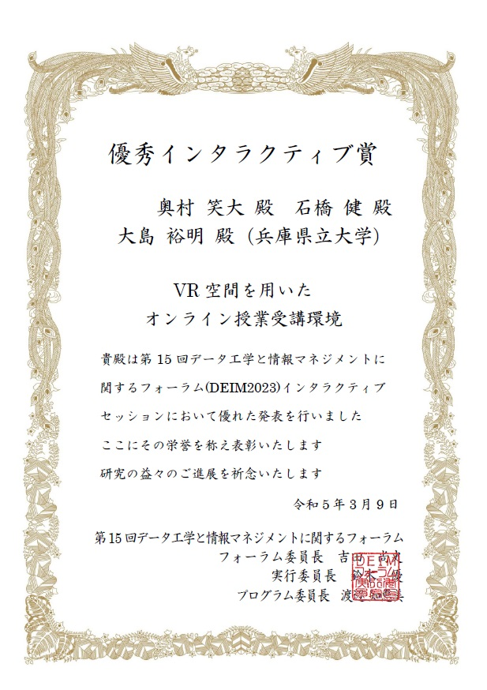

#### 日時：2023年3月5日（日）～3月9日（木）
#### 場所：Zoomと長良川国際会議場

大島研究室のメンバーがDEIM2023で発表しました。

+ [1] 	三林 亮太, 日置 淳也, ファム フーロン, 加藤 誠, 山本 祐輔, 莊司 慶行, 山本 岳洋, 大島 裕明: 「文書分類タスクにおける事前学習済みBERTモデルの検索」, 日本データベース学会, 第15回データ工学と情報マネジメントに関するフォーラム (DEIM Forum 2023), 2023年3月.
+ [2] 	奥田 萌莉, 石澤 秀紘, 大島 裕明: 「画像認識によるウキクサ科植物の表面積と総枚数の推定」, 日本データベース学会, 第15回データ工学と情報マネジメントに関するフォーラム (DEIM Forum 2023), 2023年3月.
+ [3] 	古屋 昭拓, 山本 岳洋,  窪内 将隆, 大島 裕明: 「特許マイニングによる類似度推定に基づく物質の新たな用途の発見」, 日本データベース学会, 第15回データ工学と情報マネジメントに関するフォーラム (DEIM Forum 2023), 2023年3月.
+ [4] 	Dan Wang, Ryota Mibayashi, Hiroaki Ohshima: 「Visual Metaphor Generation based on Similarities in Appearance and Concept」, 日本データベース学会, 第15回データ工学と情報マネジメントに関するフォーラム (DEIM Forum 2023), 2023年3月.
+ [5] 	奥村 笑大, 石橋 健, 大島 裕明: 「VR空間を用いたオンライン授業受講環境」, 日本データベース学会, 第15回データ工学と情報マネジメントに関するフォーラム (DEIM Forum 2023), 2023年3月.
+ [6] 	高嶋 優快, 三林 亮太, 山本 岳洋, 澤田 祥一, 椚原 光良, 大島 裕明: 「場所説明文から地点を推定するTransformer Encoderモデル」, 日本データベース学会, 第15回データ工学と情報マネジメントに関するフォーラム (DEIM Forum 2023), 2023年3月.
+ [7] 	Wenjia Zhang, Yoshiyuki Shoji, Hiroaki Ohshima: 「Recommendation of Revisiting Web Pages related to Currently browsing Web Pages」, 日本データベース学会, 電子情報通信学会, 情報処理学会, 第15回データ工学と情報マネジメントに関するフォーラム (DEIM Forum 2023), 2023年3月.
+ [8] 	津田 裕哉, 石橋 健, 大島 裕明 : 「MRデバイス環境における物理インタラクションを伴う日常タスク処理」, 日本データベース学会, 第15回データ工学と情報マネジメントに関するフォーラム (DEIM Forum 2023), 2023年3月.
+ [9] 	西本 海生, 相原 健郎, 神門 典子, 莊司 慶行, 山本 祐輔, 山本 岳洋, 大島 裕明: 「位置情報を用いたビンゴゲームによる共通点を持つ展示物の推薦」, 日本データベース学会, 第15回データ工学と情報マネジメントに関するフォーラム (DEIM Forum 2023), 2023年3月.
+ [10] 	日置 淳也, 三林 亮太, 山本 岳洋, 窪内 将隆, 大島 裕明: 「インスタンスセグメンテーションおけるデータ類似性に基づく転移学習済みモデルの検索」, 日本データベース学会, 第15回データ工学と情報マネジメントに関するフォーラム (DEIM Forum 2023), 2023年3月.
+ [11] 芦澤 亜里紗, 瀧田 愼, 大島 裕明: 「食品レビューにおける観点抽出とその検索への応用」, 日本データベース学会, 第15回データ工学と情報マネジメントに関するフォーラム (DEIM Forum 2023), 2023年3月.
+ [12] 	桑田 若菜, 三林 亮太, 谷 雅德, 大島 裕明: 「文字種とスタイルを考慮した文字生成による書家俵越山の模倣」, 日本データベース学会, 第15回データ工学と情報マネジメントに関するフォーラム (DEIM Forum 2023), 2023年3月.
+ [13] 	狹間 亮太朗, 和田 真弥, 瀧田 愼, 大島 裕明: 「人のパーソナリティと場所の特徴を用いたストレス推定と推定根拠の説明」, 日本データベース学会 , 第15回データ工学と情報マネジメントに関するフォーラム (DEIM Forum 2023), 2023年3月.
+ [14] 	花谷 翔, 古屋 昭拓, 大島 裕明: 「特許中の語に着目した被引用数予測による重要な特許の発見」, 日本データベース学会 , 第15回データ工学と情報マネジメントに関するフォーラム (DEIM Forum 2023), 2023年3月.
+ [15] 	眞鍋 陽向, 三林 亮太, 沼田 龍介, 山本 岳洋, 大島 裕明: 「Transformer Encoderを用いたプラズマ乱流の予測と分析」, 日本データベース学会 , 第15回データ工学と情報マネジメントに関するフォーラム (DEIM Forum 2023), 2023年3月.

また、王さん、奥田さん、狹間さん、三林さん、桑田さんの5名が学生プレゼンテーション賞を受賞しました！

おめでとうございます！

さらに、三林さんらの研究と、高嶋さんらの研究が最優秀インタラクティブ賞を、奥村さんらの研究が優秀インタラクティブ賞を受賞しました！

おめでとうございます！