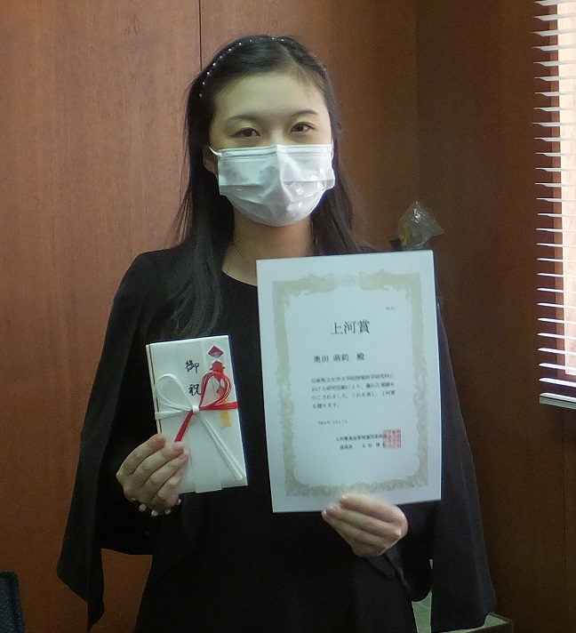
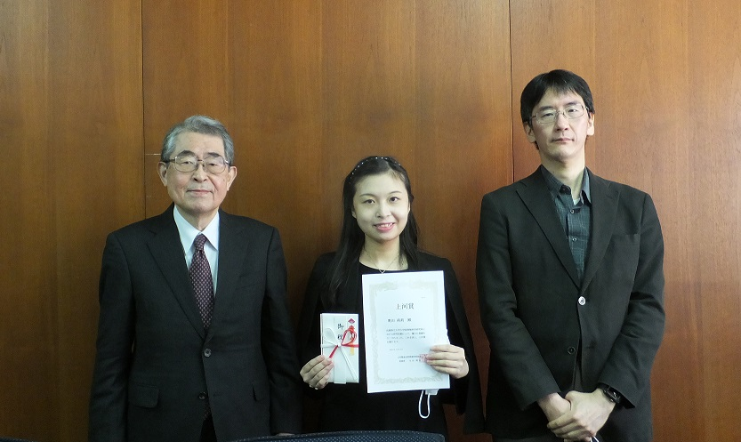

#### 日時：2023年3月27日（月）
#### 場所：神戸商科キャンパス

D1の奥田萌莉です。

このたび、上河賞を受賞いたしました。
上河賞とは、兵庫県立大学神戸商科キャンパスの大学院学生および同修了生の研究論文のうち、査読付き学術専門誌に掲載または掲載許可された第一作に対する表彰制度です。

授賞式では、たくさんの先生方の前で研究のお話をさせていただけて、非常に光栄に思います。
この場をお借りして、ご指導いただいた大島先生に心より感謝いたします。
見守ってくださっていた研究室の方々にも、心より御礼申し上げます。

数多くの方々の支えに感謝しながら、人々に勇気を与えられる研究者を目指して、今後も日々精進してまいります。誠にありがとうございました。

受賞した論文誌の書誌情報は以下の通りです。
+ 奥田 萌莉, 大島 裕明：「形・葉脈の特徴に着目した樹葉画像の深層学習に基づく分類」,情報処理学会論文誌データベース（TOD）, No.16, Vol.1, 14-25, 2023年1月.

上河賞： https://www.u-hyogo.ac.jp/g3s/econ/education/index.html

<!-- 1. 論文採録バージョン -->
<!-- [第一著者]さんの論文が「[学会フルネーム]」に採録されました。 -->

<!-- [公式Webページ](学会公式ページTopのURL) -->

<!-- 書誌情報。書式はPublicationsを参考。変にコードブロックとかで囲まなくてOK -->

<!-- [年月日]に発表予定 -->

<!-- 2. 論文発表済みバージョン -->
<!-- [第一著者]さんが「[学会フルネーム]」で発表しました。 -->

<!-- [公式Webページ](学会公式ページTopのURL) -->

<!-- 書誌情報。書式はPublicationsを参考。変にコードブロックとかで囲まなくてOK -->

<!-- 3. 論文受賞バージョン -->
<!-- [第一著者]さんの論文が「[学会フルネーム]」で「[受賞名]」を受賞しました -->

<!-- [公式Webページ](学会公式ページTopのURL) -->

<!-- 書誌情報。書式はPublicationsを参考。変にコードブロックとかで囲まなくてOK -->

<!-- 同学会複数名の場合は並べて良い感じにして -->