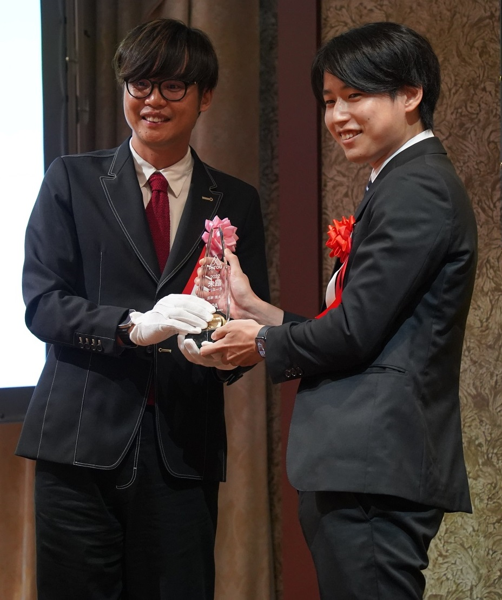
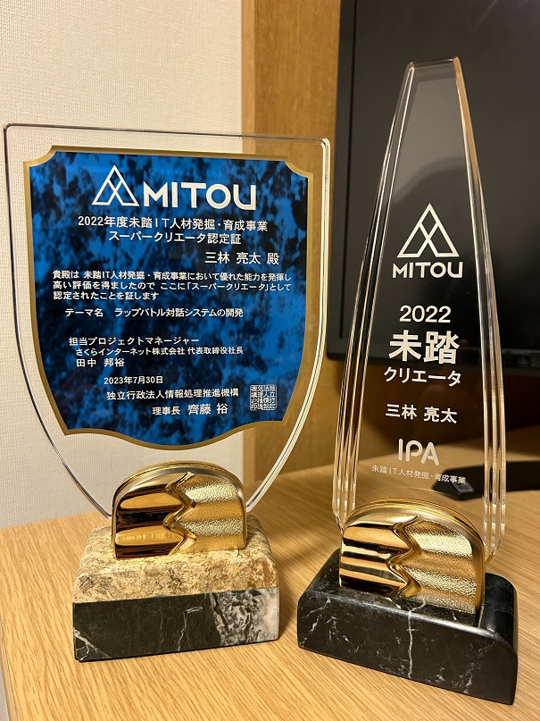

#### 日時：2023年5月26日（金）

D2の三林です。

2022年度に未踏IT人材発掘・育成事業で採択された「ラップバトル対話システムの開発」というプロジェクトに取り組んでいました。
このたび、プロジェクトの成果が認められ「未踏スーパークリエータ」に認定されました。
「未踏スーパークリエータ」は、自身のプロジェクトにおいて卓越した成果を挙げたと認められた者にのみ与えられます。
2022年度は未踏クリエータ37名の中から25名が認定されました。
未踏IT人材発掘・育成事業では、これまでに約1,800名以上のクリエータを採択・育成しており、
「未踏スーパークリエータ」は今回認定した25名を加えて総勢408名となったそうです。

未踏期間中にご協力いただいた皆様に感謝申し上げます。
これからも謙虚に頑張ります。

「ラップバトル対話システムの開発」プロジェクト概要
https://www.ipa.go.jp/jinzai/mitou/it/2022/gaiyou_tn-1.html
2022年度未踏スーパークリエータニュースリリース
https://www.ipa.go.jp/jinzai/mitou/it/2022/supercreator.html
2022年度未踏スーパークリエータの紹介資料
https://www.ipa.go.jp/jinzai/mitou/it/2022/ps6vr7000001sbsn-att/it2022_sc_booklet.pdf
未踏スーパークリエータについて
https://www.ipa.go.jp/jinzai/mitou/it/supercreator-list.html
