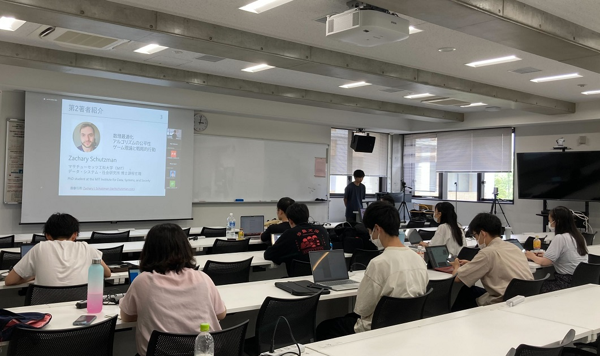

#### 日時：2023年7月8日（土）
#### 場所：Zoom

大島研の芦澤亜里紗さん、ファムフーロンさん、三林亮太さん、桑田若菜さん、狹間亮太朗さん、奥田萌莉さん、日置淳也さんがACM SIGMOD日本支部第82回支部大会（第45回先端的データベースとWeb技術動向講演会）でThe Web Conference 2023国際会議報告を行いました。

The Web Conference 2023は4月30日から5月4日にかけて開催された、Webに関連するトピックの研究、開発、標準化、応用をテーマとした国際会議です。

このThe Web Conference 2023にオンラインで参加し、ACM SIGMOD日本支部第82回支部大会にて、The Web Conference 2023の概要、Keynote、論文についての紹介を行いました。

 

発表詳細
- 芦澤亜里紗
  - The Web Conference 2023 の概要
  - Keynote: Using Diversity as a Source of Scientific Innovation for the 
Webの紹介

- ファムフーロン
  - Keynote: ACM A.M. Turing Award Lectureの紹介

- 三林亮太
  - Keynote: GNNs and Graph Generative Models for Biomedical Applicationsの紹介

- 桑田若菜
  - Keynote: Decolonizing Creative Labor in the Age of AIの紹介

- 狹間亮太朗
  - *Best paper* Simplistic Collection and Labeling Practices Limit the 
Utility of Benchmark Datasets for Twitter Bot Detectionの紹介

- 奥田萌莉
  - *Best student paper* A Vector Is Not Enough: Taxonomy Expansion via Box 
Embeddingsの紹介

- 日置淳也
  - Combining Worker Factors for Heterogeneous Crowd Task Assignmentの紹介

[The Web Conference 2023公式ページ](https://www2023.thewebconf.org)

[ACM SIGMOD日本支部第82回支部大会公式ページ](http://www.sigmodj.org/conf/detail.php?conf_no=82)
