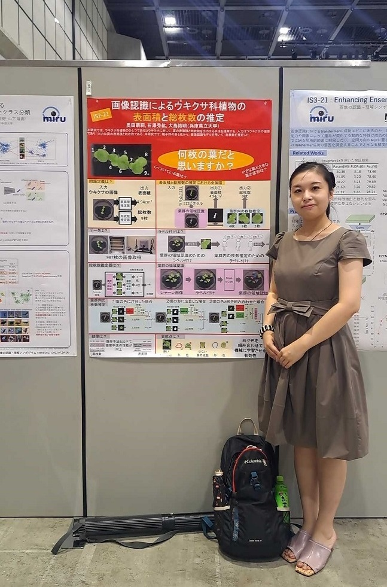

#### 日時：2023年7月24日（月）～7月28日（金）
#### 場所：アクトシティ浜松

D1の奥田萌莉です。
7月24日（月）から7月28日（金）までに開催された、画像の認識・理解シンポジウムMIRU2023に参加しました。

画像の認識・理解シンポジウムは、学生が画像処理や画像生成などの画像に関わる研究を発表し、研究に関する知見や理解を深める学会です。

24日と25日はMIRU若手プログラムで発表を行いました。同年代の友人を多く作ることができ、交流を深めました。
26日～28日は本会議でした。27日にポスター発表を行いました。若手プログラムで知り合った学生や先生方と議論したりと、有意義な時間を過ごせました。

来年度も参加させていただき、研究内容を深められれば、と思っています。参加させていただきまして、ありがとうございました。

書誌情報は以下の通りです。

+ 奥田萌莉, 石澤秀紘, 大島裕明：「画像認識によるウキクサ科植物の表面積と総枚数の推定」, 情報処理学会, 第26回画像の認識・理解シンポジウム（MIRU2023）, 2023年7月.

[第26回画像の認識・理解シンポジウムMIRU2023公式ページ](http://cvim.ipsj.or.jp/MIRU2023/)
