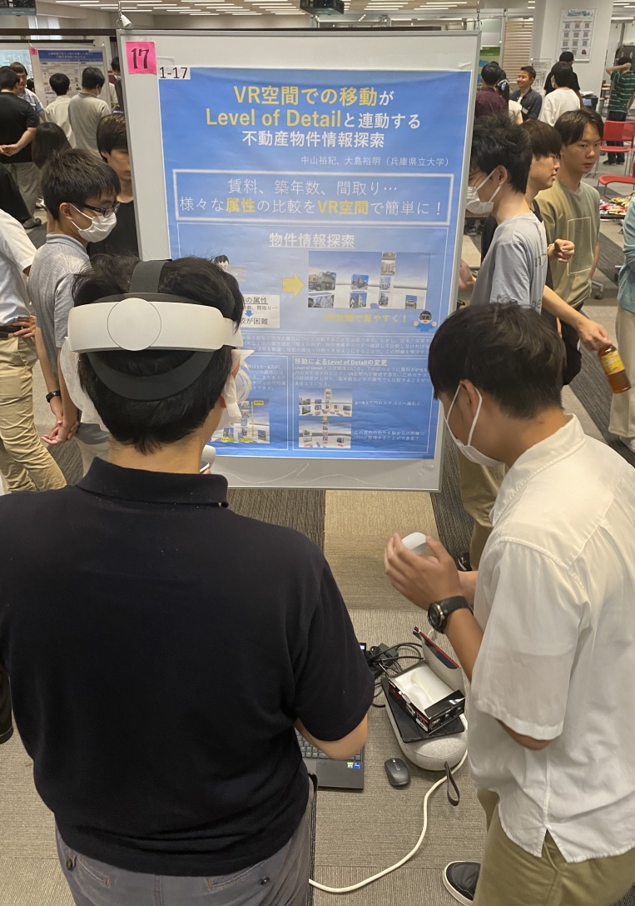
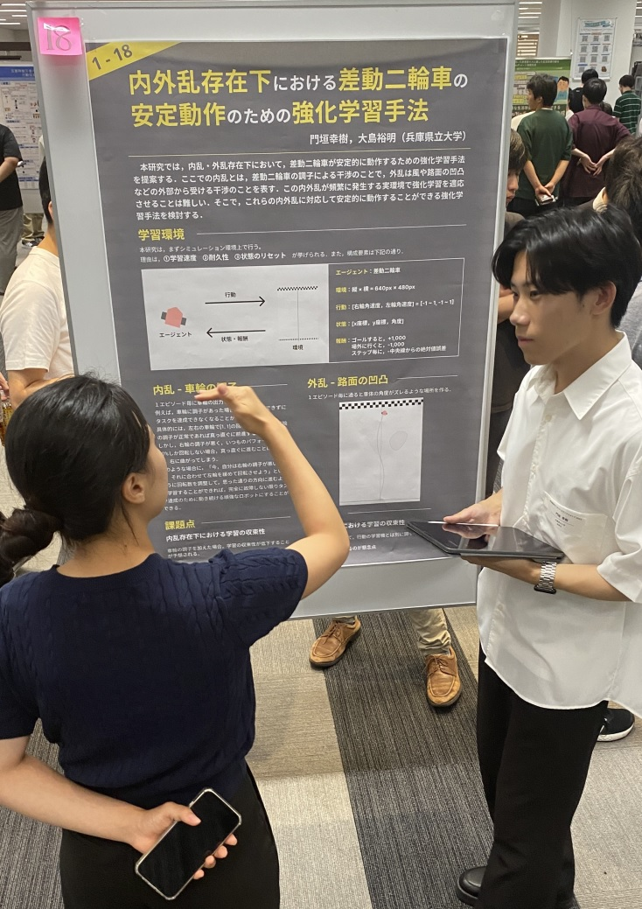
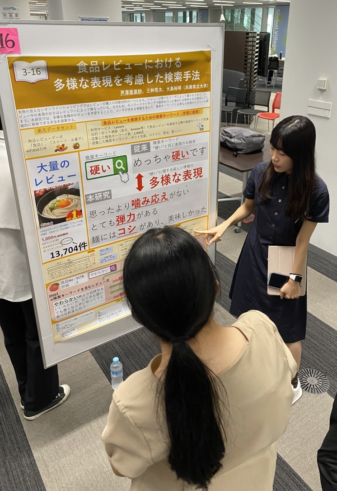
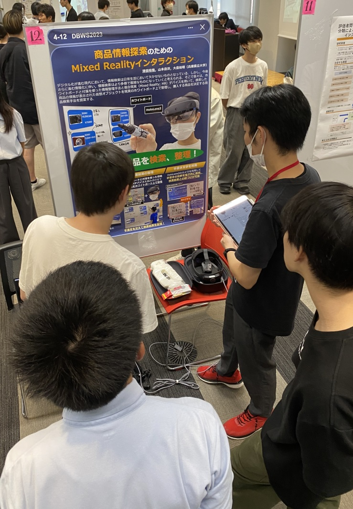
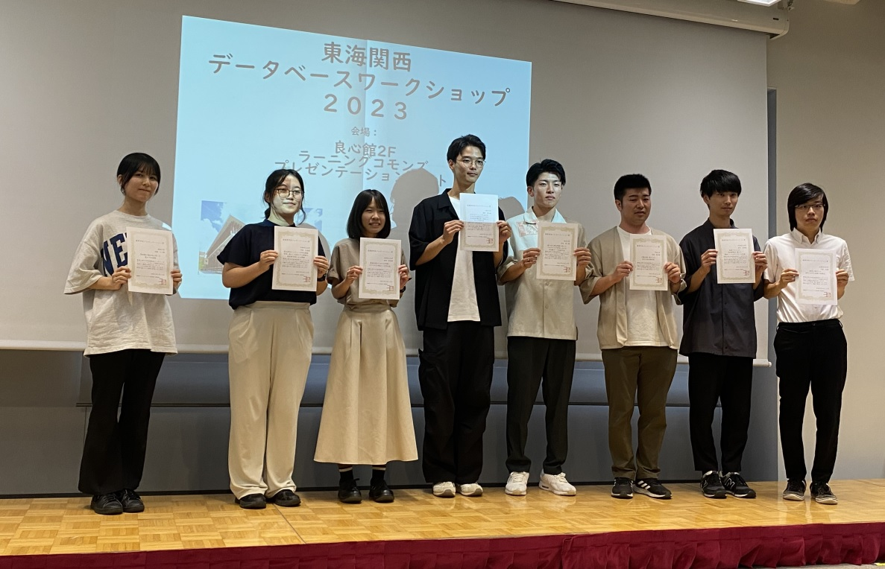

#### 日時：2023年9月14日（木）～2023年9月15日（金）
#### 場所：同志社大学今出川キャンパス良心館2Fラーニングコモンズプレゼンテーションコート

上記日程にて、大島研のメンバーが東海関西データベースワークショップ 2023に参加し、ポスター発表を行いました。

他大学の学生や先生方と、研究について意見を交わすことができました。

また、桑田若菜さんがセッション内での参加者投票によって最優秀賞を受賞しました。

おめでとうございます！

### 発表タイトル
- 奥田 萌莉, 画像認識によるウキクサ科植物の成長率の推定, 第8回東海関西データベースワークショップ, 2023年
- 津田 裕哉, 商品情報探索のためのMixed Realityインタラクション, 第8回東海関西データベースワークショップ, 2023年
- 西本 海生, 鑑賞軸の習得を目的とした位置情報を用いたビンゴゲーム, 第8回東海関西データベースワークショップ, 2023年
- 芦澤 亜里紗, 食品レビューにおける多様な表現を考慮した検索手法, 第8回東海関西データベースワークショップ, 2023年
- 桑田 若菜, 書道生成のための文字種とスタイルを考慮した文字生成, 第8回東海関西データベースワークショップ, 2023年
- 狹間 亮太朗, パーソナリティを考慮した観光地に対する感じ方の推定, 第8回東海関西データベースワークショップ, 2023年
- 中西 勇輝, AIインタビュアー：ChatGPTを利用した対話生成におけるトピックドリフト軽減手法, 第8回東海関西データベースワークショップ, 2023年
- 中山 裕紀, VR空間における移動とLevel of Detailを連動した不動産物件探索, 第8回東海関西データベースワークショップ, 2023年
- 門垣 幸樹, 内外乱存在下における差動二輪車の安定動作のための強化学習手法, 第8回東海関西データベースワークショップ, 2023年

皆さんお疲れ様でした！

[東海関西DBWS2023 公式Webページ](https://www.nadasemi.jp/dbws-2023/)

<!-- 1. 論文採録バージョン -->
<!-- [第一著者]さんの論文が「[学会フルネーム]」に採録されました。 -->

<!-- [公式Webページ](学会公式ページTopのURL) -->

<!-- 書誌情報。書式はPublicationsを参考。変にコードブロックとかで囲まなくてOK -->

<!-- [年月日]に発表予定 -->

<!-- 2. 論文発表済みバージョン -->
<!-- [第一著者]さんが「[学会フルネーム]」で発表しました。 -->

<!-- [公式Webページ](学会公式ページTopのURL) -->

<!-- 書誌情報。書式はPublicationsを参考。変にコードブロックとかで囲まなくてOK -->

<!-- 3. 論文受賞バージョン -->
<!-- [第一著者]さんの論文が「[学会フルネーム]」で「[受賞名]」を受賞しました -->

<!-- [公式Webページ](学会公式ページTopのURL) -->

<!-- 書誌情報。書式はPublicationsを参考。変にコードブロックとかで囲まなくてOK -->

<!-- 同学会複数名の場合は並べて良い感じにして -->