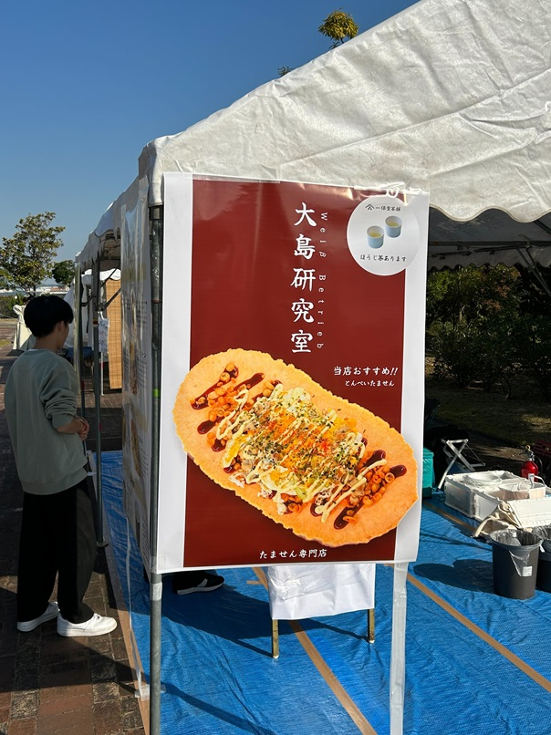
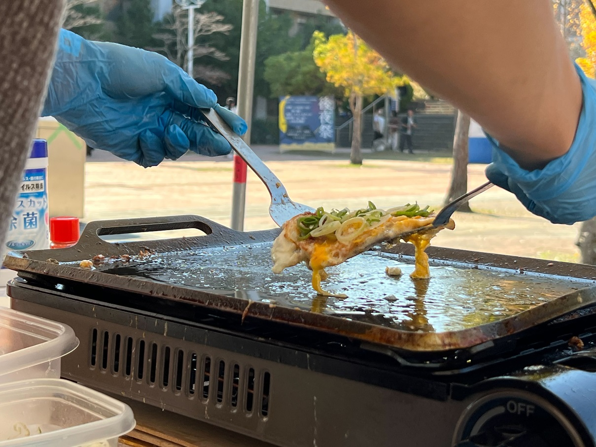
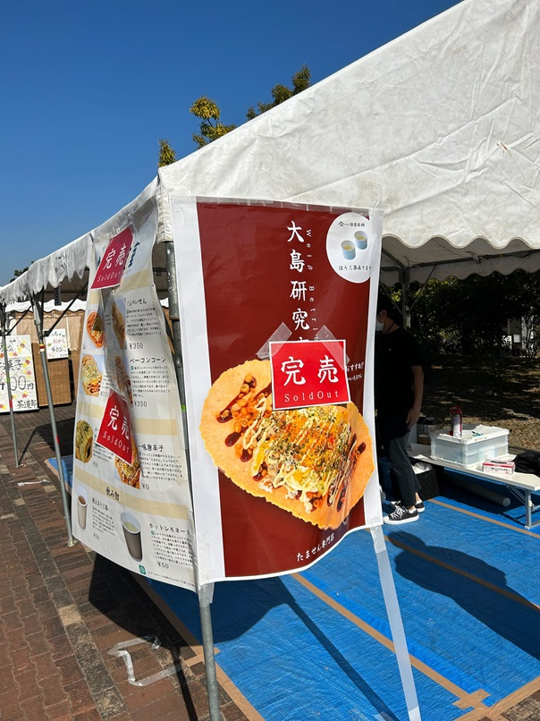
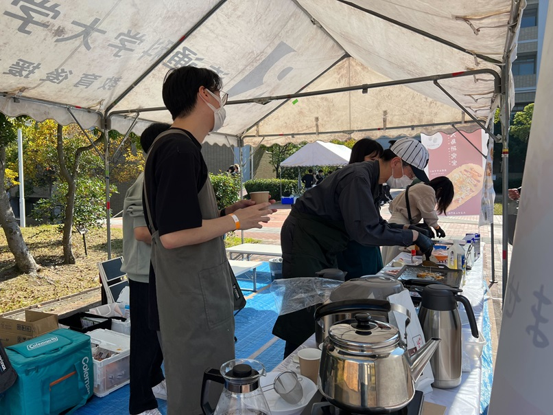
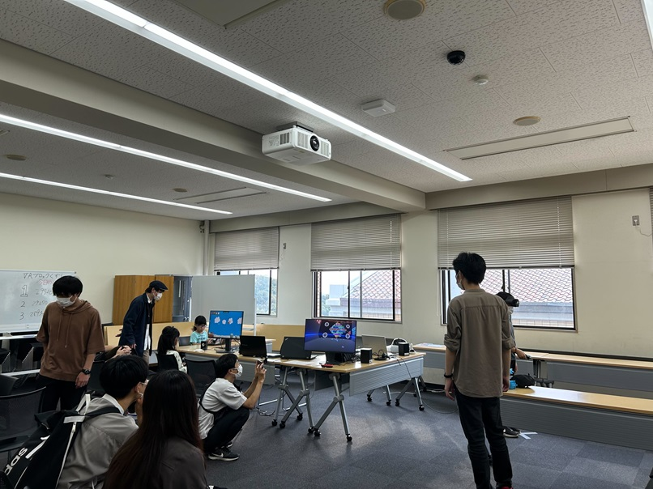
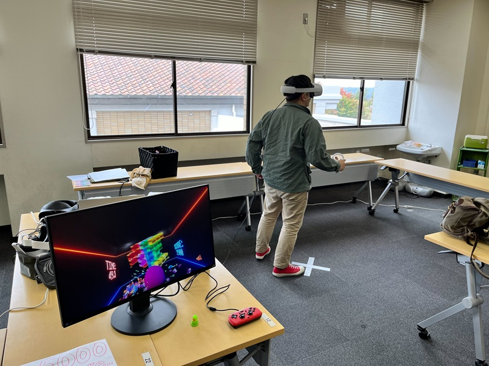
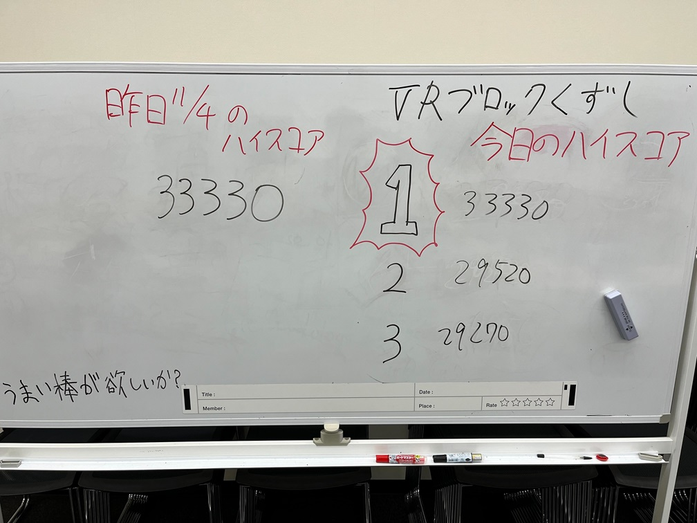
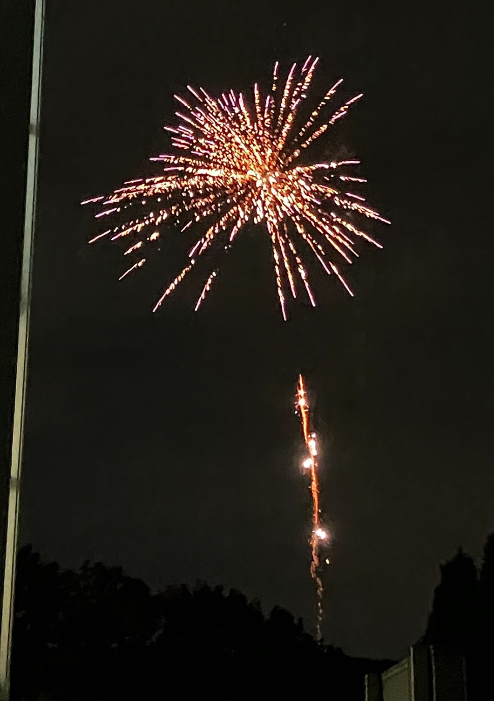

#### 日時：2023年11月3日（金）～2023年11月5日（日）
#### 場所：兵庫県立大学神戸商科キャンパス

上記日程にて商大祭が開催され、大島研究室のメンバーが模擬店の出店と展示を行いました。
季節外れの暑さの中、飲み代を賭けた漢達の熱い戦いが幕を開けました。

模擬店ではたませんを販売しました。
たくさんの人々に好評いただき、3日間かけ完売することができました。

展示では大島研メンバーの津田さん、西本さんが自作ゲームを展示しました。
慣れないVRゲームや、難易度の高いアクションゲームに苦戦しながらも、たくさんの人々に楽しんでいただけました。

3日間の最後には後夜祭がありました。
綺麗な花火が打ちあがり、3日間の締めくくりとなりました。

