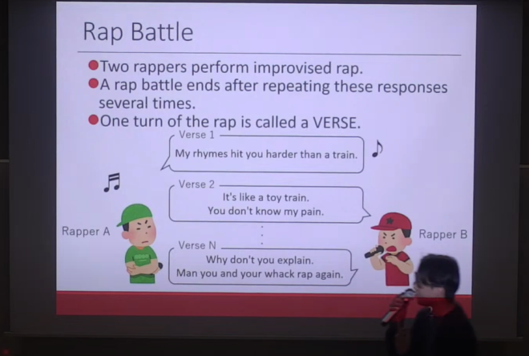

#### 日時：2023年11月13日（月）～2023年11月17日（金）
#### 場所：東京理科大学 森戸記念館

三林亮太さんが「The 16th International Symposium on Computer Music Multidisciplinary Research」で発表を行いました。

書誌情報は以下の通りです。
- Ryota Mibayashi, Takehiro Yamamoto, Kosetsu Tsukuda, Kento Watanabe, Tomoyasu Nakano, Masataka Goto, Hiroaki Ohshima: "Verse Generation by Reverse Generation Considering Rhyme and Answer in Japanese Rap Battles", Proceedings of the 16th International Symposium on Computer Music Multidisciplinary Research (CMMR 2023), pp30-41, November 2023.

[CMMR2023 公式Webページ](https://cmmr2023.gttm.jp)

<!-- 1. 論文採録バージョン -->
<!-- [第一著者]さんの論文が「[学会フルネーム]」に採録されました。 -->

<!-- [公式Webページ](学会公式ページTopのURL) -->

<!-- 書誌情報。書式はPublicationsを参考。変にコードブロックとかで囲まなくてOK -->

<!-- [年月日]に発表予定 -->

<!-- 2. 論文発表済みバージョン -->
<!-- [第一著者]さんが「[学会フルネーム]」で発表しました。 -->

<!-- [公式Webページ](学会公式ページTopのURL) -->

<!-- 書誌情報。書式はPublicationsを参考。変にコードブロックとかで囲まなくてOK -->

<!-- 3. 論文受賞バージョン -->
<!-- [第一著者]さんの論文が「[学会フルネーム]」で「[受賞名]」を受賞しました -->

<!-- [公式Webページ](学会公式ページTopのURL) -->

<!-- 書誌情報。書式はPublicationsを参考。変にコードブロックとかで囲まなくてOK -->

<!-- 同学会複数名の場合は並べて良い感じにして -->