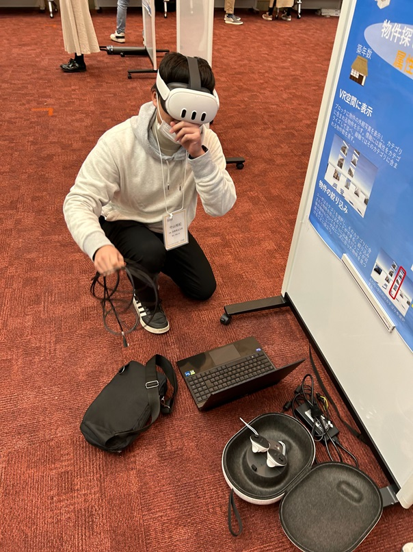
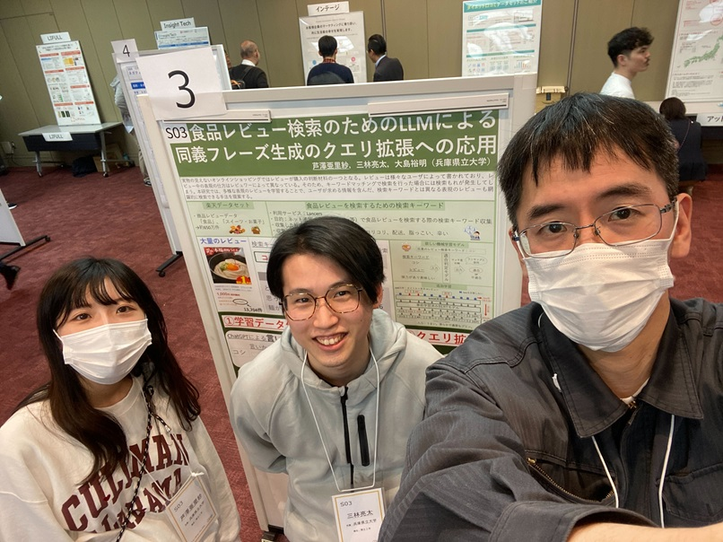

#### 日時：2023年12月11日（月）
#### 場所：一橋講堂 中会議場

M1の芦澤亜里紗さんとB4の中山裕紀さんがIDRユーザフォーラム 2023でポスター発表を行いました。

IDRユーザフォーラムとは、国立情報学研究所の「情報学研究データリポジトリ（IDR）」で提供されているデータの提供者と利用者が直接意見交換できる場です。

発表タイトルは以下の通りです。
- 芦澤亜里紗, 三林亮太, 大島裕明, 食品レビュー検索のためのLLMによる同義フレーズ生成のクエリ拡張への応用, IDRユーザフォーラム 2023, 2023年12月.
[ポスター資料](https://www.nii.ac.jp/dsc/idr/userforum/startup/IDR-UF2023_S03.pdf)

- 中山裕紀, 莊司慶行, 大島裕明, 不動産情報探索のためのVRインタフェースにおける情報との物理的距離によるLoD制御, IDRユーザフォーラム 2023, 2023年12月.
[ポスター資料](https://www.nii.ac.jp/dsc/idr/userforum/startup/IDR-UF2023_S08.pdf)

[IDRユーザフォーラム 2023公式サイト](https://www.nii.ac.jp/dsc/idr/userforum/2023.html)

<!-- 1. 論文採録バージョン -->
<!-- [第一著者]さんの論文が「[学会フルネーム]」に採録されました。 -->

<!-- [公式Webページ](学会公式ページTopのURL) -->

<!-- 書誌情報。書式はPublicationsを参考。変にコードブロックとかで囲まなくてOK -->

<!-- [年月日]に発表予定 -->

<!-- 2. 論文発表済みバージョン -->
<!-- [第一著者]さんが「[学会フルネーム]」で発表しました。 -->

<!-- [公式Webページ](学会公式ページTopのURL) -->

<!-- 書誌情報。書式はPublicationsを参考。変にコードブロックとかで囲まなくてOK -->

<!-- 3. 論文受賞バージョン -->
<!-- [第一著者]さんの論文が「[学会フルネーム]」で「[受賞名]」を受賞しました -->

<!-- [公式Webページ](学会公式ページTopのURL) -->

<!-- 書誌情報。書式はPublicationsを参考。変にコードブロックとかで囲まなくてOK -->

<!-- 同学会複数名の場合は並べて良い感じにして -->