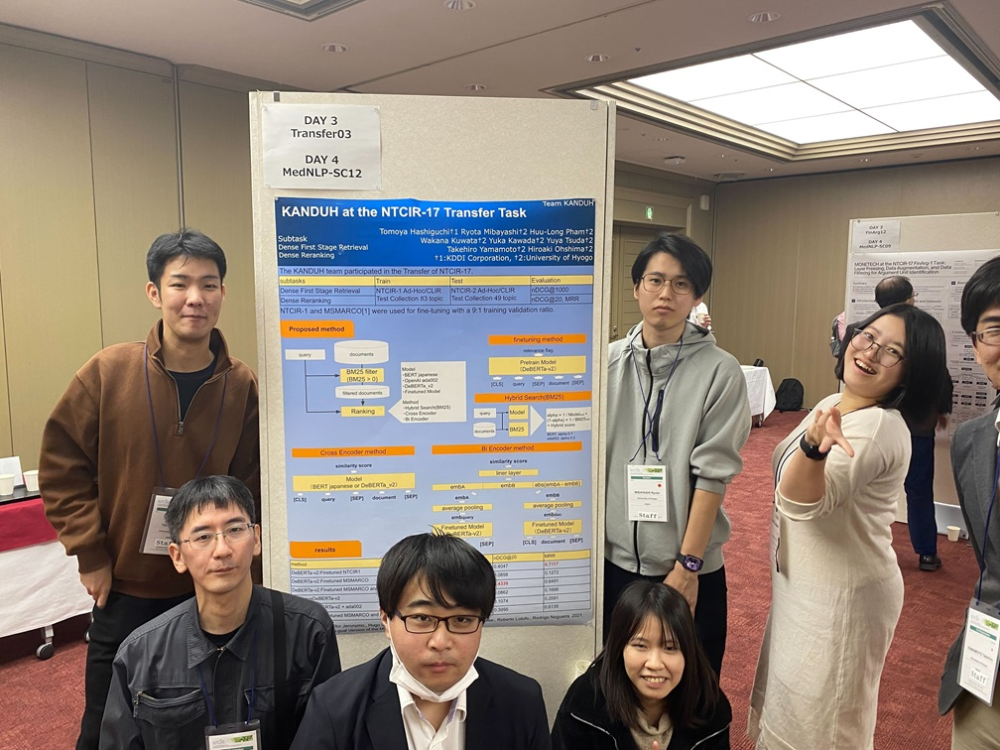

#### 日時：2023年12月12日（火）～2023年12月15日（金）
#### 場所：一橋講堂 中会議場

大島研のメンバーがThe 17th NTCIR Conferenceに参加しました。

書誌情報は以下の通りです。
- Tomoya Hashiguchi, Ryota Mibayashi, Huu-Long Pham, Wakana Kuwata, Yuka Kawada, Yuya Tsuda, Takehiro Yamamoto and Hiroaki Ohshima，KANDUH at the NTCIR-17 Transfer Task，In proceedings of the 17th NTCIR Conference

[NTCIR-17 Conference公式サイト](https://research.nii.ac.jp/ntcir/ntcir-17/conference.html)

<!-- 1. 論文採録バージョン -->
<!-- [第一著者]さんの論文が「[学会フルネーム]」に採録されました。 -->

<!-- [公式Webページ](学会公式ページTopのURL) -->

<!-- 書誌情報。書式はPublicationsを参考。変にコードブロックとかで囲まなくてOK -->

<!-- [年月日]に発表予定 -->

<!-- 2. 論文発表済みバージョン -->
<!-- [第一著者]さんが「[学会フルネーム]」で発表しました。 -->

<!-- [公式Webページ](学会公式ページTopのURL) -->

<!-- 書誌情報。書式はPublicationsを参考。変にコードブロックとかで囲まなくてOK -->

<!-- 3. 論文受賞バージョン -->
<!-- [第一著者]さんの論文が「[学会フルネーム]」で「[受賞名]」を受賞しました -->

<!-- [公式Webページ](学会公式ページTopのURL) -->

<!-- 書誌情報。書式はPublicationsを参考。変にコードブロックとかで囲まなくてOK -->

<!-- 同学会複数名の場合は並べて良い感じにして -->