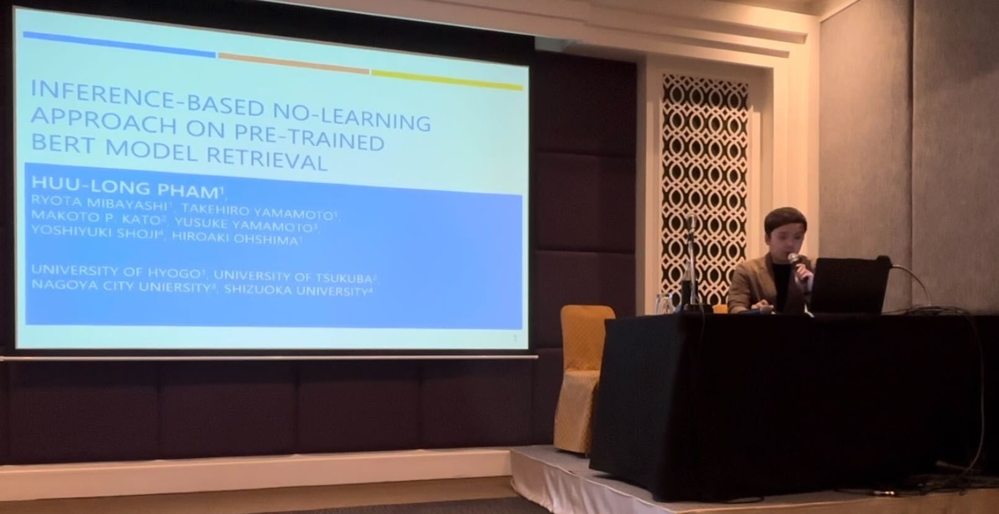
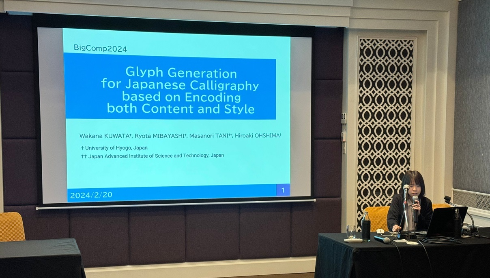

#### 日時：2024年2月18日（日）～2024年2月21日（水）
#### 場所：The Sukosol Hotel, Bangkok, Thailand 

ファムフーロンさんと桑田若菜さんの論文が国際会議「2024 IEEE International Conference on Big Data and Smart Computing (BigComp 2024)」に採択されました。

カンファレンスが2月18日から2月21日にかけてタイのバンコクで開催され口頭発表を行いました。

書誌情報は以下の通りです。
- Huu-Long Pham, Ryota Mibayashi, Takehiro Yamamoto, Makoto P. Kato, Yusuke Yamamoto, Yoshiyuki Shoji, Hiroaki Ohshima: “Inference-Based No-Learning Approach on Pre-Trained BERT Model Retrieval”, Proceedings of the 2024 IEEE International Conference on Big Data and Smart Computing (BigComp 2024), pp.234-241, February 2024.
- Wakana Kuwata, Ryota Mibayashi, Masanori Tani, and Hiroaki Ohshima: “Glyph Generation for Japanese Calligraphy based on Encoding both Content and Style”, Proceedings of the 2024 IEEE International Conference on Big Data and Smart Computing (BigComp 2024), pp.207-214, February 2024.

[BigComp 2024公式サイト](https://www.bigcomputing.org/conf2024/)

<!-- 1. 論文採録バージョン -->
<!-- [第一著者]さんの論文が「[学会フルネーム]」に採録されました。 -->

<!-- [公式Webページ](学会公式ページTopのURL) -->

<!-- 書誌情報。書式はPublicationsを参考。変にコードブロックとかで囲まなくてOK -->

<!-- [年月日]に発表予定 -->

<!-- 2. 論文発表済みバージョン -->
<!-- [第一著者]さんが「[学会フルネーム]」で発表しました。 -->

<!-- [公式Webページ](学会公式ページTopのURL) -->

<!-- 書誌情報。書式はPublicationsを参考。変にコードブロックとかで囲まなくてOK -->

<!-- 3. 論文受賞バージョン -->
<!-- [第一著者]さんの論文が「[学会フルネーム]」で「[受賞名]」を受賞しました -->

<!-- [公式Webページ](学会公式ページTopのURL) -->

<!-- 書誌情報。書式はPublicationsを参考。変にコードブロックとかで囲まなくてOK -->

<!-- 同学会複数名の場合は並べて良い感じにして -->