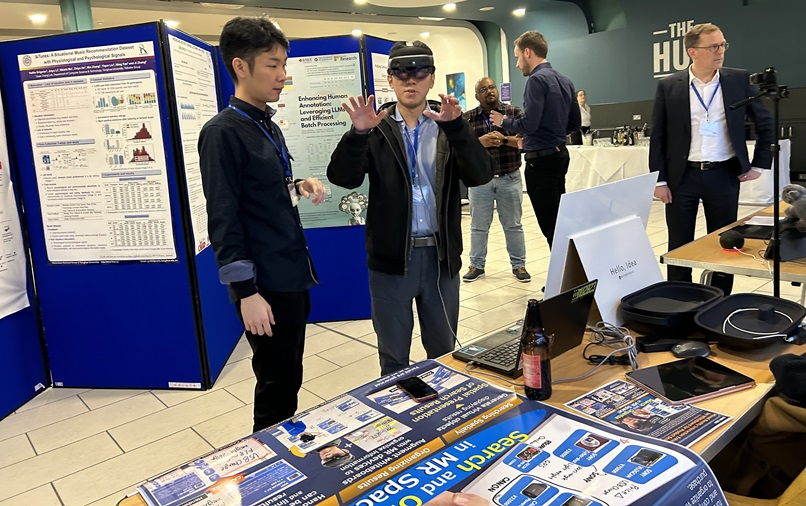

#### 日時：2024年3月10日（日）～2024年3月14日（木）
#### 場所： シェフィールド大学 (Sheffield, UK) 

津田裕哉さんの論文が国際会議The 2024 ACM SIGIR Conference on Human Information Interaction and Retrieval (CHIIR 2024)に採択されました。

CHIIR 2024は3月10日から3月14日にかけてイギリスのシェフィールドで開催され、口頭発表を行いました。

書誌情報は以下の通りです。
- Yuya Tsuda, Takehiro Yamamoto and Hiroaki Ohshima: "Mixed Reality Interaction Enhanced by Whiteboard for Product Search", Proceedings of the 2024 Conference on Human Information Interaction and Retrieval (CHIIR 2024), pp.396-400, March 2024.

[CHIIR 2024公式サイト](https://chiir2024.github.io)

<!-- 1. 論文採録バージョン -->
<!-- [第一著者]さんの論文が「[学会フルネーム]」に採録されました。 -->

<!-- [公式Webページ](学会公式ページTopのURL) -->

<!-- 書誌情報。書式はPublicationsを参考。変にコードブロックとかで囲まなくてOK -->

<!-- [年月日]に発表予定 -->

<!-- 2. 論文発表済みバージョン -->
<!-- [第一著者]さんが「[学会フルネーム]」で発表しました。 -->

<!-- [公式Webページ](学会公式ページTopのURL) -->

<!-- 書誌情報。書式はPublicationsを参考。変にコードブロックとかで囲まなくてOK -->

<!-- 3. 論文受賞バージョン -->
<!-- [第一著者]さんの論文が「[学会フルネーム]」で「[受賞名]」を受賞しました -->

<!-- [公式Webページ](学会公式ページTopのURL) -->

<!-- 書誌情報。書式はPublicationsを参考。変にコードブロックとかで囲まなくてOK -->

<!-- 同学会複数名の場合は並べて良い感じにして -->