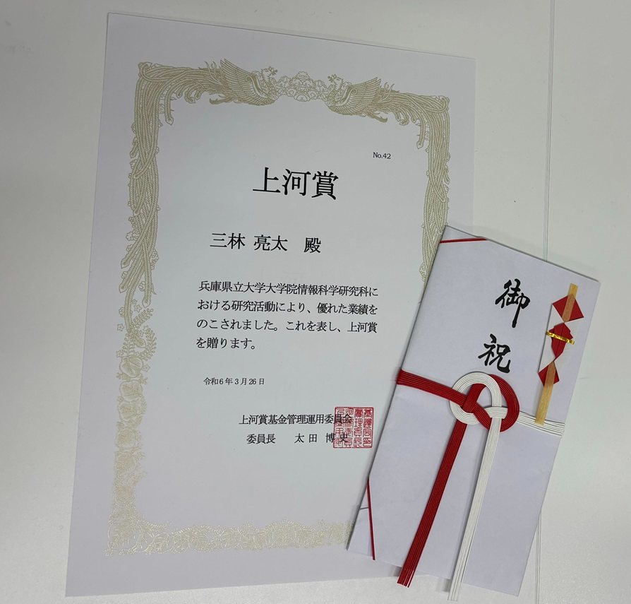

#### 日時：2024年3月26日（火）
#### 場所：神戸商科キャンパス

D2の三林亮太です。

今回、論文誌の採録にあたって、上河賞を受賞しました。
上河賞は、査読付き学術専門誌に掲載または掲載許可された第一作に対して表彰される賞です。
受賞対象となった論文は「ラップバトルにおける逆向き生成によるライムを含む返答バース生成」というタイトルで、情報処理学会論文誌データベースTODに掲載許可されたものです。
論文誌投稿にあたって、手厚くサポートしていただいた、産業技術総合研究所の後藤真孝先生、中野倫靖様、佃洸摂様、渡邉研斗様、同研究科の山本岳洋先生、大島裕明先生に心より御礼申し上げます。

以下、上河賞の詳細な説明です。（参考URLより引用）
上河賞とは、神戸商科大学大学院経済学研究科で多くの大学教員を育成し、理論・計量経済学会（現日本経済学会）の第25代会長を務められ、国際的な学術雑誌であるJournal of International Economics誌の編集委員を歴任されるなど、数々の業績を残された上河泰男先生に由来する賞です。上河賞事務局（上河賞基金管理運用委員会）では、兵庫県立大学神戸商科キャンパスの大学院学生および同修了生の研究論文のうち、査読付き学術専門誌に掲載または掲載許可された第一作に対する表彰活動を実施しています。

参考URL：  
https://www.u-hyogo.ac.jp/g3s/econ/education/index.html

書誌情報：  
三林 亮太, 佃 洸摂, 渡邉 研斗, 中野 倫靖, 後藤 真孝, 山本 岳洋, 大島 裕明：「ラップバトルにおける逆向き生成によるライムを含む返答バース生成」，情報処理学会論文誌データベースTOD，Vol.17，No.2，pp.1-12，2024年4月．

<!-- 1. 論文採録バージョン -->
<!-- [第一著者]さんの論文が「[学会フルネーム]」に採録されました。 -->

<!-- [公式Webページ](学会公式ページTopのURL) -->

<!-- 書誌情報。書式はPublicationsを参考。変にコードブロックとかで囲まなくてOK -->

<!-- [年月日]に発表予定 -->

<!-- 2. 論文発表済みバージョン -->
<!-- [第一著者]さんが「[学会フルネーム]」で発表しました。 -->

<!-- [公式Webページ](学会公式ページTopのURL) -->

<!-- 書誌情報。書式はPublicationsを参考。変にコードブロックとかで囲まなくてOK -->

<!-- 3. 論文受賞バージョン -->
<!-- [第一著者]さんの論文が「[学会フルネーム]」で「[受賞名]」を受賞しました -->

<!-- [公式Webページ](学会公式ページTopのURL) -->

<!-- 書誌情報。書式はPublicationsを参考。変にコードブロックとかで囲まなくてOK -->

<!-- 同学会複数名の場合は並べて良い感じにして -->