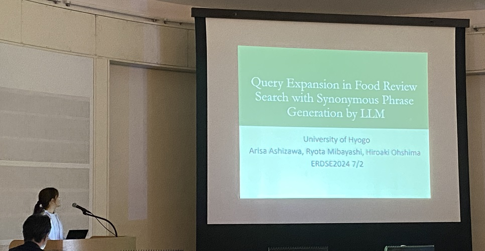
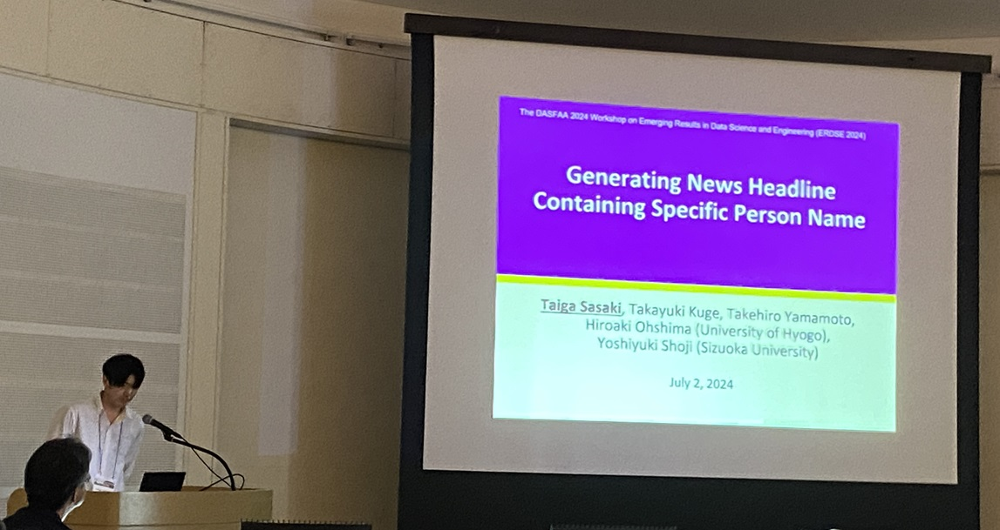
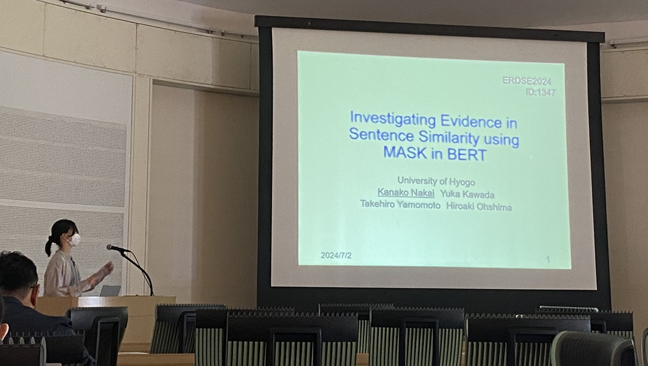
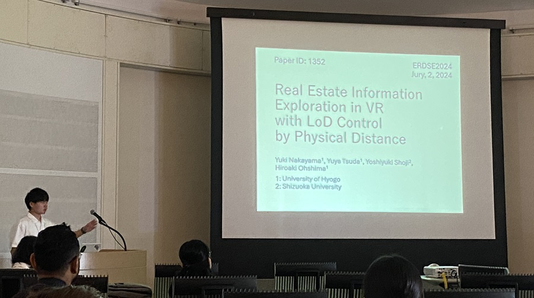

#### 日時：2024年7月2日（火）
#### 場所：長良川国際会議場 

大島研のメンバーがThe 29th International Conference on Database Systems for Advanced Applications (DASFAA 2024)の併設ワークショップであるThe DASFAA 2024 Workshop on Emerging Results in Data Science and Engineering (ERDSE 2024)で発表しました。

- Arisa Ashizawa, Ryota Mibayashi, Hiroaki Ohshima: "Query Expansion in Food Review Search with Synonymous Phrase Generation by LLM", The DASFAA 2024 Workshop on Emerging Results in Data Science and Engineering (ERDSE 2024), July 2024.
- Taiga Sasaki, Takehiro Yamamoto, Yoshiyuki Shoji, Takayuki Kuge, Hiroaki Ohshima: "Generating News Headline Containing Specific Person Name", The DASFAA 2024 Workshop on Emerging Results in Data Science and Engineering (ERDSE 2024), July 2024.
- Kanako Nakai, Yuka Kawada, Takehiro Yamamoto, Hiroaki Ohshima: "Investigating Evidence in Sentence Similarity using MASK in BERT", The DASFAA 2024 Workshop on Emerging Results in Data Science and Engineering (ERDSE 2024), July 2024.
- Yuki Nakayama, Yuya Tsuda, Yoshiyuki Shoji, Hiroaki Ohshima: "Real Estate Information Exploration in VR with LoD Control by Physical Distance", The DASFAA 2024 Workshop on Emerging Results in Data Science and Engineering (ERDSE 2024), July 2024.

[ERDSE 2024公式サイト](https://erdse2024.github.io/)

<!-- 1. 論文採録バージョン -->
<!-- [第一著者]さんの論文が「[学会フルネーム]」に採録されました。 -->

<!-- [公式Webページ](学会公式ページTopのURL) -->

<!-- 書誌情報。書式はPublicationsを参考。変にコードブロックとかで囲まなくてOK -->

<!-- [年月日]に発表予定 -->

<!-- 2. 論文発表済みバージョン -->
<!-- [第一著者]さんが「[学会フルネーム]」で発表しました。 -->

<!-- [公式Webページ](学会公式ページTopのURL) -->

<!-- 書誌情報。書式はPublicationsを参考。変にコードブロックとかで囲まなくてOK -->

<!-- 3. 論文受賞バージョン -->
<!-- [第一著者]さんの論文が「[学会フルネーム]」で「[受賞名]」を受賞しました -->

<!-- [公式Webページ](学会公式ページTopのURL) -->

<!-- 書誌情報。書式はPublicationsを参考。変にコードブロックとかで囲まなくてOK -->

<!-- 同学会複数名の場合は並べて良い感じにして -->