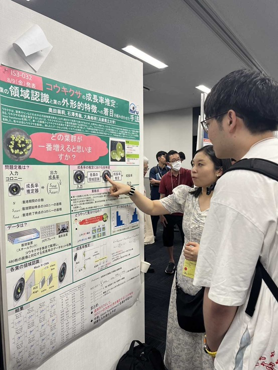
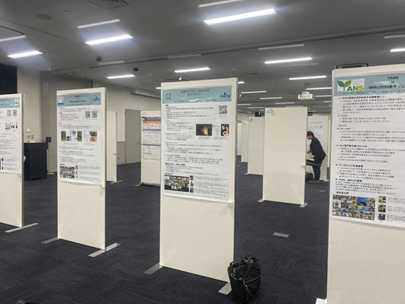

#### 日時：2024年8月6日（火）～8月9日（金）
#### 場所： 熊本城ホール

上記の日程で奥田萌莉さんが第27回 画像の認識・理解シンポジウムに参加し、ポスター発表を行いました。

- 奥田萌莉, 石澤秀紘, 大島裕明：「コウキクサの成長率推定：葉の領域認識と葉の外形的特徴への着目を組み合わせた手法」, 第27回 画像の認識・理解シンポジウム（MIRU2024）, 2024年8月.
- 上田栞, 奥田萌莉, 金岡大樹：「ろぼやん×MIRU2024若手プログラム」, 第27回 画像の認識・理解シンポジウム 若手プログラム, 2024年8月.

[MIRU2024公式サイト](https://miru-committee.github.io/miru2024/)
