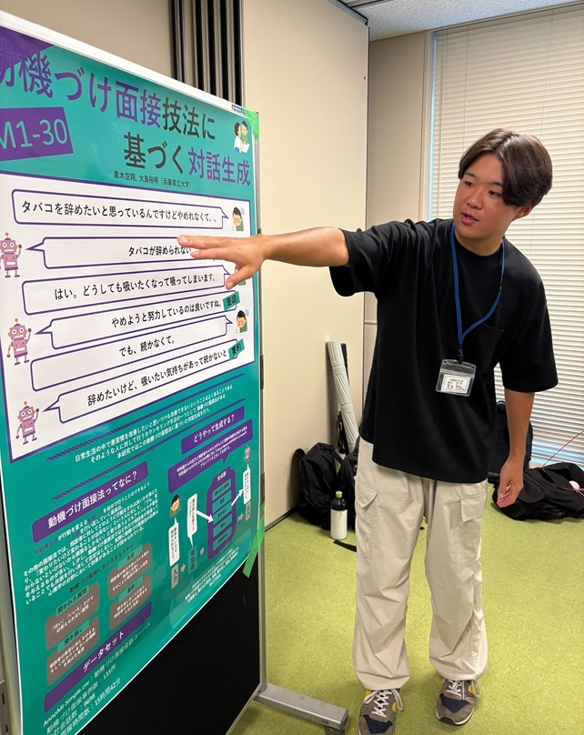
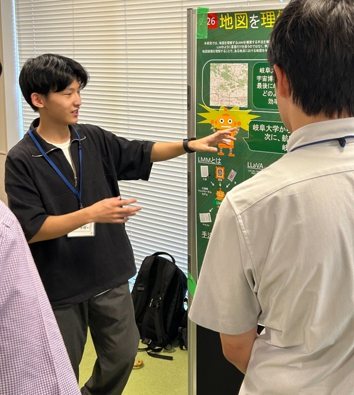
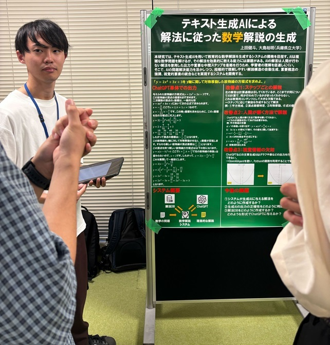
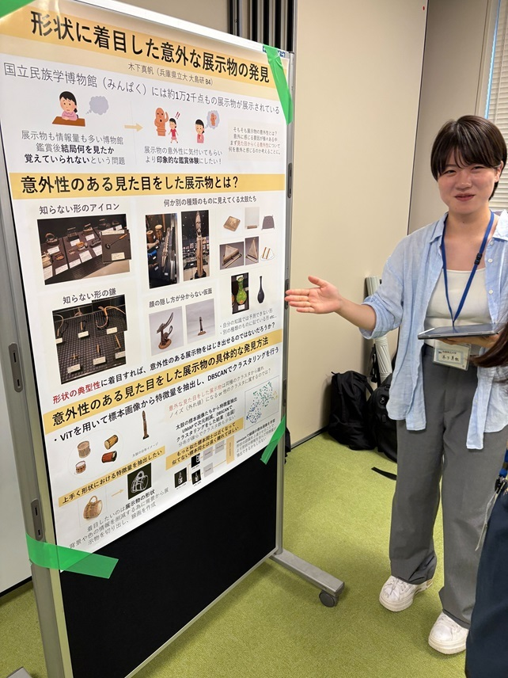

#### 日時：2024年9月24日（火）
#### 場所： 甲南大学岡本キャンパス iCommons

上記日程にて開催されたプチDBWS2024に大島研のメンバーが参加し、発表しました。
岐阜大学や甲南大学、静岡大学、同志社大学の方々も参加され、活発な議論を交わしていました。

お疲れ様でした！

### 発表タイトル
- 三林 亮太, RLHFによる意味的関連性を考慮したライム生成, プチDBWS2024, 2024年
- ファム フーロン, 性能類似性を考慮した画像セグメンテーション機械学習モデル検索, プチDBWS2024, 2024年
- 芦澤 亜里紗, 人の意図に沿ったセルフケア関連新聞記事の意味理解, プチDBWS2024, 2024年
- 桑田 若菜, 日本書道における文字の骨格を考慮したバリエーションのある字形の生成, プチDBWS2024, 2024年
- 黒木 空翔, 動機づけ面接技法に基づく対話生成, プチDBWS2024, 2024年
- 佐々木 泰河, 進化的モデルマージを用いた多言語検索モデルの構築, プチDBWS2024, 2024年
- 中西 勇輝, 地図を理解するLMMの構築, プチDBWS2024, 2024年
- 中山 裕紀, 情報の俯瞰を可能とする不動産情報探索VRインタフェース, プチDBWS2024, 2024年
- 王 一霖, 類似モーラ検索と文の自然さ判定を用いただじゃれ生成, プチDBWS2024, 2024年
- 上田 健斗, テキスト生成AIによる解法に従った数学解説の生成, プチDBWS2024, 2024年
- 木下 真帆, 形状に着目した意外な展示物の発見, プチDBWS2024, 2024年

