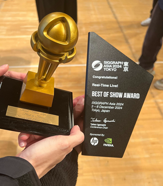
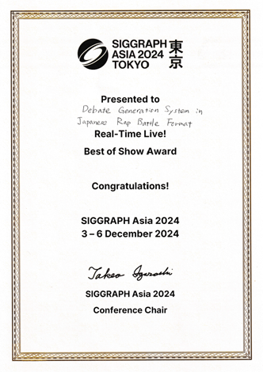

#### 日時：2024年12月3日（火）～2024年12月6日（金）
#### 場所：東京国際フォーラム（有楽町）

三林亮太さんが「第17回SIGGRAPH Asia：コンピュータグラフィックスとインタラクティブ技術に関する国際会議と展示会」のReal-Time Live!でBEST OF SHOW AWARDを受賞しました。

- Ryota Mibayashi, Toru Urakawa, Dai Takanashi, Kanata Yamagishi, Tomoya Morohoshi, Ryuho Sekikawa, Yasuhiko Nishimura, Yuta Takeuchi, Mina Shibasaki, Hideaki Tamori, Takehiro Yamamoto, Hiroaki Ohshima: "Debate Generation System in Japanese Rap Battle Format", SIGGRAPH Asia 2024 Real-Time Live! 

おめでとうございます！

[発表詳細はこちら](https://asia.siggraph.org/2024/ja/presentation/?id=real_117&sess=sess208)

[SIGGRAPH Asia 2024公式ページ](https://asia.siggraph.org/2024/ja/)

[Real-Time Live!ページ](https://asia.siggraph.org/2024/ja/program/real-time-live/)

