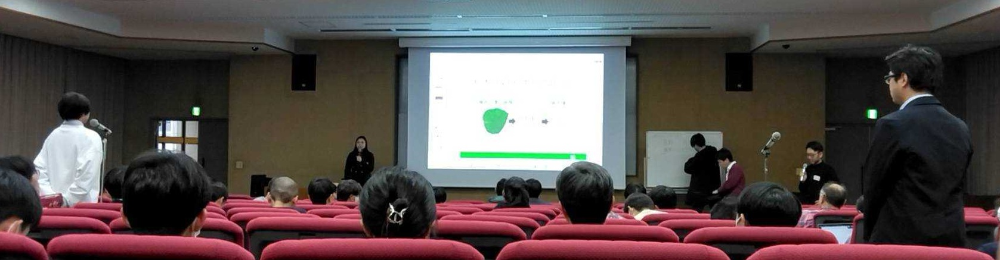
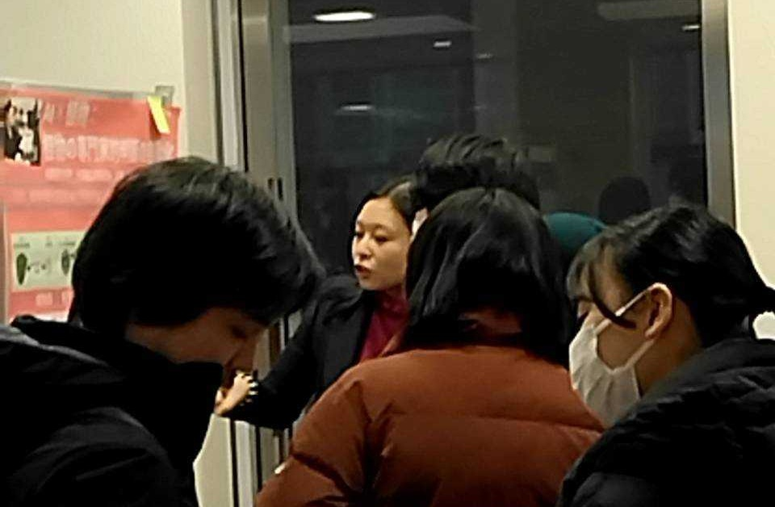

#### 日時：2025年1月11日（土）～2025年1月12日（日）
#### 場所：九州大学　馬出病院キャンパス

奥田萌莉さんが「定量生物の会 九州キャバラン 2025」でショートトークを行いました。

定量生物の会とは、定量的な解析から生命システムの定性的な性質を明らかにすることを目指す生命科学について、その方向性や解決すべき点などを具体的な問題設定のもとで議論する研究者の集まりです。

九州キャバラン2025では、計52名のポスター発表が行われます。その中でご依頼を受けたショートトーク発表者は、15分（質疑応答込み）の発表を行います。

- 奥田萌莉, AI×植物：植物の専門家的判断の自動化, 定量生物の会 九州キャバラン 2025, 2025年1月.

[定量生物学の会 九州キャバラン 2025 公式ページ](https://q-bio.jp/index.php?title=Caravan_2025)

