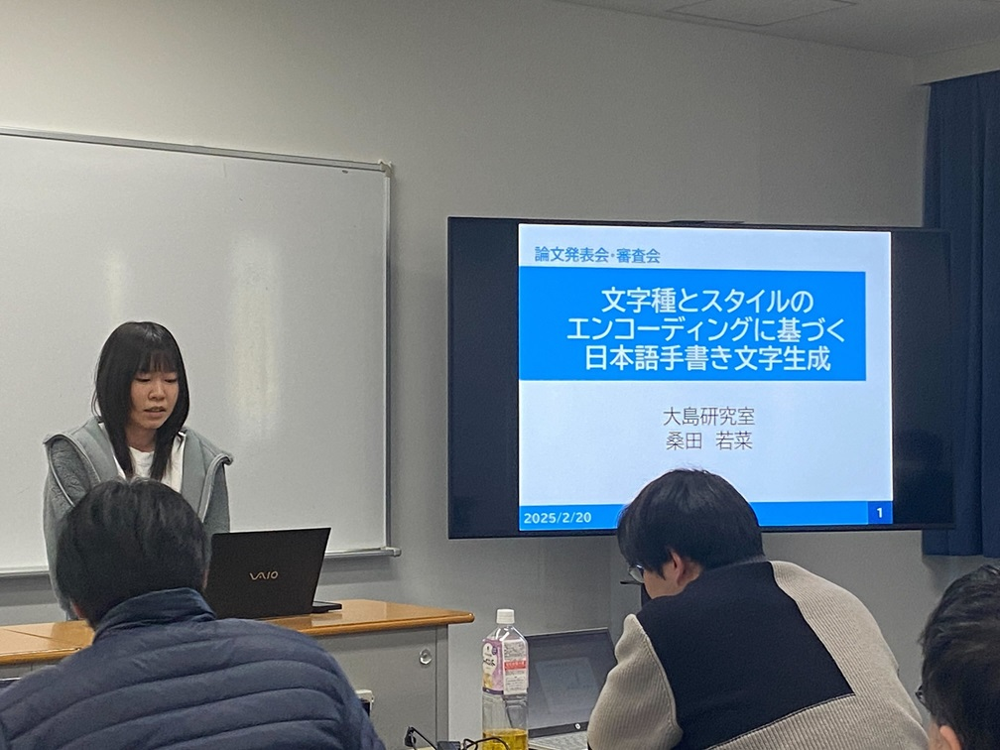
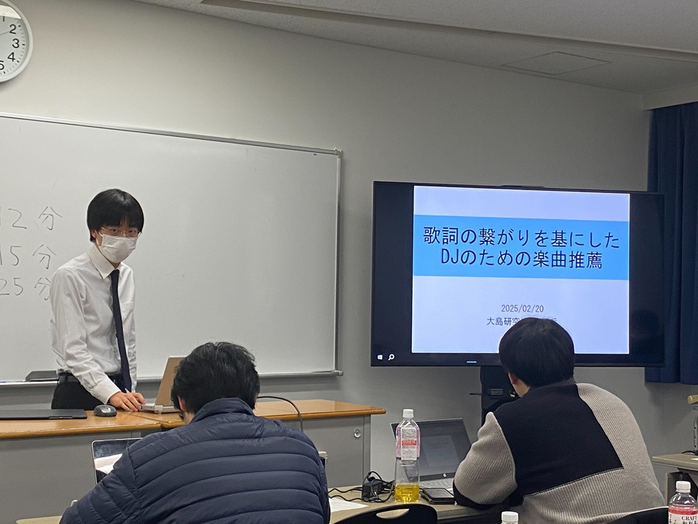
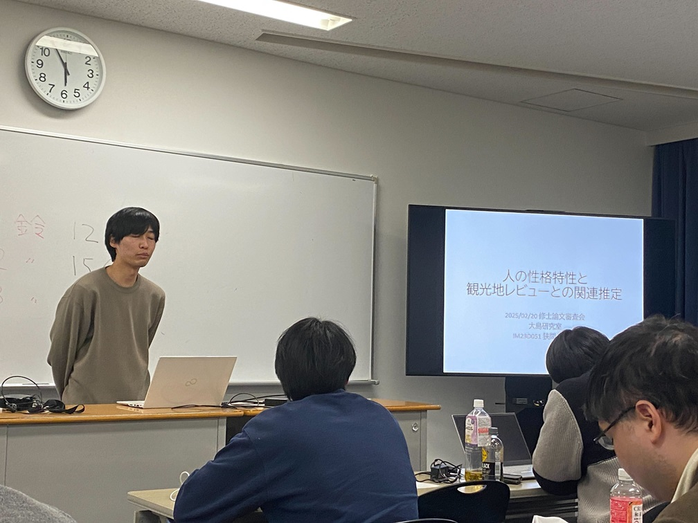
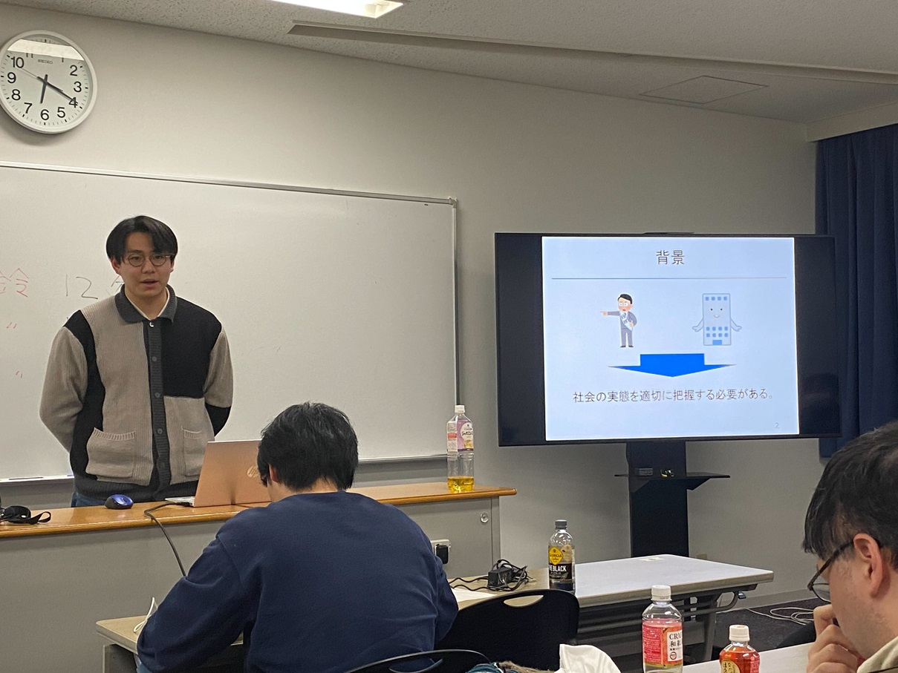
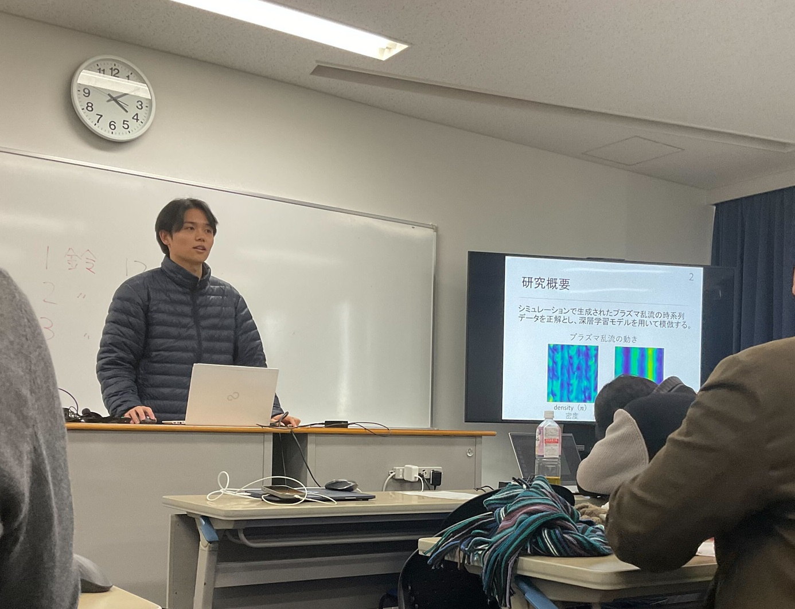

#### 日時：2025年2月20日（木）～2月21日（金）
#### 場所：神戸情報科学キャンパス

上記日程にて、大島研究室の修士2年生6人が修士論文発表を行いました。

修士論文発表会は2日間開催され、1人あたり発表15分、質疑10分でした。

発表の題目は以下の通りです。
- [1] 芦澤 亜里紗: 「LLM による意味理解を利用した文書の分析と検索」
- [2] 桑田 若菜: 「文字種とスタイルのエンコーディングに基づく日本語手書き文字生成」
- [3] 中屋 岳: 「歌詞の繋がりを基にしたDJのための楽曲推薦」
- [4] 狹間 亮太朗: 「人の性格特性と観光地レビューの関連推定」
- [5] 花谷 翔: 「特許情報と業界規模の関係性分析」
- [6] 眞鍋 陽向: 「深層学習によるプラズマ乱流の予測」

<!--  -->

