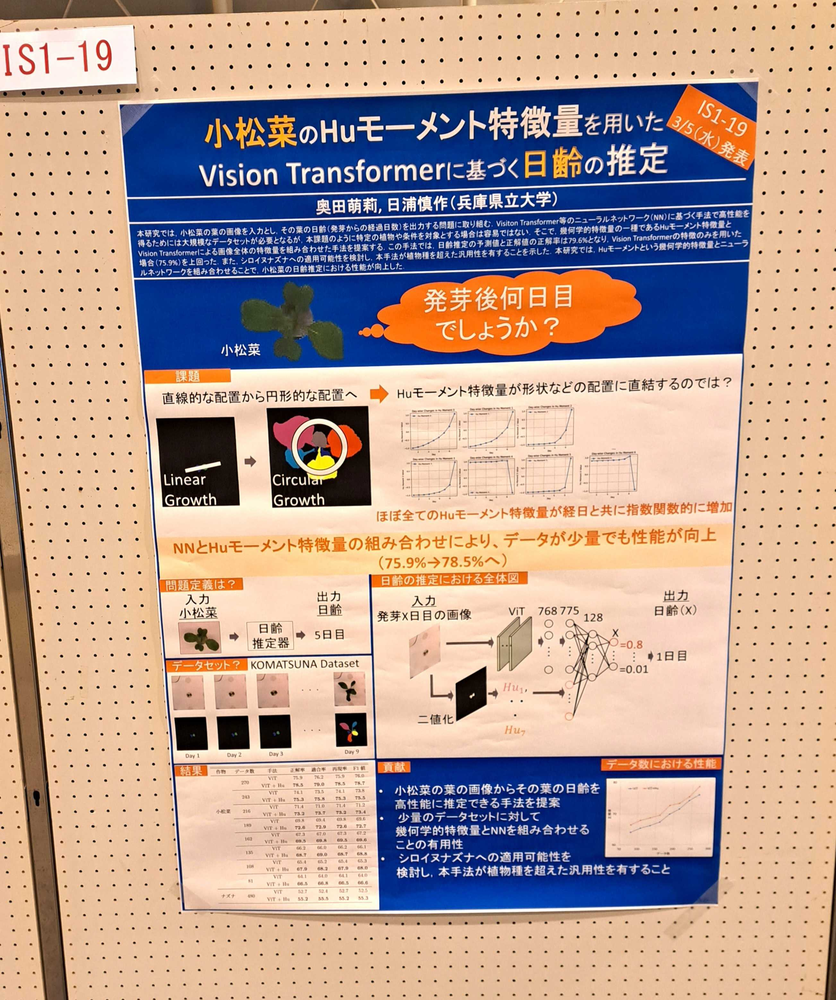
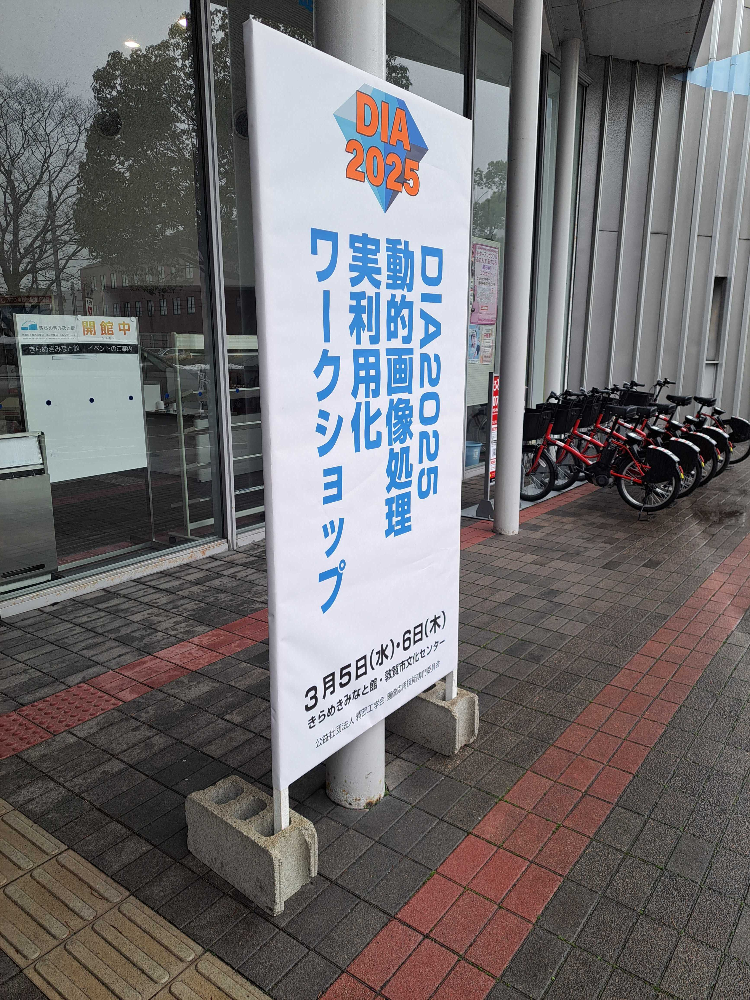
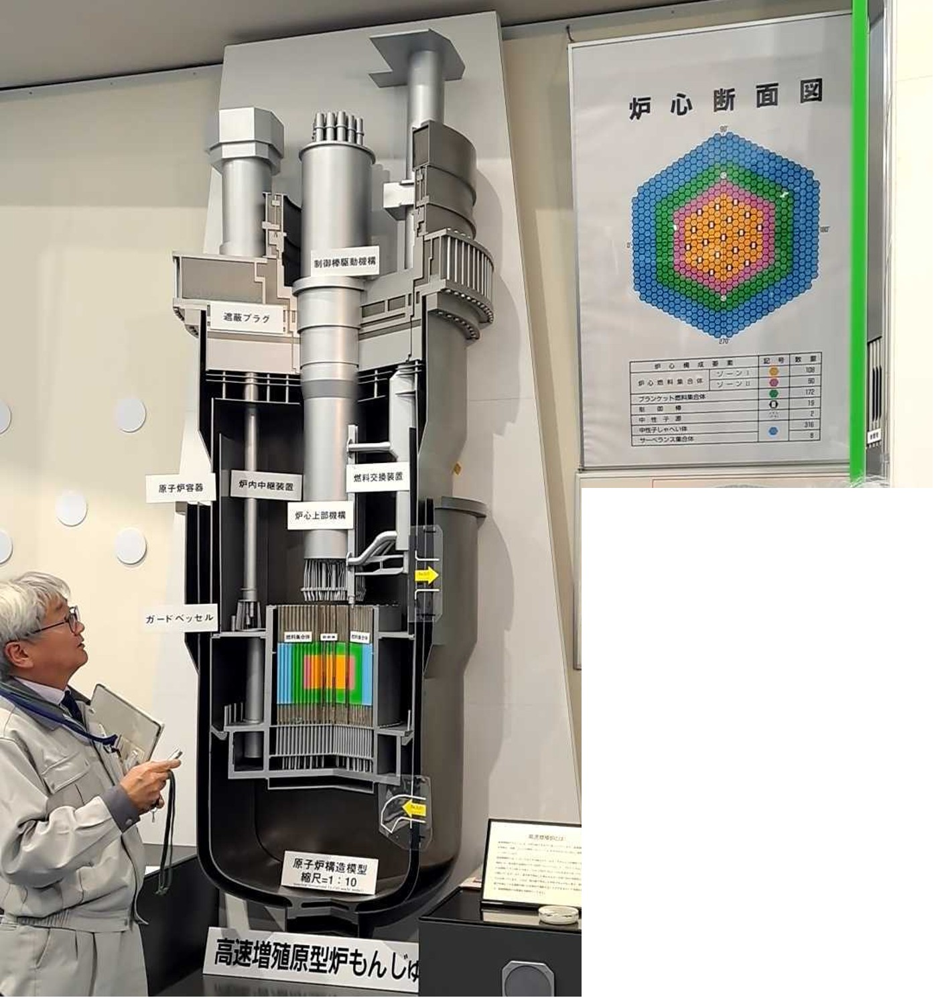
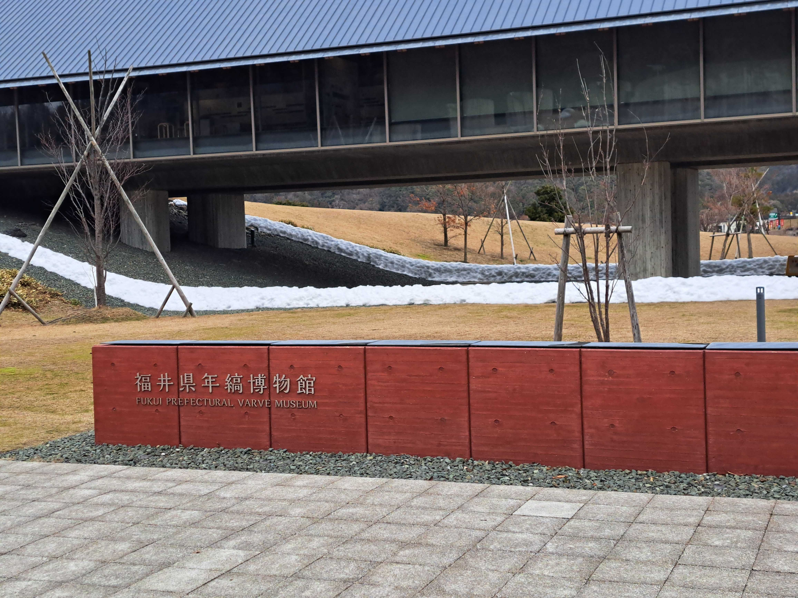

#### 日時：2025年3月4日（火）～3月6日（木）
#### 場所：きらめきみなと館/敦賀市民文化センター

D2の奥田萌莉です。上記日程において、DIA2025でポスター発表を行いました。

3月5日には、ポスター発表を行いました。

<!--  -->

3月4日にはプレイベントとして高速増殖原型炉もんじゅを訪問しました。
扱いが難しいナトリウムを包丁で切るという体験をさせていただきました。
3月6日には、見学会として福井県年縞博物館と鳥浜酒造（酒蔵）を見学させていただきました。
<!--  -->

敦賀という長閑な街で研究を議論でき、大変有意義な3日間を過ごすことができました。
美しい敦賀富士をを心に刻み、今後も益々研究に取り組んでいきたいと思います。

発表の題目は以下の通りです。
- [1] 奥田 萌莉, 日浦 慎作: 「小松菜のHuモーメント特徴量を用いたVision Transformerに基づく日齢の推定」, 動的画像処理実利用化ワークショップ 2025（DIA2025）, 2025年3月5日. 

[DIA2025 公式HP](https://www.tc-iaip.org/dia/2025/)