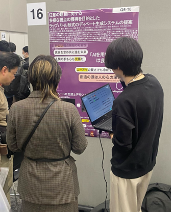
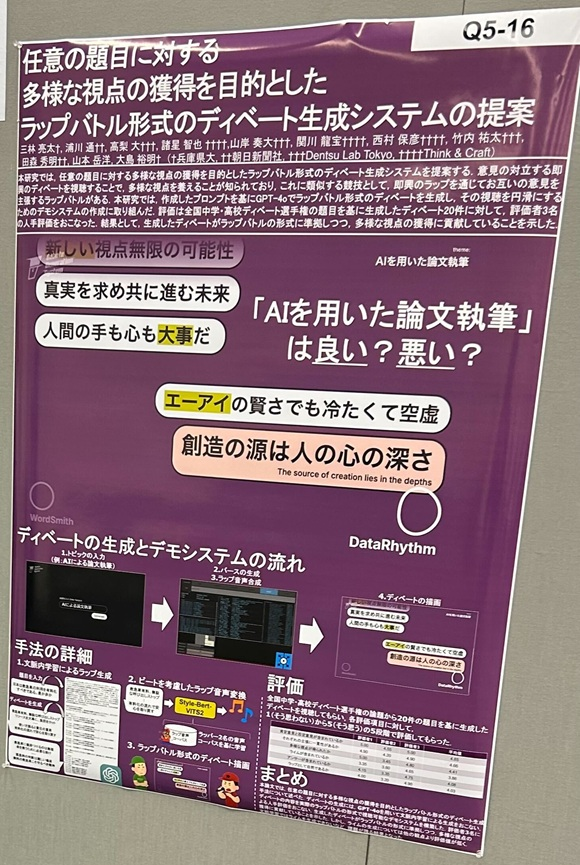

#### 日時：2025年3月10日（月）～2025年3月14日（金）
#### 場所：出島メッセ長崎 

上記の日程で三林亮太さんが言語処理学会第31回年次大会に参加し、ポスター発表を行いました。

- 三林 亮太, 浦川 通, 高梨 大, 諸星 智也, 山岸 奏大, 関川 龍宝, 西村 保彦, 竹内 祐太, 田森  秀明, 山本 岳洋, 大島 裕明「任意の題目に対する多様な視点の獲得を目的とした ラップバトル形式のディベート生成システムの提案」言語処理学会第31回年次大会(NLP2025), 2025年．

[NLP2025　公式サイト](https://anlp.jp/nlp2025/)
