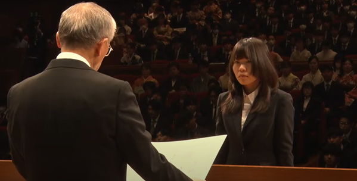
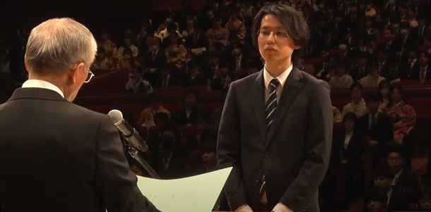

#### 日時：2025年3月25日（火）
#### 場所：神戸国際会館

大島研からB4が4名、M2が6名、D3が2名、卒業・修了しました。

うちB4からは2名が大島研のM1に、M2からは1名が大島研のD1になります。

また、M2の桑田若菜さんとD3の三林亮太さんが、
情報科学研究科・応用情報科学研究科の博士前期課程と博士後期課程の代表としてそれぞれ選ばれ、
兵庫県立大学全体の学位記授与式にて代表受領を行いました。

おめでとうございます！