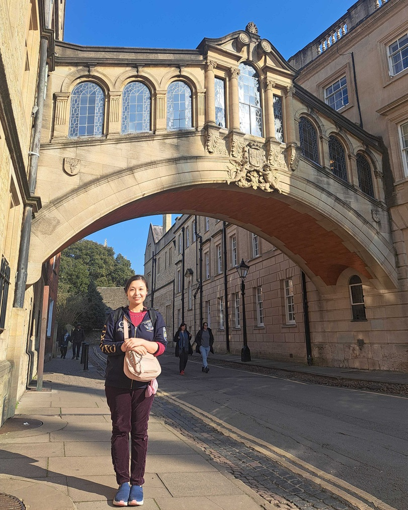

#### 日時：2025年3月21日（金）～3月28日（金）
#### 場所：オックスフォード、ケンブリッジ

D2の奥田萌莉です。上記日程において、海外出張を行いました。
今回の記事は、大学教員というもうひとつの立場として執筆いたします。

産業技術総合研究所/オックスフォード大学所属の片岡裕雄さんの元を研究訪問いたしました。
オックスフォード大学の博士後期課程の学生、AWS Cambridgeの方をご紹介いただき、研究や生活の話を拝聴いたしました。

出張の前日にヒースロー空港近くの変電所が火事になり空港が停電した際には、今回は行くことができないかと諦めかけましたが、片岡さんをはじめとする方々が非常に親身になってくださり、何とかつくことができました。

この出張を振り返ると、イギリスは自然豊かな非常に美しい国でした。特に、今回訪れたオックスフォードとケンブリッジは、自然とITが共にある街でした。大学内にたくさんあるカフェで研究の議論を気軽に行うことができ、研究の環境がとても整っている点を痛感いたしました。

私にとって海外出張は初めての経験でしたが、イギリスの方々は非常に親切で、何かと助けていただきました。
（ケンブリッジ大学の門を通過してから戻れなくなってしまった際には、教授がガードマンに話をつけてくださり、ガードマンから"OK, nice accident. Cool."と言われました。）

今回渡英することができたのは、上司である日浦先生と山添先生のご支援なくしては達成することは出来ませんでした。心より感謝申し上げます。また、現地ではオックスフォードの街を案内してくださった片岡さんに非常にお世話になりました。オックスフォード大学のOishiさん、AWS Cambridgeの板摺さんともお知り合いになれて大変嬉しく思っております。

今回の出張は、人々の温かさをひしひしと感じる1週間でした。大学教員または先輩として、「世界は広い」ということをお伝えできれば幸いです。最後になりますが、この場をお借りして、指導教員であり鍛えてくださった大島先生に深く感謝申し上げ、引き続き研鑽することを誓い、結びの言葉といたします。

