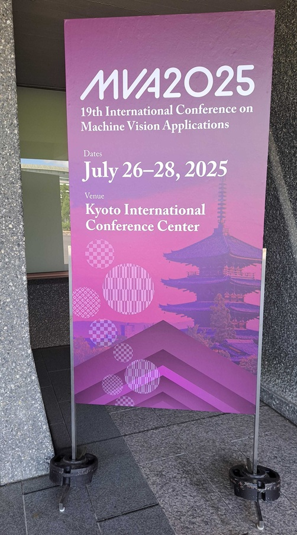
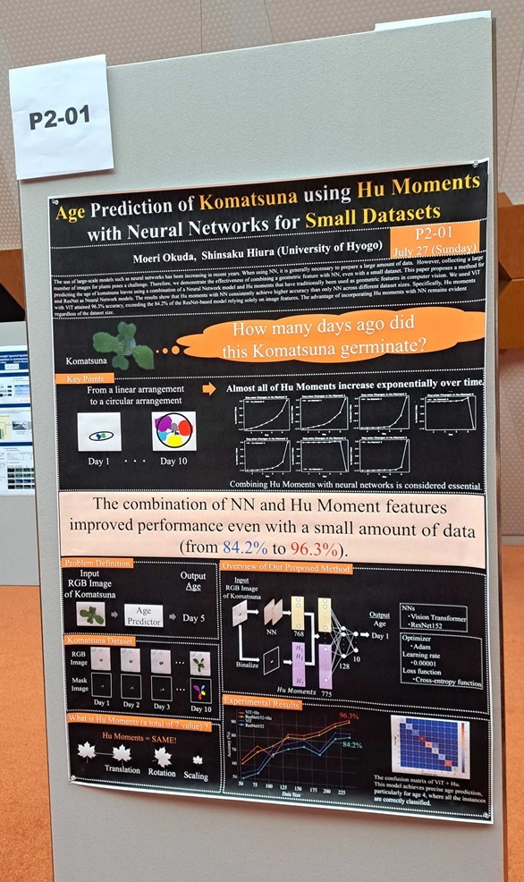

奥田萌莉さんの論文がMVA2025に採択されました。

書誌情報は以下の通りです。
- Moeri Okuda, Shinsaku Hiura:"Age Prediction of Komatsuna using Hu Moments with Neural Networks for Small Datasets", In Proceedings of the 19th International Conference on Machine Vision Applications, July, 2025.
