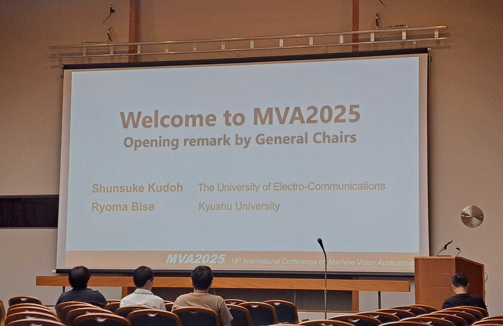
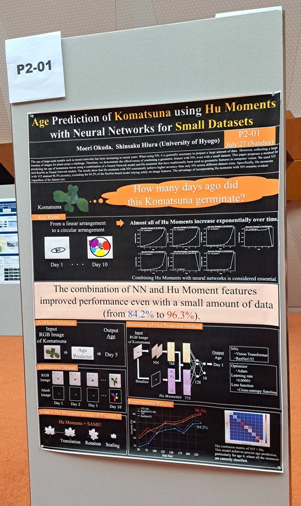

奥田萌莉さんの論文がMVA2025に採択されました。

<iframe style="display:block;margin:0px auto"
 width="560" height="315" src="https://www.youtube.com/embed/1O2_sCv98UU?si=K7flhSG0ZQnUwf8a" title="YouTube video player" frameborder="0" allow="accelerometer; autoplay; clipboard-write; encrypted-media; gyroscope; picture-in-picture; web-share" referrerpolicy="strict-origin-when-cross-origin" allowfullscreen></iframe>
  

書誌情報は以下の通りです。
- Moeri Okuda, Shinsaku Hiura:"Age Prediction of Komatsuna using Hu Moments with Neural Networks for Small Datasets", In Proceedings of the 19th International Conference on Machine Vision Applications, July, 2025.

[MVA2025 公式Webページ](https://mva-org.jp/mva2025/)
