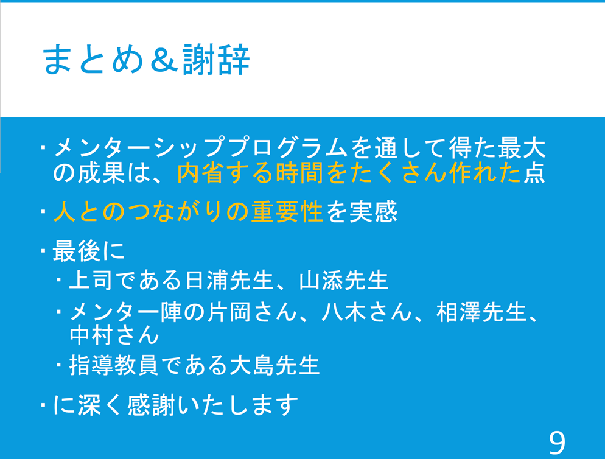

奥田萌莉さんがMIRU2025で発表を行いました。

書誌情報は以下の通りです。
- 奥田萌莉, 谷口諒伍, 日浦慎作:"クロロフィル蛍光画像を用いたコウキクサの成長要因の分析 , 2025年7月.

同日には、MIRUメンターシッププログラムにおけるミートアップで、約10名に対して体験者としての説明を行いました。

[MIRU2025 公式Webページ](https://cvim.ipsj.or.jp/MIRU2025/)
