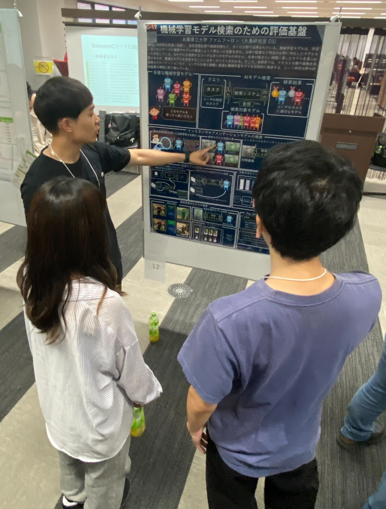
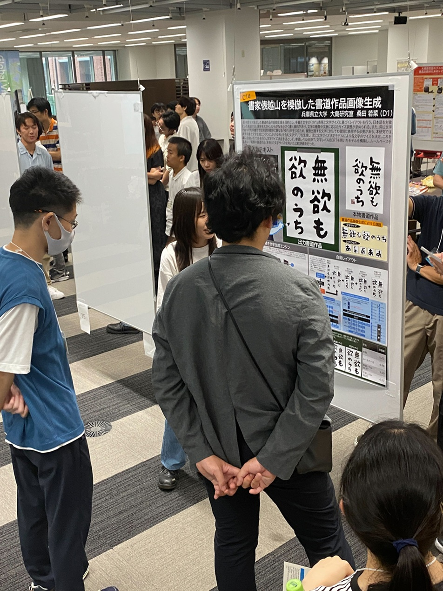
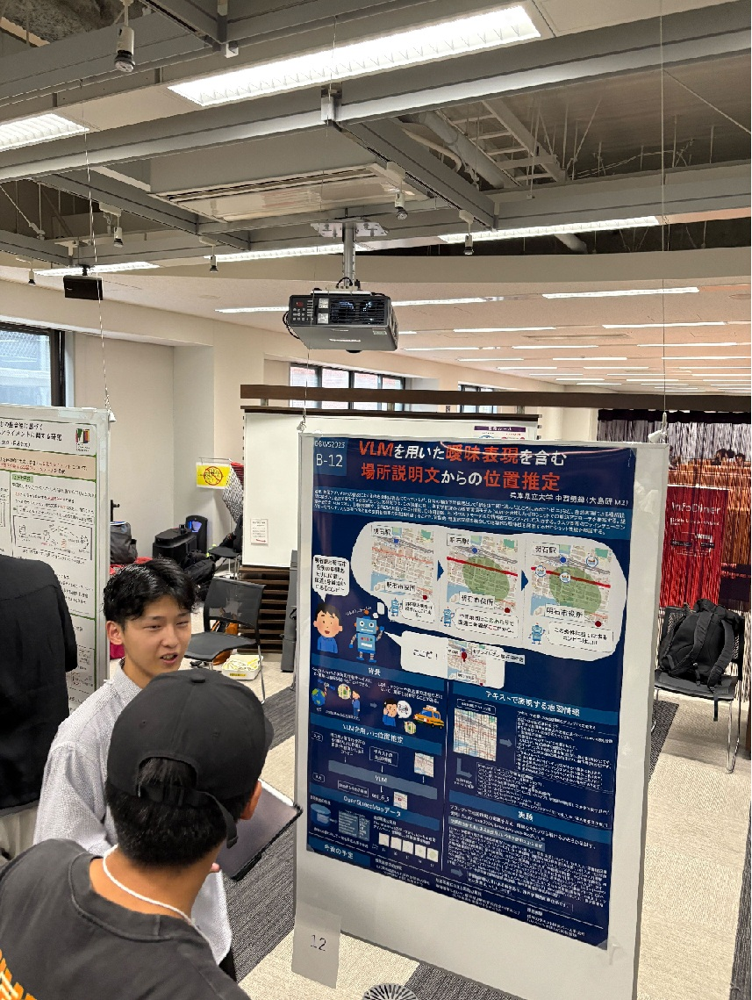
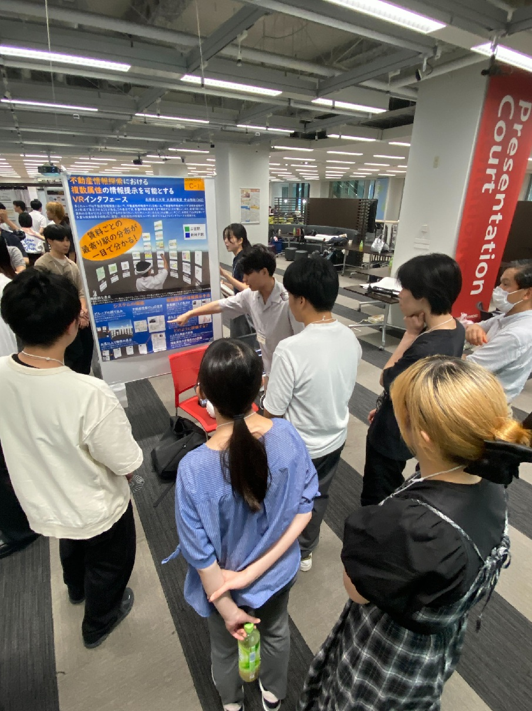
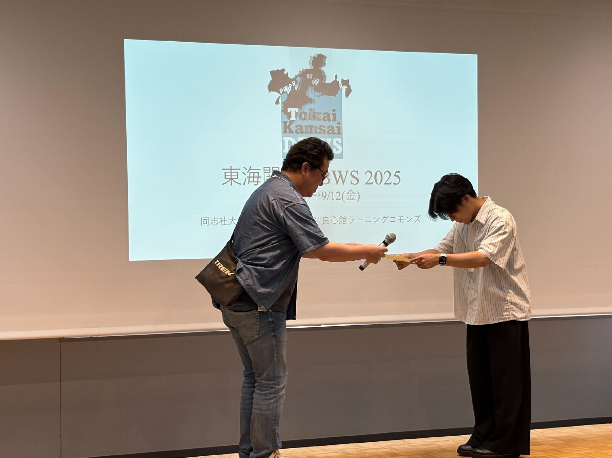
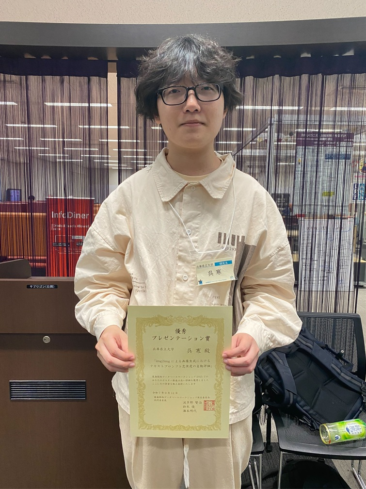

#### 日時：2025年9月11日（木）～2025年9月12日（金）
#### 場所：同志社大学今出川キャンパス良心館2Fラーニングコモンズ

上記日程にて、大島研のメンバーが東海関西データベースワークショップ 2025に参加し、ポスター発表を行いました。

他大学の学生や先生方と、研究について意見を交わすことができました。

また、門垣幸樹さん、呉寒さんがセッション内での参加者投票によって優秀賞を受賞しました。

おめでとうございます！

### 発表タイトル
- 大島 裕明, LLM型生成AIによる医療対話テキストの自動生成と共感度に基づく品質分析, 第10回東海関西データベースワークショップ, 2025年
- ファム フーロン, 機械学習モデル検索のための評価基盤, 第10回東海関西データベースワークショップ, 2025年
- 桑田 若菜, 書家俵越山を模倣した書道作品画像生成, 第10回東海関西データベースワークショップ, 2025年
- 黒木 空翔, 発話行動の多段階分類による動機づけ面接の自動評価, 第10回東海関西データベースワークショップ, 2025年
- 中西 勇輝, VLMを用いた曖昧表現を含む場所説明文からの位置推定, 第10回東海関西データベースワークショップ, 2025年
- 中山 裕紀, 不動産情報探索における複数属性の情報提示を可能とするVRインタフェース, 第10回東海関西データベースワークショップ, 2025年
- 門垣 幸樹, 強化学習による差動二輪車制御における未知実証環境での安全推論, 第10回東海関西データベースワークショップ, 2025年
- 内藤 洋輝, 地理情報と衛生画像からの樹冠高の推定, 第10回東海関西データベースワークショップ, 2025年
- 中村 嵩, 俳句のコンテキストを考慮した効果音の検索と生成, 第10回東海関西データベースワークショップ, 2025年
- 松本 美風, 分かりやすい道案内文生成のためのランドマーク抽出, 第10回東海関西データベースワークショップ, 2025年
- 村上 耀紀, 禁煙促進のための根拠提示型情報提供ボット, 第10回東海関西データベースワークショップ, 2025年
- 呉 寒, img2imgによる画像生成におけるテキストプロンプト忠実度の自動評価, 第10回東海関西データベースワークショップ, 2025年

皆さんお疲れ様でした！

[東海関西DBWS2025 公式Webページ](https://sites.google.com/mil.doshisha.ac.jp/dbws-2025/%E3%83%9B%E3%83%BC%E3%83%A0?authuser=0)

<!-- 1. 論文採録バージョン -->
<!-- [第一著者]さんの論文が「[学会フルネーム]」に採録されました。 -->

<!-- [公式Webページ](学会公式ページTopのURL) -->

<!-- 書誌情報。書式はPublicationsを参考。変にコードブロックとかで囲まなくてOK -->

<!-- [年月日]に発表予定 -->

<!-- 2. 論文発表済みバージョン -->
<!-- [第一著者]さんが「[学会フルネーム]」で発表しました。 -->

<!-- [公式Webページ](学会公式ページTopのURL) -->

<!-- 書誌情報。書式はPublicationsを参考。変にコードブロックとかで囲まなくてOK -->

<!-- 3. 論文受賞バージョン -->
<!-- [第一著者]さんの論文が「[学会フルネーム]」で「[受賞名]」を受賞しました -->

<!-- [公式Webページ](学会公式ページTopのURL) -->

<!-- 書誌情報。書式はPublicationsを参考。変にコードブロックとかで囲まなくてOK -->

<!-- 同学会複数名の場合は並べて良い感じにして -->