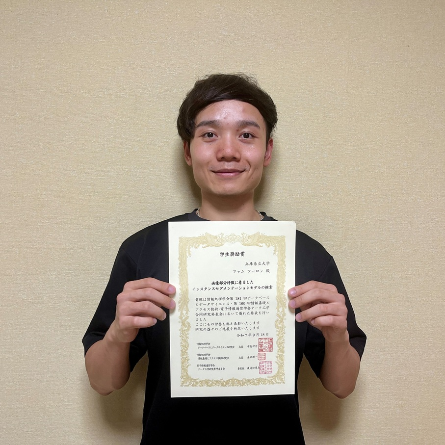

#### 日時：2025 年 9 月 16 日（火）～ 9 月 18 日（木）

#### 場所：アクトシティ浜松コングレスセンター

大島研究室の桑田若菜さん、橋口友哉さん、ファムフーロンさんがWebDB夏のワークショップ2025で発表を行いました。

- [1] 桑田 若菜, 三林 亮太, 谷 雅德, 大島 裕明: 「手書き文字のゆれ表現と自動レイアウトによる書道作品生成」, 情報処理学会, 第160回 情報基礎とアクセス技術研究会（SIG-IFAT）, 2025 年 9 月.
- [2] 橋口 友哉, 大島 裕明: 「LLM-as-a-Judgeによるカウンセリング対話品質の評価」, 情報処理学会, 第160回 情報基礎とアクセス技術研究会（SIG-IFAT）, 2025 年 9 月.
- [3] ファム フーロン, 窪内 将隆, 西本 拓磨, 山本 岳洋, 大島 裕明: 「画像部分特徴に着目したインスタンスセグメンテーションモデルの検索」, 情報処理学会, 第160回 情報基礎とアクセス技術研究会（SIG-IFAT）, 2025 年 9 月.

また、ファム フーロンさんが学生奨励賞を受賞しました！

おめでとうございます！

[WebDB2025公式サイト](https://db-event.jpn.org/webdbw2025/)