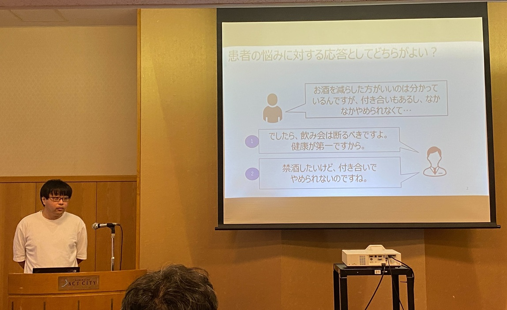
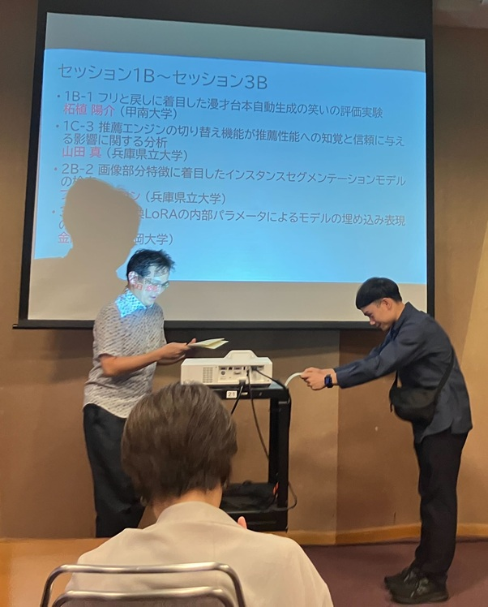

#### 日時：2025 年 9 月 16 日（火）～ 9 月 18 日（木）

#### 場所：アクトシティ浜松コングレスセンター

大島研究室の桑田若菜さん、橋口友哉さん、ファムフーロンさんがWebDB夏のワークショップ2025で発表を行いました。

- [1] 桑田 若菜, 三林 亮太, 谷 雅德, 大島 裕明: 「手書き文字のゆれ表現と自動レイアウトによる書道作品生成」, 情報処理学会, 第181回データベースとデータサイエンス・第160回情報基礎とアクセス技術合同研究発表会, 2025 年 9 月.
- [2] 橋口 友哉, 大島 裕明: 「LLM-as-a-Judgeによるカウンセリング対話品質の評価」, 情報処理学会, 第181回データベースとデータサイエンス・第160回情報基礎とアクセス技術合同研究発表会, 2025 年 9 月.
- [3] ファム フーロン, 窪内 将隆, 西本 拓磨, 山本 岳洋, 大島 裕明: 「画像部分特徴に着目したインスタンスセグメンテーションモデルの検索」, 情報処理学会, 第181回データベースとデータサイエンス・第160回情報基礎とアクセス技術合同研究発表会, 2025 年 9 月.

<!-- - [2] ファム フーロン, 山本 岳洋, 窪内 将隆, 西本 拓磨, 大島 裕明: 「性能予測およびランキング学習を用いた画像インスタンスセグメンテーションモデル検索」, 日本データベース学会, 第 16 回データ工学と情報マネジメントに関するフォーラム (DEIM Forum 2025), 2025 年 3 月.
- [3] 芦澤 亜里紗, 川崎 優子, 大島 裕明: 「人の意図に沿ったセルフケア関連新聞記事の意味理解」, 日本データベース学会, 第 16 回データ工学と情報マネジメントに関するフォーラム (DEIM Forum 2025), 2025 年 3 月.
- [4] 桑田 若菜 ,三林 亮太, 谷 雅德, 大島 裕明: 「Diffusion モデルによる文字種とスタイルの特徴を利用した日本語手書き文字生成」, 日本データベース学会, 第 16 回データ工学と情報マネジメントに関するフォーラム (DEIM Forum 2025), 2025 年 3 月.
- [5] 黒木 空翔, 橋口 友哉, 大島 裕明: 「LLM-as-a-judge による動機づけ面接の自動評価」, 日本データベース学会, 第 16 回データ工学と情報マネジメントに関するフォーラム (DEIM Forum 2025), 2025 年 3 月.
- [6] 中西 勇輝, 橋口 友哉, 桑田 若菜, 三林 亮太, 大島 裕明: 「LLaVA を用いた地図画像とテキスト情報の統合的理解」, 日本データベース学会, 第 16 回データ工学と情報マネジメントに関するフォーラム (DEIM Forum 2025), 2025 年 3 月.
- [7] 門垣 幸樹, 大島 裕明: 「強化学習による差動二輪車制御における未知実証環境への適応」, 日本データベース学会, 第 16 回データ工学と情報マネジメントに関するフォーラム (DEIM Forum 2025), 2025 年 3 月.
- [8] 上田 健斗, 白田 由香利, 大島 裕明: 「視覚認識を要する２次関数最大最小問題の ChatGPT による解法」, 日本データベース学会, 第 16 回データ工学と情報マネジメントに関するフォーラム (DEIM Forum 2025), 2025 年 3 月.
- [9] 木下 真帆, 桑田 若菜, 大島 裕明: 「線画特徴の自己教師あり学習による意外な形状の展示物発見」, 日本データベース学会, 第 16 回データ工学と情報マネジメントに関するフォーラム (DEIM Forum 2025), 2025 年 3 月. -->

また、ファム フーロンさんが学生奨励賞を受賞しました！

おめでとうございます！
