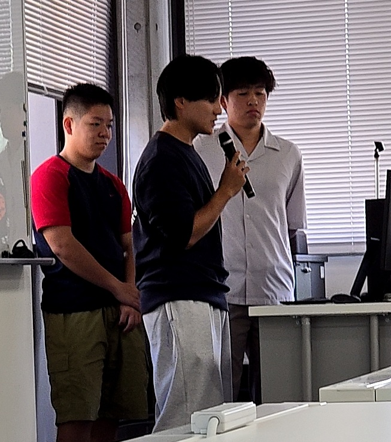

#### 日時：2025年10月10日
#### 場所：兵庫県立大学　神戸商科キャンパス

B4が卒業研究の中間報告を行いました。お疲れさまでした！

- 岡田 敦生：「モデルエンベディングに基づくタスクに適応するLLMの検索」
- 河野 心斗：「新聞記事データに基づく喫煙に関する社会的関心の変遷分析」
- 島内 健志：「Webサイトの内容に基づく広告クリック予測」
- 松本 美風：「分かりやすい道案内文生成のためのランドマーク抽出」
- 村上 耀紀：「禁煙促進のための根拠提示型情報提供ボット」

