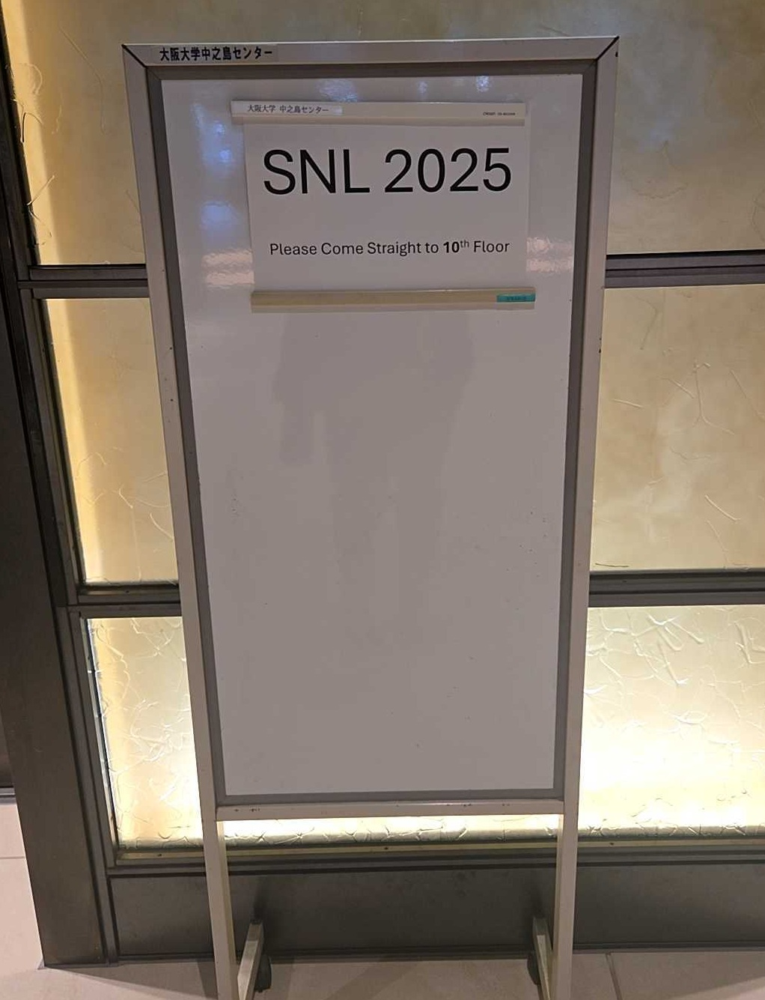
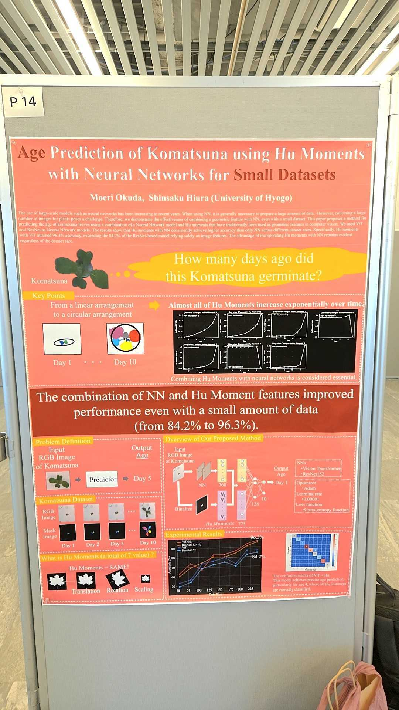

#### 日時：2025 年 10 月 29 日（水）～ 10 月 30 日（木）
#### 場所：大阪大学　中之島センター

奥田萌莉さんがSNL2025で発表を行いました。

書誌情報は以下の通りです。
- Moeri Okuda, Shinsaku Hiura:"Age Prediction of Komatsuna using Hu Moments with Neural Networks for Small Datasets", Ninth International Workshop on Symbolic-Neural Learning, October, 2025.

[SNL2025 公式Webページ](https://im.sanken.osaka-u.ac.jp/snl2025/index.html)
