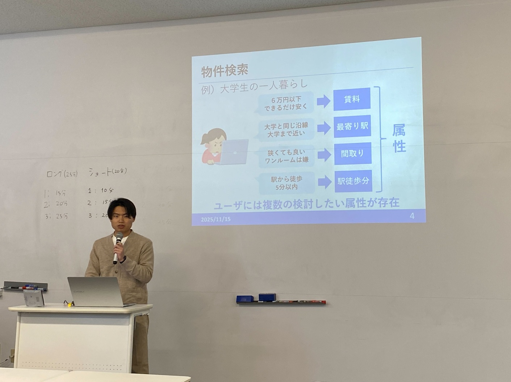

#### 日時：2025 年 11 月 14 日（金）～ 11 月 15 日（土）

#### 場所：⾼知⼯科⼤学 永国寺キャンパス

大島研究室の桑田若菜さん、中山裕紀さんが情報処理学会第77回エンタテインメントコンピューティング（EC）研究発表会で発表を行いました。

- [1] 桑田 若菜, 三林 亮太, 谷 雅德, 大島 裕明: 「手書き文字生成とレイアウト予測を基にした書道作品画像生成システム」, 情報処理学会, 第77回 エンタテインメントコンピューティング研究発表会（SIG-EC）, 2025 年 11 月.
- [2] 中山 裕紀, 大島 裕明: 「不動産探索VR：不動産情報探索のためのVRインタフェース」, 情報処理学会, 第77回 エンタテインメントコンピューティング研究発表会（SIG-EC）, 2025 年 11 月.

[第77回エンタテインメントコンピューティング研究発表会公式サイト](https://www.ipsj.or.jp/kenkyukai/event/ec77.html)