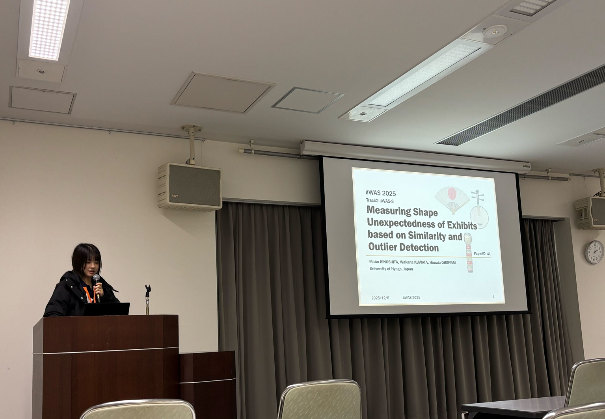

#### 日時：2025 年 12 月 8 日（月）～ 12 月 10 日（水）

#### 場所：くにびきメッセ

大島研究室の木下真帆さんと桑田若菜さんの論文がそれぞれThe 27th International Conference on Information Integration and Web Intelligence (iiWAS 2025)とThe 23rd International Conference on Advances in Mobile Computing & Multimedia Intelligence (MoMM 2025)に採択されました。

カンファレンスが島根県松江市のくにびきメッセで12月8日から10日にかけて開催され、口頭発表を行いました。

- [1] Maho Kinoshita, Wakana Kuwata and Hiroaki Ohshima: "Measuring Shape Unexpectedness of Exhibits based on Similarity and Outlier Detection". Proceedings of the 27th International Conference on Information Integration and Web Intelligence (iiWAS 2025), December 2025.

- [2] Wakana Kuwata and Hiroaki Ohshima: "Lyric-Aware DJ Track Recommendation Based on Semantic Relationships". Proceedings of the 23rd International Conference on Advances in Mobile Computing & Multimedia Intelligence (MoMM 2025), December 2025.

[iiWAS2025公式サイト](https://www.iiwas.org/conferences/iiwas2025/)

[MoMM2025公式サイト](https://www.iiwas.org/conferences/momm2025/)